## Benchmarks

### AMD Ryzen 9 5950X 16-Core

#### VS 2022 (`/O2 /arch:AVX2`)

| relative | ns/op |             op/s | err% | total | Compare sal vs builtin << (uint32_t) |
|---------:|------:|-----------------:|-----:|------:|:-------------------------------------|
|   100.0% |  0.41 | 2,432,991,779.38 | 0.1% |  9.06 | `builtin << (uint32_t)`              |
|    86.8% |  0.47 | 2,111,605,877.90 | 0.1% | 11.27 | `sal<uint32_t>`                      |

| relative | ns/op |             op/s | err% | total | Compare sal vs builtin << (uint64_t) |
|---------:|------:|-----------------:|-----:|------:|:-------------------------------------|
|   100.0% |  0.41 | 2,413,145,066.52 | 0.1% |  9.05 | `builtin << (uint64_t)`              |
|    78.3% |  0.53 | 1,889,617,697.16 | 0.1% | 12.59 | `sal<uint64_t>`                      |

| relative | ns/op |             op/s | err% | total | Compare sar vs builtin >> (uint32_t) |
|---------:|------:|-----------------:|-----:|------:|:-------------------------------------|
|   100.0% |  0.41 | 2,434,731,148.68 | 0.1% |  8.97 | `builtin >> (uint32_t)`              |
|    87.3% |  0.47 | 2,124,612,522.42 | 0.0% | 11.21 | `sar<uint32_t>`                      |

| relative | ns/op |             op/s | err% | total | Compare sar vs builtin >> (uint64_t) |
|---------:|------:|-----------------:|-----:|------:|:-------------------------------------|
|   100.0% |  0.41 | 2,438,652,364.67 | 0.2% |  8.97 | `builtin >> (uint64_t)`              |
|    62.2% |  0.66 | 1,516,845,779.38 | 0.0% | 15.69 | `sar<uint64_t>`                      |

| relative | ns/op |             op/s | err% | total | Compare sar vs builtin >> (int32_t) |
|---------:|------:|-----------------:|-----:|------:|:------------------------------------|
|   100.0% |  0.41 | 2,438,291,051.90 | 0.1% |  8.96 | `builtin >> (int32_t)`              |
|    62.2% |  0.66 | 1,516,157,216.54 | 0.1% | 15.71 | `sar<int32_t>`                      |

| relative | ns/op |             op/s | err% | total | Compare sar vs builtin >> (int64_t) |
|---------:|------:|-----------------:|-----:|------:|:------------------------------------|
|   100.0% |  0.44 | 2,271,498,128.00 | 0.0% |  9.61 | `builtin >> (int64_t)`              |
|    66.5% |  0.66 | 1,511,548,314.06 | 0.2% | 15.76 | `sar<int64_t>`                      |

| relative | ns/op |             op/s | err% | total | Compare shl vs builtin << (uint32_t) |
|---------:|------:|-----------------:|-----:|------:|:-------------------------------------|
|   100.0% |  0.41 | 2,454,974,421.21 | 0.0% |  8.90 | `builtin << (uint32_t)`              |
|    86.6% |  0.47 | 2,126,021,271.09 | 0.1% | 11.20 | `shl<uint32_t>`                      |

| relative | ns/op |             op/s | err% | total | Compare shl vs builtin << (uint64_t) |
|---------:|------:|-----------------:|-----:|------:|:-------------------------------------|
|   100.0% |  0.41 | 2,415,458,039.09 | 0.0% |  9.04 | `builtin << (uint64_t)`              |
|    78.5% |  0.53 | 1,895,981,392.22 | 0.2% | 12.54 | `shl<uint64_t>`                      |

| relative | ns/op |             op/s | err% | total | Compare shr vs builtin >> (uint32_t) |
|---------:|------:|-----------------:|-----:|------:|:-------------------------------------|
|   100.0% |  0.41 | 2,451,879,764.51 | 0.0% |  8.91 | `builtin >> (uint32_t)`              |
|    87.3% |  0.47 | 2,139,882,752.72 | 0.2% | 11.12 | `shr<uint32_t>`                      |

| relative | ns/op |             op/s | err% | total | Compare shr vs builtin >> (uint64_t) |
|---------:|------:|-----------------:|-----:|------:|:-------------------------------------|
|   100.0% |  0.41 | 2,450,086,352.83 | 0.0% |  8.92 | `builtin >> (uint64_t)`              |
|    61.9% |  0.66 | 1,517,323,372.72 | 0.0% | 15.69 | `shr<uint64_t>`                      |

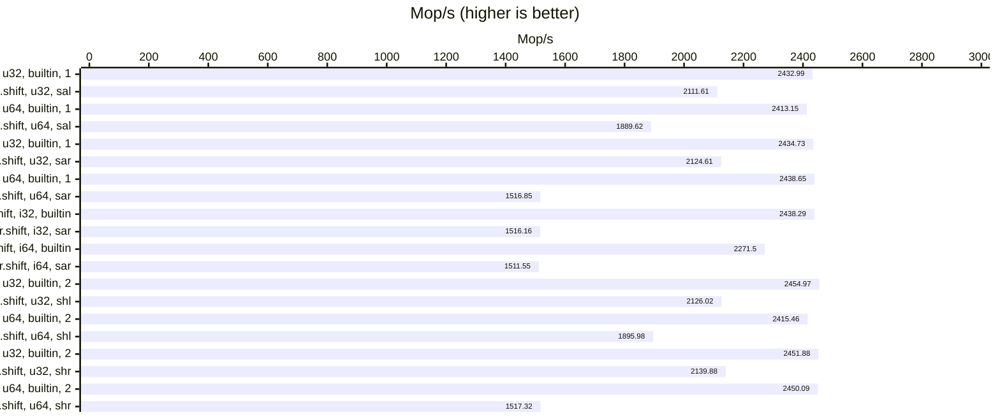

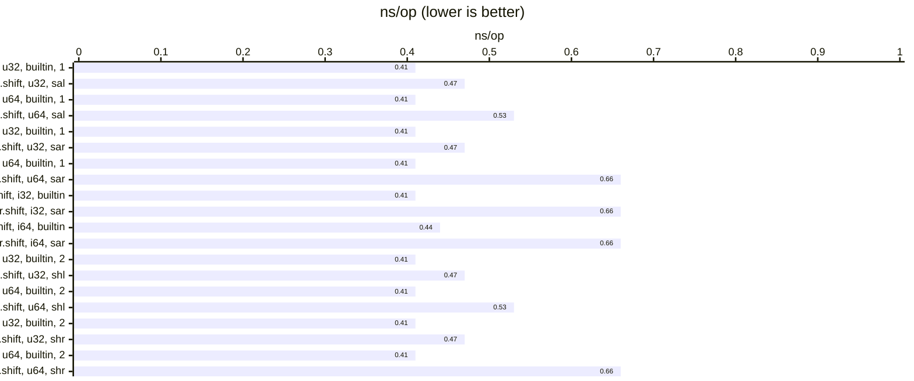


### VS 2022 (clang-cl, `/O2 -march=native`)

| relative | ns/op |              op/s | err% | total | Compare sal vs builtin << (uint32_t) |
|---------:|------:|------------------:|-----:|------:|:-------------------------------------|
|   100.0% |  0.06 | 17,955,998,150.00 | 0.1% |  1.80 | `builtin << (uint32_t)`              |
|    98.9% |  0.06 | 17,752,996,669.90 | 0.1% |  1.82 | `sal<uint32_t>`                      |

| relative | ns/op |              op/s | err% | total | Compare sal vs builtin << (uint64_t) |
|---------:|------:|------------------:|-----:|------:|:-------------------------------------|
|   100.0% |  0.08 | 11,801,165,804.83 | 0.1% |  2.02 | `builtin << (uint64_t)`              |
|    53.4% |  0.16 |  6,300,931,020.29 | 0.0% |  3.78 | `sal<uint64_t>`                      |

| relative | ns/op |              op/s | err% | total | Compare sar vs builtin >> (uint32_t) |
|---------:|------:|------------------:|-----:|------:|:-------------------------------------|
|   100.0% |  0.06 | 16,799,323,115.62 | 0.5% |  1.81 | `builtin >> (uint32_t)`              |
|   104.8% |  0.06 | 17,604,804,652.46 | 0.1% |  1.81 | `sar<uint32_t>`                      |

| relative | ns/op |              op/s | err% | total | Compare sar vs builtin >> (uint64_t) |
|---------:|------:|------------------:|-----:|------:|:-------------------------------------|
|   100.0% |  0.08 | 11,796,012,352.21 | 0.1% |  2.02 | `builtin >> (uint64_t)`              |
|    53.4% |  0.16 |  6,301,508,878.77 | 0.1% |  3.78 | `sar<uint64_t>`                      |

| relative | ns/op |              op/s | err% | total | Compare sar vs builtin >> (int32_t) |
|---------:|------:|------------------:|-----:|------:|:------------------------------------|
|   100.0% |  0.06 | 17,649,120,829.06 | 0.1% |  1.81 | `builtin >> (int32_t)`              |
|   102.8% |  0.06 | 18,143,178,004.93 | 0.1% |  1.82 | `sar<int32_t>`                      |

| relative | ns/op |             op/s | err% | total | Compare sar vs builtin >> (int64_t) |
|---------:|------:|-----------------:|-----:|------:|:------------------------------------|
|   100.0% |  0.10 | 9,788,159,897.06 | 0.0% |  2.43 | `builtin >> (int64_t)`              |
|    79.0% |  0.13 | 7,730,263,774.87 | 0.0% |  3.08 | `sar<int64_t>`                      |

| relative | ns/op |              op/s | err% | total | Compare shl vs builtin << (uint32_t) |
|---------:|------:|------------------:|-----:|------:|:-------------------------------------|
|   100.0% |  0.05 | 18,319,645,351.49 | 0.1% |  1.82 | `builtin << (uint32_t)`              |
|   100.0% |  0.05 | 18,316,279,311.77 | 0.1% |  1.82 | `shl<uint32_t>`                      |

| relative | ns/op |              op/s | err% | total | Compare shl vs builtin << (uint64_t) |
|---------:|------:|------------------:|-----:|------:|:-------------------------------------|
|   100.0% |  0.09 | 11,383,350,417.65 | 0.1% |  2.09 | `builtin << (uint64_t)`              |
|    54.9% |  0.16 |  6,246,243,608.04 | 0.1% |  3.81 | `shl<uint64_t>`                      |

| relative | ns/op |              op/s | err% | total | Compare shr vs builtin >> (uint32_t) |
|---------:|------:|------------------:|-----:|------:|:-------------------------------------|
|   100.0% |  0.05 | 18,205,070,840.23 | 0.0% |  1.81 | `builtin >> (uint32_t)`              |
|    99.9% |  0.05 | 18,191,648,662.57 | 0.1% |  1.82 | `shr<uint32_t>`                      |

| relative | ns/op |              op/s | err% | total | Compare shr vs builtin >> (uint64_t) |
|---------:|------:|------------------:|-----:|------:|:-------------------------------------|
|   100.0% |  0.09 | 11,300,875,200.65 | 0.0% |  2.11 | `builtin >> (uint64_t)`              |
|    55.4% |  0.16 |  6,265,789,875.15 | 0.1% |  3.80 | `shr<uint64_t>`                      |

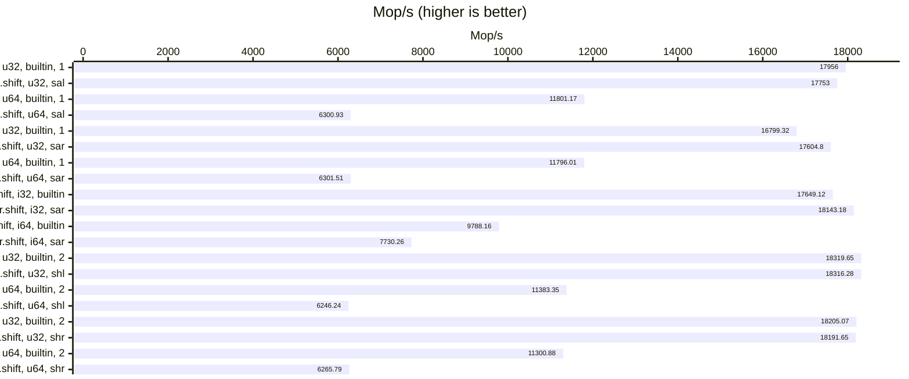

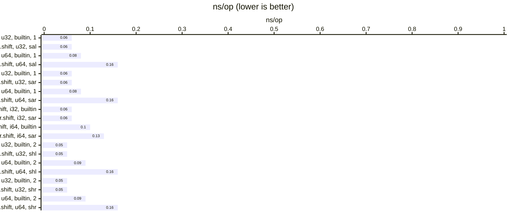

#### WSL-gcc 10.5 (`-O3 -march=native`)

| relative | ns/op |              op/s | err% | total | Compare sal vs builtin << (uint32_t) |
|---------:|------:|------------------:|-----:|------:|:-------------------------------------|
|   100.0% |  0.06 | 16,945,179,593.29 | 0.2% |  1.81 | `builtin << (uint32_t)`              |
|    13.3% |  0.44 |  2,261,472,301.51 | 0.1% |  9.66 | `sal<uint32_t>`                      |

| relative | ns/op |             op/s | err% | total | Compare sal vs builtin << (uint64_t) |
|---------:|------:|-----------------:|-----:|------:|:-------------------------------------|
|   100.0% |  0.11 | 8,905,876,211.07 | 0.1% |  2.67 | `builtin << (uint64_t)`              |
|    24.7% |  0.45 | 2,200,860,280.92 | 0.1% | 10.82 | `sal<uint64_t>`                      |

| relative | ns/op |              op/s | err% | total | Compare sar vs builtin >> (uint32_t) |
|---------:|------:|------------------:|-----:|------:|:-------------------------------------|
|   100.0% |  0.06 | 17,121,456,228.22 | 0.1% |  1.82 | `builtin >> (uint32_t)`              |
|    13.2% |  0.44 |  2,261,031,021.19 | 0.2% |  9.67 | `sar<uint32_t>`                      |

| relative | ns/op |             op/s | err% | total | Compare sar vs builtin >> (uint64_t) |
|---------:|------:|-----------------:|-----:|------:|:-------------------------------------|
|   100.0% |  0.11 | 8,831,752,939.87 | 0.7% |  2.75 | `builtin >> (uint64_t)`              |
|    24.8% |  0.46 | 2,193,428,697.08 | 0.0% | 10.85 | `sar<uint64_t>`                      |

| relative | ns/op |              op/s | err% | total | Compare sar vs builtin >> (int32_t) |
|---------:|------:|------------------:|-----:|------:|:------------------------------------|
|   100.0% |  0.06 | 17,404,306,223.04 | 0.0% |  1.82 | `builtin >> (int32_t)`              |
|    68.0% |  0.08 | 11,837,317,982.98 | 0.2% |  2.01 | `sar<int32_t>`                      |

| relative | ns/op |             op/s | err% | total | Compare sar vs builtin >> (int64_t) |
|---------:|------:|-----------------:|-----:|------:|:------------------------------------|
|   100.0% |  0.23 | 4,311,408,630.53 | 0.3% |  5.53 | `builtin >> (int64_t)`              |
|    52.3% |  0.44 | 2,255,494,776.48 | 0.1% |  9.69 | `sar<int64_t>`                      |

| relative | ns/op |              op/s | err% | total | Compare shl vs builtin << (uint32_t) |
|---------:|------:|------------------:|-----:|------:|:-------------------------------------|
|   100.0% |  0.06 | 17,933,976,141.00 | 0.1% |  1.82 | `builtin << (uint32_t)`              |
|    12.6% |  0.44 |  2,265,242,327.68 | 0.1% |  9.64 | `shl<uint32_t>`                      |

| relative | ns/op |             op/s | err% | total | Compare shl vs builtin << (uint64_t) |
|---------:|------:|-----------------:|-----:|------:|:-------------------------------------|
|   100.0% |  0.11 | 8,758,258,587.04 | 0.1% |  2.71 | `builtin << (uint64_t)`              |
|    25.6% |  0.45 | 2,238,260,692.21 | 0.3% |  9.74 | `shl<uint64_t>`                      |

| relative | ns/op |              op/s | err% | total | Compare shr vs builtin >> (uint32_t) |
|---------:|------:|------------------:|-----:|------:|:-------------------------------------|
|   100.0% |  0.06 | 17,128,366,013.42 | 0.1% |  1.82 | `builtin >> (uint32_t)`              |
|    13.2% |  0.44 |  2,264,039,547.91 | 0.2% |  9.67 | `shr<uint32_t>`                      |

| relative | ns/op |             op/s | err% | total | Compare shr vs builtin >> (uint64_t) |
|---------:|------:|-----------------:|-----:|------:|:-------------------------------------|
|   100.0% |  0.11 | 8,869,741,551.77 | 0.0% |  2.68 | `builtin >> (uint64_t)`              |
|    24.6% |  0.46 | 2,179,601,383.66 | 0.1% | 10.92 | `shr<uint64_t>`                      |

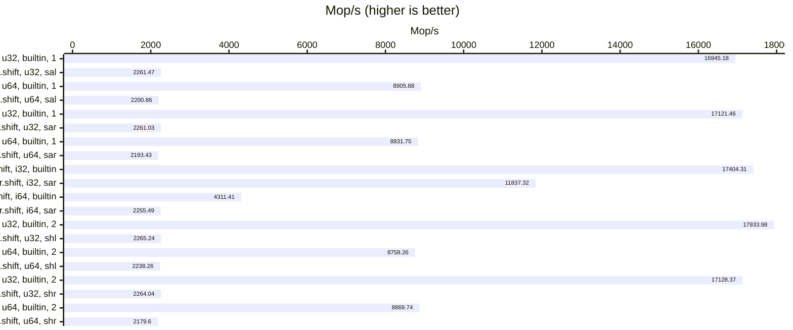

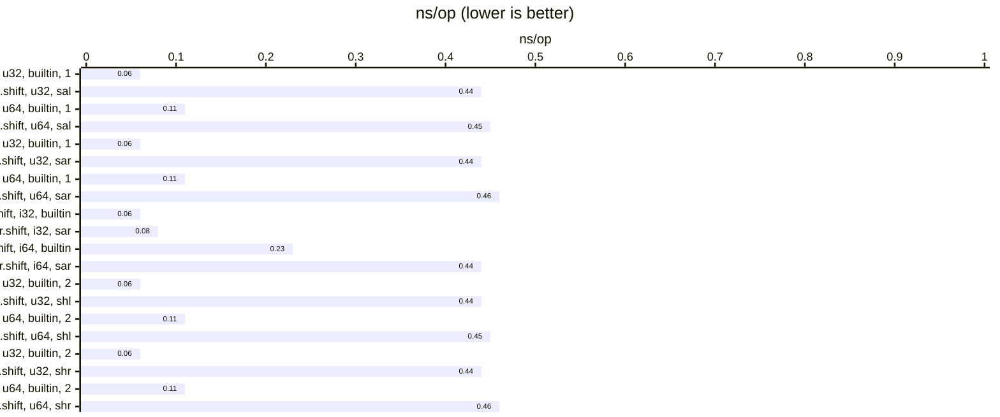

#### WSL-gcc 11.5 (`-O3 -march=native`)

| relative | ns/op |              op/s | err% | total | Compare sal vs builtin << (uint32_t) |
|---------:|------:|------------------:|-----:|------:|:-------------------------------------|
|   100.0% |  0.06 | 16,959,665,864.96 | 0.4% |  1.80 | `builtin << (uint32_t)`              |
|    13.3% |  0.44 |  2,256,692,193.42 | 0.2% |  9.69 | `sal<uint32_t>`                      |

| relative | ns/op |             op/s | err% | total | Compare sal vs builtin << (uint64_t) |
|---------:|------:|-----------------:|-----:|------:|:-------------------------------------|
|   100.0% |  0.11 | 8,779,974,477.73 | 0.2% |  2.72 | `builtin << (uint64_t)`              |
|    24.8% |  0.46 | 2,176,605,365.34 | 0.1% | 10.95 | `sal<uint64_t>`                      |

| relative | ns/op |              op/s | err% | total | Compare sar vs builtin >> (uint32_t) |
|---------:|------:|------------------:|-----:|------:|:-------------------------------------|
|   100.0% |  0.06 | 16,864,706,142.51 | 0.3% |  1.82 | `builtin >> (uint32_t)`              |
|    13.3% |  0.45 |  2,236,881,506.51 | 0.4% |  9.82 | `sar<uint32_t>`                      |

| relative | ns/op |             op/s | err% | total | Compare sar vs builtin >> (uint64_t) |
|---------:|------:|-----------------:|-----:|------:|:-------------------------------------|
|   100.0% |  0.11 | 8,793,699,245.91 | 0.1% |  2.73 | `builtin >> (uint64_t)`              |
|    24.7% |  0.46 | 2,173,596,646.79 | 0.1% | 10.95 | `sar<uint64_t>`                      |

| relative | ns/op |              op/s | err% | total | Compare sar vs builtin >> (int32_t) |
|---------:|------:|------------------:|-----:|------:|:------------------------------------|
|   100.0% |  0.06 | 17,177,619,700.68 | 0.3% |  1.82 | `builtin >> (int32_t)`              |
|    54.6% |  0.11 |  9,383,197,594.71 | 0.2% |  2.54 | `sar<int32_t>`                      |

| relative | ns/op |             op/s | err% | total | Compare sar vs builtin >> (int64_t) |
|---------:|------:|-----------------:|-----:|------:|:------------------------------------|
|   100.0% |  0.23 | 4,371,158,965.57 | 0.2% |  5.45 | `builtin >> (int64_t)`              |
|    51.4% |  0.45 | 2,246,821,613.68 | 0.3% |  9.72 | `sar<int64_t>`                      |

| relative | ns/op |              op/s | err% | total | Compare shl vs builtin << (uint32_t) |
|---------:|------:|------------------:|-----:|------:|:-------------------------------------|
|   100.0% |  0.06 | 17,480,269,667.06 | 0.1% |  1.82 | `builtin << (uint32_t)`              |
|    12.9% |  0.44 |  2,258,621,106.65 | 0.1% |  9.68 | `shl<uint32_t>`                      |

| relative | ns/op |             op/s | err% | total | Compare shl vs builtin << (uint64_t) |
|---------:|------:|-----------------:|-----:|------:|:-------------------------------------|
|   100.0% |  0.11 | 8,850,538,231.82 | 0.1% |  2.69 | `builtin << (uint64_t)`              |
|    24.5% |  0.46 | 2,170,762,780.36 | 0.1% | 10.98 | `shl<uint64_t>`                      |

| relative | ns/op |              op/s | err% | total | Compare shr vs builtin >> (uint32_t) |
|---------:|------:|------------------:|-----:|------:|:-------------------------------------|
|   100.0% |  0.06 | 17,451,655,818.14 | 0.2% |  1.82 | `builtin >> (uint32_t)`              |
|    12.9% |  0.45 |  2,246,639,057.61 | 0.1% |  9.73 | `shr<uint32_t>`                      |

| relative | ns/op |             op/s | err% | total | Compare shr vs builtin >> (uint64_t) |
|---------:|------:|-----------------:|-----:|------:|:-------------------------------------|
|   100.0% |  0.11 | 8,833,349,063.30 | 0.2% |  2.69 | `builtin >> (uint64_t)`              |
|    24.5% |  0.46 | 2,160,366,669.78 | 0.2% | 11.04 | `shr<uint64_t>`                      |

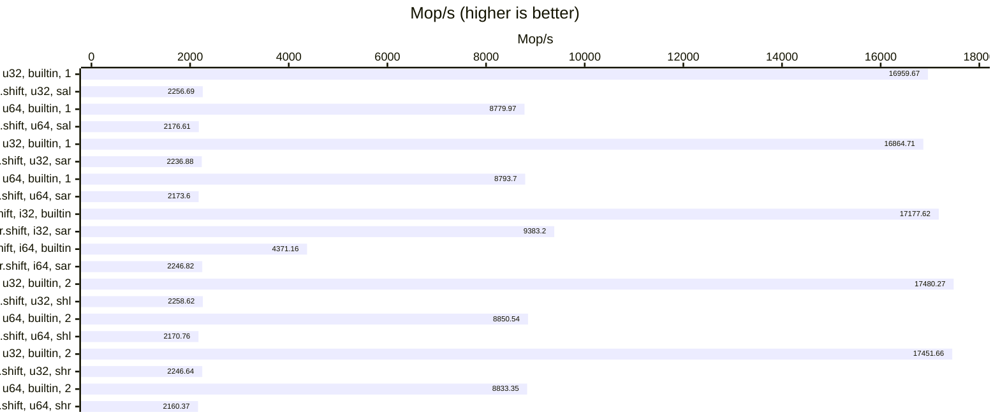

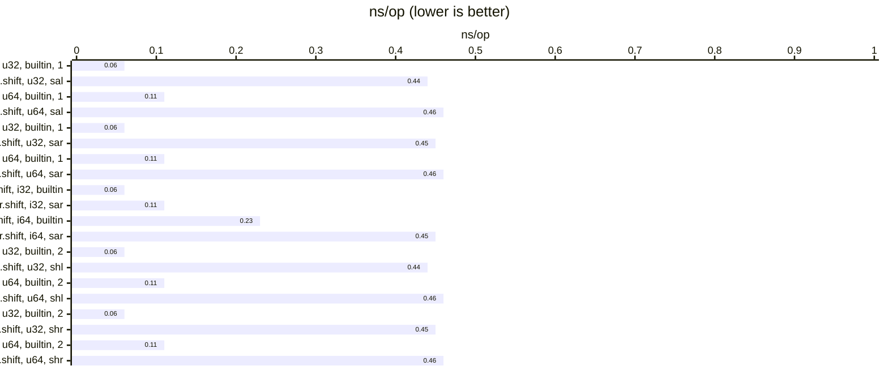

#### WSL-gcc 12.4 (`-O3 -march=native`)

| relative | ns/op |              op/s | err% | total | Compare sal vs builtin << (uint32_t) |
|---------:|------:|------------------:|-----:|------:|:-------------------------------------|
|   100.0% |  0.06 | 17,204,898,950.00 | 0.3% |  1.82 | `builtin << (uint32_t)`              |
|    54.5% |  0.11 |  9,369,708,606.55 | 0.1% |  2.54 | `sal<uint32_t>`                      |

| relative | ns/op |             op/s | err% | total | Compare sal vs builtin << (uint64_t) |
|---------:|------:|-----------------:|-----:|------:|:-------------------------------------|
|   100.0% |  0.11 | 8,854,114,559.45 | 0.2% |  2.69 | `builtin << (uint64_t)`              |
|    55.4% |  0.20 | 4,906,145,457.06 | 0.0% |  4.85 | `sal<uint64_t>`                      |

| relative | ns/op |              op/s | err% | total | Compare sar vs builtin >> (uint32_t) |
|---------:|------:|------------------:|-----:|------:|:-------------------------------------|
|   100.0% |  0.06 | 16,247,307,616.94 | 0.3% |  1.80 | `builtin >> (uint32_t)`              |
|    57.3% |  0.11 |  9,311,304,676.79 | 0.0% |  2.56 | `sar<uint32_t>`                      |

| relative | ns/op |             op/s | err% | total | Compare sar vs builtin >> (uint64_t) |
|---------:|------:|-----------------:|-----:|------:|:-------------------------------------|
|   100.0% |  0.12 | 8,652,374,695.41 | 0.7% |  2.75 | `builtin >> (uint64_t)`              |
|    56.3% |  0.21 | 4,874,471,362.38 | 0.2% |  4.95 | `sar<uint64_t>`                      |

| relative | ns/op |              op/s | err% | total | Compare sar vs builtin >> (int32_t) |
|---------:|------:|------------------:|-----:|------:|:------------------------------------|
|   100.0% |  0.06 | 16,841,229,213.28 | 0.1% |  1.81 | `builtin >> (int32_t)`              |
|    55.3% |  0.11 |  9,311,906,799.76 | 0.2% |  2.58 | `sar<int32_t>`                      |

| relative | ns/op |             op/s | err% | total | Compare sar vs builtin >> (int64_t) |
|---------:|------:|-----------------:|-----:|------:|:------------------------------------|
|   100.0% |  0.16 | 6,366,292,912.42 | 0.2% |  3.74 | `builtin >> (int64_t)`              |
|    62.0% |  0.25 | 3,949,647,835.20 | 0.2% |  6.05 | `sar<int64_t>`                      |

| relative | ns/op |              op/s | err% | total | Compare shl vs builtin << (uint32_t) |
|---------:|------:|------------------:|-----:|------:|:-------------------------------------|
|   100.0% |  0.06 | 18,013,851,674.53 | 0.1% |  1.81 | `builtin << (uint32_t)`              |
|    57.2% |  0.10 | 10,295,325,478.34 | 0.2% |  2.32 | `shl<uint32_t>`                      |

| relative | ns/op |             op/s | err% | total | Compare shl vs builtin << (uint64_t) |
|---------:|------:|-----------------:|-----:|------:|:-------------------------------------|
|   100.0% |  0.11 | 8,835,792,078.02 | 0.2% |  2.71 | `builtin << (uint64_t)`              |
|    54.8% |  0.21 | 4,838,113,779.47 | 0.2% |  4.94 | `shl<uint64_t>`                      |

| relative | ns/op |              op/s | err% | total | Compare shr vs builtin >> (uint32_t) |
|---------:|------:|------------------:|-----:|------:|:-------------------------------------|
|   100.0% |  0.06 | 17,926,547,046.17 | 0.2% |  1.81 | `builtin >> (uint32_t)`              |
|    56.9% |  0.10 | 10,197,874,600.81 | 0.3% |  2.35 | `shr<uint32_t>`                      |

| relative | ns/op |             op/s | err% | total | Compare shr vs builtin >> (uint64_t) |
|---------:|------:|-----------------:|-----:|------:|:-------------------------------------|
|   100.0% |  0.11 | 8,791,782,020.29 | 0.1% |  2.71 | `builtin >> (uint64_t)`              |
|    55.4% |  0.21 | 4,875,036,774.05 | 0.1% |  4.89 | `shr<uint64_t>`                      |

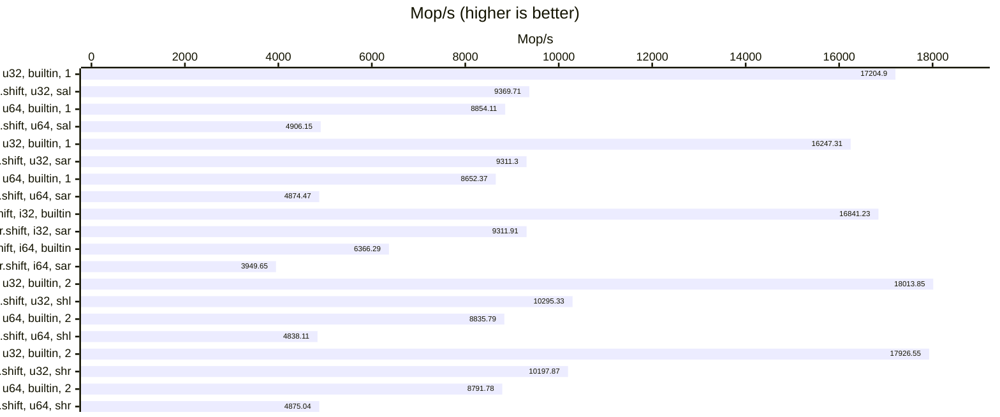

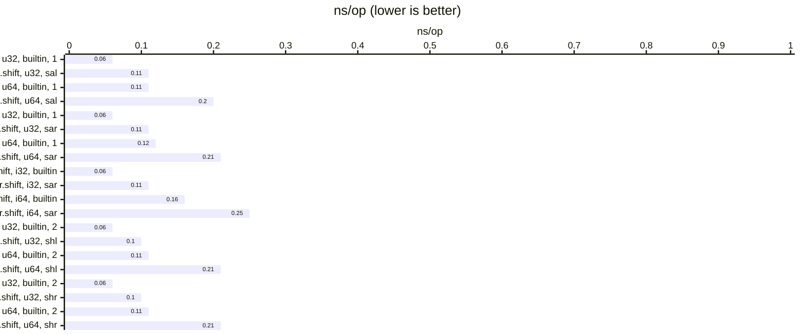

#### WSL-gcc 13.3 (`-O3 -march=native`)

| relative | ns/op |              op/s | err% | total | Compare sal vs builtin << (uint32_t) |
|---------:|------:|------------------:|-----:|------:|:-------------------------------------|
|   100.0% |  0.06 | 17,268,914,315.34 | 0.1% |  1.82 | `builtin << (uint32_t)`              |
|    54.4% |  0.11 |  9,397,261,630.75 | 0.2% |  2.54 | `sal<uint32_t>`                      |

| relative | ns/op |             op/s | err% | total | Compare sal vs builtin << (uint64_t) |
|---------:|------:|-----------------:|-----:|------:|:-------------------------------------|
|   100.0% |  0.11 | 8,851,303,493.99 | 0.5% |  2.70 | `builtin << (uint64_t)`              |
|    53.6% |  0.21 | 4,746,723,780.26 | 0.1% |  5.01 | `sal<uint64_t>`                      |

| relative | ns/op |              op/s | err% | total | Compare sar vs builtin >> (uint32_t) |
|---------:|------:|------------------:|-----:|------:|:-------------------------------------|
|   100.0% |  0.06 | 16,179,375,527.22 | 0.4% |  1.82 | `builtin >> (uint32_t)`              |
|    57.7% |  0.11 |  9,339,222,256.46 | 0.4% |  2.54 | `sar<uint32_t>`                      |

| relative | ns/op |             op/s | err% | total | Compare sar vs builtin >> (uint64_t) |
|---------:|------:|-----------------:|-----:|------:|:-------------------------------------|
|   100.0% |  0.12 | 8,669,247,015.68 | 0.2% |  2.75 | `builtin >> (uint64_t)`              |
|    54.0% |  0.21 | 4,677,840,701.37 | 0.1% |  5.09 | `sar<uint64_t>`                      |

| relative | ns/op |              op/s | err% | total | Compare sar vs builtin >> (int32_t) |
|---------:|------:|------------------:|-----:|------:|:------------------------------------|
|   100.0% |  0.06 | 17,205,838,359.84 | 0.1% |  1.82 | `builtin >> (int32_t)`              |
|    54.3% |  0.11 |  9,343,613,775.27 | 0.2% |  2.55 | `sar<int32_t>`                      |

| relative | ns/op |             op/s | err% | total | Compare sar vs builtin >> (int64_t) |
|---------:|------:|-----------------:|-----:|------:|:------------------------------------|
|   100.0% |  0.16 | 6,408,124,256.25 | 0.1% |  3.72 | `builtin >> (int64_t)`              |
|    62.0% |  0.25 | 3,974,798,674.20 | 0.1% |  5.98 | `sar<int64_t>`                      |

| relative | ns/op |              op/s | err% | total | Compare shl vs builtin << (uint32_t) |
|---------:|------:|------------------:|-----:|------:|:-------------------------------------|
|   100.0% |  0.06 | 17,307,961,711.33 | 0.2% |  1.82 | `builtin << (uint32_t)`              |
|    71.9% |  0.08 | 12,445,237,257.20 | 0.1% |  1.92 | `shl<uint32_t>`                      |

| relative | ns/op |             op/s | err% | total | Compare shl vs builtin << (uint64_t) |
|---------:|------:|-----------------:|-----:|------:|:-------------------------------------|
|   100.0% |  0.12 | 8,676,964,063.00 | 0.4% |  2.74 | `builtin << (uint64_t)`              |
|    54.5% |  0.21 | 4,724,694,167.36 | 0.4% |  5.07 | `shl<uint64_t>`                      |

| relative | ns/op |              op/s | err% | total | Compare shr vs builtin >> (uint32_t) |
|---------:|------:|------------------:|-----:|------:|:-------------------------------------|
|   100.0% |  0.06 | 17,966,017,008.29 | 0.2% |  1.82 | `builtin >> (uint32_t)`              |
|    69.6% |  0.08 | 12,501,156,993.96 | 0.3% |  1.91 | `shr<uint32_t>`                      |

| relative | ns/op |             op/s | err% | total | Compare shr vs builtin >> (uint64_t) |
|---------:|------:|-----------------:|-----:|------:|:-------------------------------------|
|   100.0% |  0.11 | 8,837,163,021.86 | 0.1% |  2.69 | `builtin >> (uint64_t)`              |
|    54.2% |  0.21 | 4,786,722,102.48 | 0.2% |  4.98 | `shr<uint64_t>`                      |

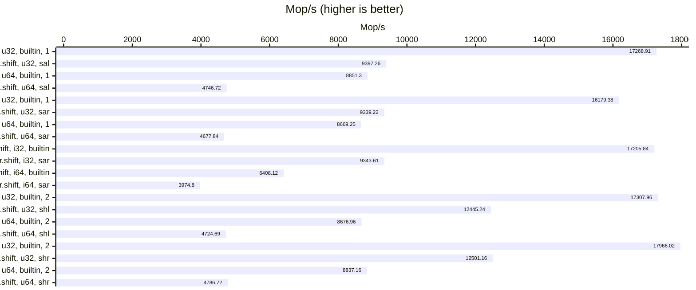

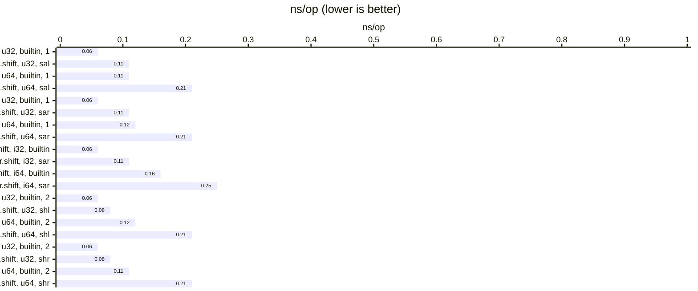

#### WSL-gcc 14.2 (`-O3 -march=native`)

| relative | ns/op |              op/s | err% | total | Compare sal vs builtin << (uint32_t) |
|---------:|------:|------------------:|-----:|------:|:-------------------------------------|
|   100.0% |  0.06 | 16,862,552,073.48 | 0.1% |  1.82 | `builtin << (uint32_t)`              |
|    89.8% |  0.07 | 15,135,432,252.15 | 0.2% |  1.81 | `sal<uint32_t>`                      |

| relative | ns/op |             op/s | err% | total | Compare sal vs builtin << (uint64_t) |
|---------:|------:|-----------------:|-----:|------:|:-------------------------------------|
|   100.0% |  0.11 | 8,744,965,934.74 | 0.1% |  2.73 | `builtin << (uint64_t)`              |
|    53.6% |  0.21 | 4,685,561,490.07 | 0.2% |  5.08 | `sal<uint64_t>`                      |

| relative | ns/op |              op/s | err% | total | Compare sar vs builtin >> (uint32_t) |
|---------:|------:|------------------:|-----:|------:|:-------------------------------------|
|   100.0% |  0.06 | 16,736,110,122.01 | 0.8% |  1.81 | `builtin >> (uint32_t)`              |
|    90.7% |  0.07 | 15,183,936,531.40 | 0.1% |  1.82 | `sar<uint32_t>`                      |

| relative | ns/op |             op/s | err% | total | Compare sar vs builtin >> (uint64_t) |
|---------:|------:|-----------------:|-----:|------:|:-------------------------------------|
|   100.0% |  0.11 | 8,871,622,398.32 | 0.2% |  2.68 | `builtin >> (uint64_t)`              |
|    53.5% |  0.21 | 4,745,998,100.44 | 0.1% |  5.01 | `sar<uint64_t>`                      |

| relative | ns/op |              op/s | err% | total | Compare sar vs builtin >> (int32_t) |
|---------:|------:|------------------:|-----:|------:|:------------------------------------|
|   100.0% |  0.06 | 17,220,819,967.68 | 0.0% |  1.82 | `builtin >> (int32_t)`              |
|    86.0% |  0.07 | 14,811,280,856.77 | 0.5% |  1.81 | `sar<int32_t>`                      |

| relative | ns/op |             op/s | err% | total | Compare sar vs builtin >> (int64_t) |
|---------:|------:|-----------------:|-----:|------:|:------------------------------------|
|   100.0% |  0.15 | 6,692,935,181.52 | 0.0% |  3.56 | `builtin >> (int64_t)`              |
|    58.2% |  0.26 | 3,892,234,906.65 | 0.1% |  6.12 | `sar<int64_t>`                      |

| relative | ns/op |              op/s | err% | total | Compare shl vs builtin << (uint32_t) |
|---------:|------:|------------------:|-----:|------:|:-------------------------------------|
|   100.0% |  0.06 | 17,506,442,919.38 | 0.2% |  1.82 | `builtin << (uint32_t)`              |
|    87.2% |  0.07 | 15,265,991,840.74 | 0.2% |  1.81 | `shl<uint32_t>`                      |

| relative | ns/op |             op/s | err% | total | Compare shl vs builtin << (uint64_t) |
|---------:|------:|-----------------:|-----:|------:|:-------------------------------------|
|   100.0% |  0.11 | 8,859,091,698.57 | 0.2% |  2.69 | `builtin << (uint64_t)`              |
|    53.6% |  0.21 | 4,748,418,704.22 | 0.1% |  5.01 | `shl<uint64_t>`                      |

| relative | ns/op |              op/s | err% | total | Compare shr vs builtin >> (uint32_t) |
|---------:|------:|------------------:|-----:|------:|:-------------------------------------|
|   100.0% |  0.06 | 17,747,519,381.40 | 0.1% |  1.82 | `builtin >> (uint32_t)`              |
|    87.0% |  0.06 | 15,447,407,715.77 | 0.1% |  1.82 | `shr<uint32_t>`                      |

| relative | ns/op |             op/s | err% | total | Compare shr vs builtin >> (uint64_t) |
|---------:|------:|-----------------:|-----:|------:|:-------------------------------------|
|   100.0% |  0.11 | 8,892,467,868.64 | 0.0% |  2.68 | `builtin >> (uint64_t)`              |
|    53.6% |  0.21 | 4,765,263,110.84 | 0.2% |  5.00 | `shr<uint64_t>`                      |


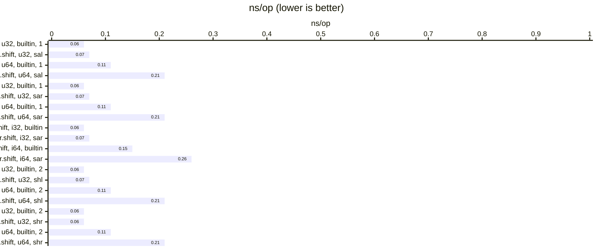

#### WSL-gcc 15.2 (`-O3 -march=native`)

| relative | ns/op |              op/s | err% | total | Compare sal vs builtin << (uint32_t) |
|---------:|------:|------------------:|-----:|------:|:-------------------------------------|
|   100.0% |  0.06 | 16,994,459,679.95 | 0.2% |  1.81 | `builtin << (uint32_t)`              |
|    90.6% |  0.06 | 15,396,342,700.17 | 0.1% |  1.81 | `sal<uint32_t>`                      |

| relative | ns/op |             op/s | err% | total | Compare sal vs builtin << (uint64_t) |
|---------:|------:|-----------------:|-----:|------:|:-------------------------------------|
|   100.0% |  0.11 | 8,910,644,096.84 | 0.1% |  2.67 | `builtin << (uint64_t)`              |
|    54.0% |  0.21 | 4,811,314,337.95 | 0.1% |  4.95 | `sal<uint64_t>`                      |

| relative | ns/op |              op/s | err% | total | Compare sar vs builtin >> (uint32_t) |
|---------:|------:|------------------:|-----:|------:|:-------------------------------------|
|   100.0% |  0.06 | 16,994,350,985.52 | 0.3% |  1.82 | `builtin >> (uint32_t)`              |
|    90.7% |  0.06 | 15,406,205,863.73 | 0.1% |  1.82 | `sar<uint32_t>`                      |

| relative | ns/op |             op/s | err% | total | Compare sar vs builtin >> (uint64_t) |
|---------:|------:|-----------------:|-----:|------:|:-------------------------------------|
|   100.0% |  0.11 | 8,842,699,246.61 | 0.2% |  2.69 | `builtin >> (uint64_t)`              |
|    53.8% |  0.21 | 4,758,383,129.63 | 0.1% |  5.00 | `sar<uint64_t>`                      |

| relative | ns/op |              op/s | err% | total | Compare sar vs builtin >> (int32_t) |
|---------:|------:|------------------:|-----:|------:|:------------------------------------|
|   100.0% |  0.06 | 17,308,986,166.06 | 0.2% |  1.81 | `builtin >> (int32_t)`              |
|    89.2% |  0.06 | 15,434,114,205.55 | 0.2% |  1.82 | `sar<int32_t>`                      |

| relative | ns/op |             op/s | err% | total | Compare sar vs builtin >> (int64_t) |
|---------:|------:|-----------------:|-----:|------:|:------------------------------------|
|   100.0% |  0.15 | 6,640,997,090.41 | 0.1% |  3.59 | `builtin >> (int64_t)`              |
|    58.4% |  0.26 | 3,876,288,518.26 | 0.2% |  6.14 | `sar<int64_t>`                      |

| relative | ns/op |              op/s | err% | total | Compare shl vs builtin << (uint32_t) |
|---------:|------:|------------------:|-----:|------:|:-------------------------------------|
|   100.0% |  0.06 | 17,579,662,795.00 | 0.3% |  1.82 | `builtin << (uint32_t)`              |
|    88.9% |  0.06 | 15,620,147,142.05 | 0.3% |  1.82 | `shl<uint32_t>`                      |

| relative | ns/op |             op/s | err% | total | Compare shl vs builtin << (uint64_t) |
|---------:|------:|-----------------:|-----:|------:|:-------------------------------------|
|   100.0% |  0.11 | 8,735,583,260.04 | 0.2% |  2.72 | `builtin << (uint64_t)`              |
|    54.2% |  0.21 | 4,735,084,023.54 | 0.2% |  5.08 | `shl<uint64_t>`                      |

| relative | ns/op |              op/s | err% | total | Compare shr vs builtin >> (uint32_t) |
|---------:|------:|------------------:|-----:|------:|:-------------------------------------|
|   100.0% |  0.06 | 17,577,195,425.64 | 0.4% |  1.82 | `builtin >> (uint32_t)`              |
|    88.0% |  0.06 | 15,476,006,579.12 | 0.7% |  1.79 | `shr<uint32_t>`                      |

| relative | ns/op |             op/s | err% | total | Compare shr vs builtin >> (uint64_t) |
|---------:|------:|-----------------:|-----:|------:|:-------------------------------------|
|   100.0% |  0.11 | 8,855,206,524.92 | 0.1% |  2.69 | `builtin >> (uint64_t)`              |
|    53.9% |  0.21 | 4,769,563,344.02 | 0.2% |  5.00 | `shr<uint64_t>`                      |

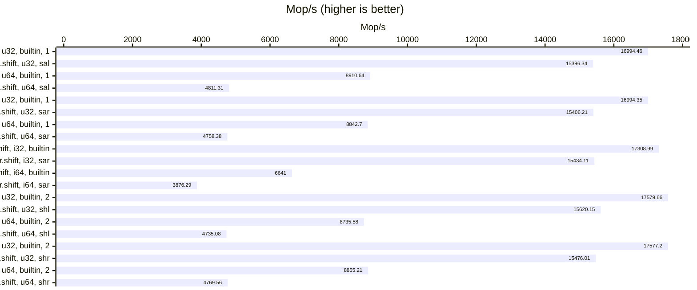

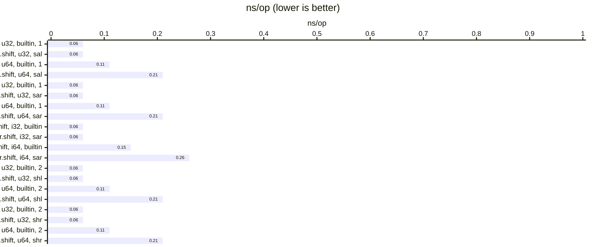

#### WSL-clang 16.0.6 (`-O3 -march=native`)

| relative | ns/op |              op/s | err% | total | Compare sal vs builtin << (uint32_t) |
|---------:|------:|------------------:|-----:|------:|:-------------------------------------|
|   100.0% |  0.06 | 17,243,391,597.01 | 0.4% |  1.80 | `builtin << (uint32_t)`              |
|    92.2% |  0.06 | 15,903,711,743.47 | 0.2% |  1.81 | `sal<uint32_t>`                      |

| relative | ns/op |              op/s | err% | total | Compare sal vs builtin << (uint64_t) |
|---------:|------:|------------------:|-----:|------:|:-------------------------------------|
|   100.0% |  0.09 | 11,525,804,738.07 | 0.1% |  2.07 | `builtin << (uint64_t)`              |
|    55.1% |  0.16 |  6,350,010,111.35 | 0.2% |  3.75 | `sal<uint64_t>`                      |

| relative | ns/op |              op/s | err% | total | Compare sar vs builtin >> (uint32_t) |
|---------:|------:|------------------:|-----:|------:|:-------------------------------------|
|   100.0% |  0.06 | 17,331,675,501.91 | 0.1% |  1.81 | `builtin >> (uint32_t)`              |
|    91.7% |  0.06 | 15,893,088,352.46 | 0.1% |  1.82 | `sar<uint32_t>`                      |

| relative | ns/op |              op/s | err% | total | Compare sar vs builtin >> (uint64_t) |
|---------:|------:|------------------:|-----:|------:|:-------------------------------------|
|   100.0% |  0.09 | 11,562,979,006.97 | 0.2% |  2.06 | `builtin >> (uint64_t)`              |
|    55.0% |  0.16 |  6,361,210,002.00 | 0.6% |  3.74 | `sar<uint64_t>`                      |

| relative | ns/op |              op/s | err% | total | Compare sar vs builtin >> (int32_t) |
|---------:|------:|------------------:|-----:|------:|:------------------------------------|
|   100.0% |  0.07 | 15,127,633,962.70 | 0.1% |  1.82 | `builtin >> (int32_t)`              |
|   112.1% |  0.06 | 16,955,222,580.88 | 0.3% |  1.83 | `sar<int32_t>`                      |

| relative | ns/op |             op/s | err% | total | Compare sar vs builtin >> (int64_t) |
|---------:|------:|-----------------:|-----:|------:|:------------------------------------|
|   100.0% |  0.11 | 9,462,789,405.60 | 0.1% |  2.52 | `builtin >> (int64_t)`              |
|    72.7% |  0.15 | 6,881,273,929.85 | 0.3% |  3.46 | `sar<int64_t>`                      |

| relative | ns/op |              op/s | err% | total | Compare shl vs builtin << (uint32_t) |
|---------:|------:|------------------:|-----:|------:|:-------------------------------------|
|   100.0% |  0.06 | 18,005,171,920.74 | 0.2% |  1.81 | `builtin << (uint32_t)`              |
|    93.8% |  0.06 | 16,889,122,294.12 | 0.1% |  1.81 | `shl<uint32_t>`                      |

| relative | ns/op |              op/s | err% | total | Compare shl vs builtin << (uint64_t) |
|---------:|------:|------------------:|-----:|------:|:-------------------------------------|
|   100.0% |  0.09 | 11,736,466,136.26 | 0.2% |  2.04 | `builtin << (uint64_t)`              |
|    54.2% |  0.16 |  6,358,564,831.52 | 0.1% |  3.74 | `shl<uint64_t>`                      |

| relative | ns/op |              op/s | err% | total | Compare shr vs builtin >> (uint32_t) |
|---------:|------:|------------------:|-----:|------:|:-------------------------------------|
|   100.0% |  0.06 | 18,075,521,013.56 | 0.1% |  1.82 | `builtin >> (uint32_t)`              |
|    93.9% |  0.06 | 16,973,795,285.49 | 0.2% |  1.81 | `shr<uint32_t>`                      |

| relative | ns/op |              op/s | err% | total | Compare shr vs builtin >> (uint64_t) |
|---------:|------:|------------------:|-----:|------:|:-------------------------------------|
|   100.0% |  0.08 | 11,808,008,033.37 | 0.0% |  2.01 | `builtin >> (uint64_t)`              |
|    54.7% |  0.15 |  6,456,068,152.36 | 0.1% |  3.69 | `shr<uint64_t>`                      |

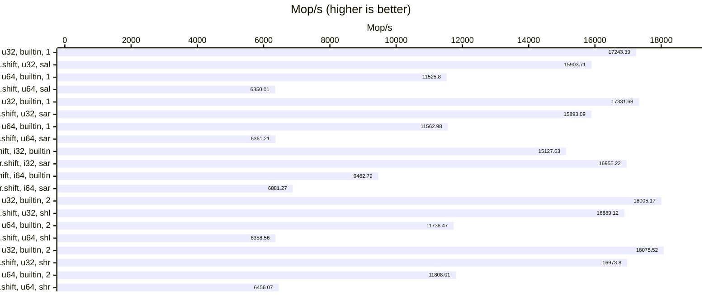

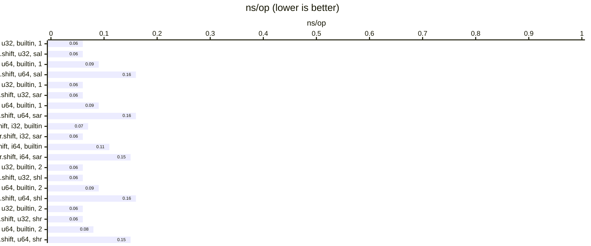

#### WSL-clang 17.0.6 (`-O3 -march=native`)

| relative | ns/op |              op/s | err% | total | Compare sal vs builtin << (uint32_t) |
|---------:|------:|------------------:|-----:|------:|:-------------------------------------|
|   100.0% |  0.06 | 17,311,841,152.93 | 0.1% |  1.81 | `builtin << (uint32_t)`              |
|    91.5% |  0.06 | 15,847,226,825.81 | 0.1% |  1.82 | `sal<uint32_t>`                      |

| relative | ns/op |              op/s | err% | total | Compare sal vs builtin << (uint64_t) |
|---------:|------:|------------------:|-----:|------:|:-------------------------------------|
|   100.0% |  0.09 | 11,429,623,219.48 | 0.1% |  2.08 | `builtin << (uint64_t)`              |
|    56.1% |  0.16 |  6,412,591,755.73 | 0.5% |  3.71 | `sal<uint64_t>`                      |

| relative | ns/op |              op/s | err% | total | Compare sar vs builtin >> (uint32_t) |
|---------:|------:|------------------:|-----:|------:|:-------------------------------------|
|   100.0% |  0.06 | 17,356,886,932.48 | 0.4% |  1.81 | `builtin >> (uint32_t)`              |
|    87.3% |  0.07 | 15,147,127,626.41 | 0.1% |  1.82 | `sar<uint32_t>`                      |

| relative | ns/op |              op/s | err% | total | Compare sar vs builtin >> (uint64_t) |
|---------:|------:|------------------:|-----:|------:|:-------------------------------------|
|   100.0% |  0.09 | 11,569,568,157.37 | 0.1% |  2.07 | `builtin >> (uint64_t)`              |
|    55.8% |  0.15 |  6,452,767,050.41 | 0.1% |  3.69 | `sar<uint64_t>`                      |

| relative | ns/op |              op/s | err% | total | Compare sar vs builtin >> (int32_t) |
|---------:|------:|------------------:|-----:|------:|:------------------------------------|
|   100.0% |  0.06 | 17,496,942,794.70 | 0.1% |  1.82 | `builtin >> (int32_t)`              |
|    99.3% |  0.06 | 17,370,251,565.93 | 0.1% |  1.81 | `sar<int32_t>`                      |

| relative | ns/op |             op/s | err% | total | Compare sar vs builtin >> (int64_t) |
|---------:|------:|-----------------:|-----:|------:|:------------------------------------|
|   100.0% |  0.10 | 9,532,870,658.03 | 0.1% |  2.50 | `builtin >> (int64_t)`              |
|    77.6% |  0.14 | 7,402,199,293.65 | 0.1% |  3.22 | `sar<int64_t>`                      |

| relative | ns/op |              op/s | err% | total | Compare shl vs builtin << (uint32_t) |
|---------:|------:|------------------:|-----:|------:|:-------------------------------------|
|   100.0% |  0.06 | 18,077,914,713.98 | 0.1% |  1.82 | `builtin << (uint32_t)`              |
|    93.0% |  0.06 | 16,815,159,462.95 | 0.2% |  1.82 | `shl<uint32_t>`                      |

| relative | ns/op |              op/s | err% | total | Compare shl vs builtin << (uint64_t) |
|---------:|------:|------------------:|-----:|------:|:-------------------------------------|
|   100.0% |  0.09 | 11,679,915,817.87 | 0.1% |  2.04 | `builtin << (uint64_t)`              |
|    54.5% |  0.16 |  6,368,131,765.27 | 0.1% |  3.74 | `shl<uint64_t>`                      |

| relative | ns/op |              op/s | err% | total | Compare shr vs builtin >> (uint32_t) |
|---------:|------:|------------------:|-----:|------:|:-------------------------------------|
|   100.0% |  0.06 | 18,063,553,960.97 | 0.1% |  1.82 | `builtin >> (uint32_t)`              |
|    93.6% |  0.06 | 16,913,381,302.89 | 0.1% |  1.82 | `shr<uint32_t>`                      |

| relative | ns/op |              op/s | err% | total | Compare shr vs builtin >> (uint64_t) |
|---------:|------:|------------------:|-----:|------:|:-------------------------------------|
|   100.0% |  0.08 | 11,771,214,324.70 | 0.1% |  2.02 | `builtin >> (uint64_t)`              |
|    54.3% |  0.16 |  6,391,300,517.80 | 0.1% |  3.73 | `shr<uint64_t>`                      |

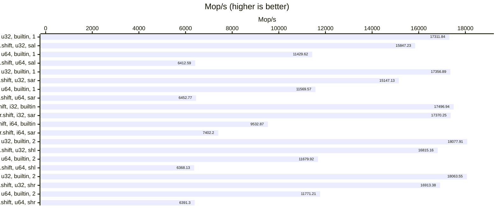

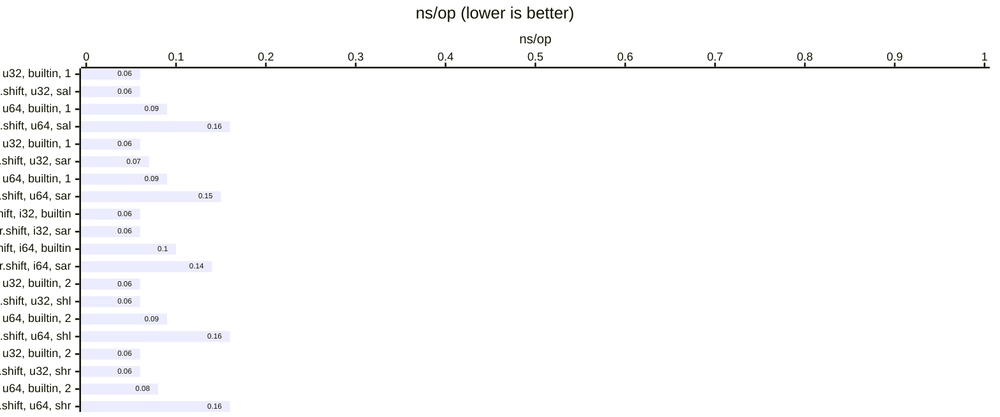

#### WSL-clang 18.1.3 (`-O3 -march=native`)

| relative | ns/op |              op/s | err% | total | Compare sal vs builtin << (uint32_t) |
|---------:|------:|------------------:|-----:|------:|:-------------------------------------|
|   100.0% |  0.06 | 17,099,440,367.44 | 0.2% |  1.81 | `builtin << (uint32_t)`              |
|    88.3% |  0.07 | 15,103,956,767.99 | 0.1% |  1.81 | `sal<uint32_t>`                      |

| relative | ns/op |              op/s | err% | total | Compare sal vs builtin << (uint64_t) |
|---------:|------:|------------------:|-----:|------:|:-------------------------------------|
|   100.0% |  0.09 | 10,576,086,565.45 | 0.3% |  2.25 | `builtin << (uint64_t)`              |
|    60.1% |  0.16 |  6,361,216,541.73 | 0.1% |  3.74 | `sal<uint64_t>`                      |

| relative | ns/op |              op/s | err% | total | Compare sar vs builtin >> (uint32_t) |
|---------:|------:|------------------:|-----:|------:|:-------------------------------------|
|   100.0% |  0.06 | 17,154,499,865.66 | 0.1% |  1.81 | `builtin >> (uint32_t)`              |
|    90.6% |  0.06 | 15,534,185,749.97 | 0.2% |  1.82 | `sar<uint32_t>`                      |

| relative | ns/op |              op/s | err% | total | Compare sar vs builtin >> (uint64_t) |
|---------:|------:|------------------:|-----:|------:|:-------------------------------------|
|   100.0% |  0.09 | 11,346,291,852.31 | 0.2% |  2.10 | `builtin >> (uint64_t)`              |
|    56.1% |  0.16 |  6,365,262,428.73 | 0.1% |  3.74 | `sar<uint64_t>`                      |

| relative | ns/op |              op/s | err% | total | Compare sar vs builtin >> (int32_t) |
|---------:|------:|------------------:|-----:|------:|:------------------------------------|
|   100.0% |  0.06 | 17,380,851,280.34 | 0.0% |  1.82 | `builtin >> (int32_t)`              |
|    99.7% |  0.06 | 17,325,724,304.32 | 0.1% |  1.82 | `sar<int32_t>`                      |

| relative | ns/op |             op/s | err% | total | Compare sar vs builtin >> (int64_t) |
|---------:|------:|-----------------:|-----:|------:|:------------------------------------|
|   100.0% |  0.11 | 9,437,677,530.59 | 0.1% |  2.52 | `builtin >> (int64_t)`              |
|    77.9% |  0.14 | 7,349,399,448.07 | 0.1% |  3.25 | `sar<int64_t>`                      |

| relative | ns/op |              op/s | err% | total | Compare shl vs builtin << (uint32_t) |
|---------:|------:|------------------:|-----:|------:|:-------------------------------------|
|   100.0% |  0.06 | 17,844,339,388.84 | 0.1% |  1.82 | `builtin << (uint32_t)`              |
|    94.4% |  0.06 | 16,853,917,918.29 | 0.4% |  1.82 | `shl<uint32_t>`                      |

| relative | ns/op |              op/s | err% | total | Compare shl vs builtin << (uint64_t) |
|---------:|------:|------------------:|-----:|------:|:-------------------------------------|
|   100.0% |  0.09 | 11,426,009,606.50 | 0.4% |  2.08 | `builtin << (uint64_t)`              |
|    56.3% |  0.16 |  6,435,394,258.79 | 0.3% |  3.70 | `shl<uint64_t>`                      |

| relative | ns/op |              op/s | err% | total | Compare shr vs builtin >> (uint32_t) |
|---------:|------:|------------------:|-----:|------:|:-------------------------------------|
|   100.0% |  0.06 | 17,900,431,145.55 | 0.5% |  1.83 | `builtin >> (uint32_t)`              |
|    95.2% |  0.06 | 17,034,875,464.31 | 0.2% |  1.81 | `shr<uint32_t>`                      |

| relative | ns/op |              op/s | err% | total | Compare shr vs builtin >> (uint64_t) |
|---------:|------:|------------------:|-----:|------:|:-------------------------------------|
|   100.0% |  0.09 | 11,356,751,586.34 | 0.7% |  2.10 | `builtin >> (uint64_t)`              |
|    56.4% |  0.16 |  6,402,617,839.35 | 0.2% |  3.79 | `shr<uint64_t>`                      |

```mermaid
---
config:
    xyChart:
        showDataLabel: true
        width: 1200
    yAxis:
        showLabel: false
        showAxisLine: false
---
xychart-beta horizontal
title "Mop/s (higher is better)"
y-axis "Mop/s" 0 --> 18000
x-axis ["l.shift, u32, builtin, 1", "l.shift, u32, sal", "l.shift, u64, builtin, 1", "l.shift, u64, sal", "r.shift, u32, builtin, 1", "r.shift, u32, sar", "r.shift, u64, builtin, 1", "r.shift, u64, sar", "r.shift, i32, builtin", "r.shift, i32, sar", "r.shift, i64, builtin", "r.shift, i64, sar", "l.shift, u32, builtin, 2", "l.shift, u32, shl", "l.shift, u64, builtin, 2", "l.shift, u64, shl", "r.shift, u32, builtin, 2", "r.shift, u32, shr", "r.shift, u64, builtin, 2", "r.shift, u64, shr"]
bar [17099.44, 15103.96, 10576.09, 6361.22, 17154.50, 15534.19, 11346.29, 6365.26, 17380.85, 17325.72, 9437.68, 7349.40, 17844.34, 16853.92, 11426.01, 6435.39, 17900.43, 17034.88, 11356.75, 6402.62]
```

```mermaid
---
config:
    xyChart:
        showDataLabel: true
        width: 1200
    yAxis:
        showLabel: false
        showAxisLine: false
---
xychart-beta horizontal
title "ns/op (lower is better)"
y-axis "ns/op" 0 --> 1
x-axis ["l.shift, u32, builtin, 1", "l.shift, u32, sal", "l.shift, u64, builtin, 1", "l.shift, u64, sal", "r.shift, u32, builtin, 1", "r.shift, u32, sar", "r.shift, u64, builtin, 1", "r.shift, u64, sar", "r.shift, i32, builtin", "r.shift, i32, sar", "r.shift, i64, builtin", "r.shift, i64, sar", "l.shift, u32, builtin, 2", "l.shift, u32, shl", "l.shift, u64, builtin, 2", "l.shift, u64, shl", "r.shift, u32, builtin, 2", "r.shift, u32, shr", "r.shift, u64, builtin, 2", "r.shift, u64, shr"]
bar [0.06, 0.07, 0.09, 0.16, 0.06, 0.06, 0.09, 0.16, 0.06, 0.06, 0.11, 0.14, 0.06, 0.06, 0.09, 0.16, 0.06, 0.06, 0.09, 0.16]
```

#### WSL-clang 19.1.1 (`-O3 -march=native`)

| relative | ns/op |              op/s | err% | total | Compare sal vs builtin << (uint32_t) |
|---------:|------:|------------------:|-----:|------:|:-------------------------------------|
|   100.0% |  0.06 | 17,533,064,260.61 | 0.1% |  1.81 | `builtin << (uint32_t)`              |
|   100.1% |  0.06 | 17,555,842,183.04 | 0.2% |  1.81 | `sal<uint32_t>`                      |

| relative | ns/op |              op/s | err% | total | Compare sal vs builtin << (uint64_t) |
|---------:|------:|------------------:|-----:|------:|:-------------------------------------|
|   100.0% |  0.09 | 11,584,856,681.83 | 0.1% |  2.06 | `builtin << (uint64_t)`              |
|    53.9% |  0.16 |  6,243,801,173.56 | 0.1% |  3.81 | `sal<uint64_t>`                      |

| relative | ns/op |              op/s | err% | total | Compare sar vs builtin >> (uint32_t) |
|---------:|------:|------------------:|-----:|------:|:-------------------------------------|
|   100.0% |  0.06 | 17,695,119,213.35 | 0.1% |  1.82 | `builtin >> (uint32_t)`              |
|    99.3% |  0.06 | 17,569,552,125.78 | 0.3% |  1.82 | `sar<uint32_t>`                      |

| relative | ns/op |              op/s | err% | total | Compare sar vs builtin >> (uint64_t) |
|---------:|------:|------------------:|-----:|------:|:-------------------------------------|
|   100.0% |  0.09 | 11,644,340,938.00 | 0.1% |  2.04 | `builtin >> (uint64_t)`              |
|    53.7% |  0.16 |  6,250,876,049.91 | 0.2% |  3.81 | `sar<uint64_t>`                      |

| relative | ns/op |              op/s | err% | total | Compare sar vs builtin >> (int32_t) |
|---------:|------:|------------------:|-----:|------:|:------------------------------------|
|   100.0% |  0.06 | 17,766,542,921.72 | 0.1% |  1.82 | `builtin >> (int32_t)`              |
|    99.9% |  0.06 | 17,754,155,297.75 | 0.1% |  1.82 | `sar<int32_t>`                      |

| relative | ns/op |             op/s | err% | total | Compare sar vs builtin >> (int64_t) |
|---------:|------:|-----------------:|-----:|------:|:------------------------------------|
|   100.0% |  0.11 | 9,215,516,940.63 | 0.1% |  2.59 | `builtin >> (int64_t)`              |
|    79.5% |  0.14 | 7,325,479,535.25 | 0.2% |  3.26 | `sar<int64_t>`                      |

| relative | ns/op |              op/s | err% | total | Compare shl vs builtin << (uint32_t) |
|---------:|------:|------------------:|-----:|------:|:-------------------------------------|
|   100.0% |  0.06 | 17,936,421,752.28 | 0.2% |  1.85 | `builtin << (uint32_t)`              |
|    99.9% |  0.06 | 17,924,198,668.90 | 0.1% |  1.82 | `shl<uint32_t>`                      |

| relative | ns/op |              op/s | err% | total | Compare shl vs builtin << (uint64_t) |
|---------:|------:|------------------:|-----:|------:|:-------------------------------------|
|   100.0% |  0.09 | 11,559,782,219.10 | 0.2% |  2.07 | `builtin << (uint64_t)`              |
|    54.0% |  0.16 |  6,238,407,670.59 | 0.1% |  3.81 | `shl<uint64_t>`                      |

| relative | ns/op |              op/s | err% | total | Compare shr vs builtin >> (uint32_t) |
|---------:|------:|------------------:|-----:|------:|:-------------------------------------|
|   100.0% |  0.06 | 17,989,670,173.72 | 0.1% |  1.81 | `builtin >> (uint32_t)`              |
|   100.0% |  0.06 | 17,992,451,215.60 | 0.1% |  1.81 | `shr<uint32_t>`                      |

| relative | ns/op |              op/s | err% | total | Compare shr vs builtin >> (uint64_t) |
|---------:|------:|------------------:|-----:|------:|:-------------------------------------|
|   100.0% |  0.09 | 11,688,180,024.89 | 0.1% |  2.04 | `builtin >> (uint64_t)`              |
|    53.7% |  0.16 |  6,281,457,609.51 | 0.1% |  3.79 | `shr<uint64_t>`                      |

```mermaid
---
config:
    xyChart:
        showDataLabel: true
        width: 1200
    yAxis:
        showLabel: false
        showAxisLine: false
---
xychart-beta horizontal
title "Mop/s (higher is better)"
y-axis "Mop/s" 0 --> 18000
x-axis ["l.shift, u32, builtin, 1", "l.shift, u32, sal", "l.shift, u64, builtin, 1", "l.shift, u64, sal", "r.shift, u32, builtin, 1", "r.shift, u32, sar", "r.shift, u64, builtin, 1", "r.shift, u64, sar", "r.shift, i32, builtin", "r.shift, i32, sar", "r.shift, i64, builtin", "r.shift, i64, sar", "l.shift, u32, builtin, 2", "l.shift, u32, shl", "l.shift, u64, builtin, 2", "l.shift, u64, shl", "r.shift, u32, builtin, 2", "r.shift, u32, shr", "r.shift, u64, builtin, 2", "r.shift, u64, shr"]
bar [17533.06, 17555.84, 11584.86, 6243.80, 17695.12, 17569.55, 11644.34, 6250.88, 17766.54, 17754.16, 9215.52, 7325.48, 17936.42, 17924.20, 11559.78, 6238.41, 17989.67, 17992.45, 11688.18, 6281.46]
```

```mermaid
---
config:
    xyChart:
        showDataLabel: true
        width: 1200
    yAxis:
        showLabel: false
        showAxisLine: false
---
xychart-beta horizontal
title "ns/op (lower is better)"
y-axis "ns/op" 0 --> 1
x-axis ["l.shift, u32, builtin, 1", "l.shift, u32, sal", "l.shift, u64, builtin, 1", "l.shift, u64, sal", "r.shift, u32, builtin, 1", "r.shift, u32, sar", "r.shift, u64, builtin, 1", "r.shift, u64, sar", "r.shift, i32, builtin", "r.shift, i32, sar", "r.shift, i64, builtin", "r.shift, i64, sar", "l.shift, u32, builtin, 2", "l.shift, u32, shl", "l.shift, u64, builtin, 2", "l.shift, u64, shl", "r.shift, u32, builtin, 2", "r.shift, u32, shr", "r.shift, u64, builtin, 2", "r.shift, u64, shr"]
bar [0.06, 0.06, 0.09, 0.16, 0.06, 0.06, 0.09, 0.16, 0.06, 0.06, 0.11, 0.14, 0.06, 0.06, 0.09, 0.16, 0.06, 0.06, 0.09, 0.16]
```

#### WSL-clang 20.1.2 (`-O3 -march=native`)

| relative | ns/op |              op/s | err% | total | Compare sal vs builtin << (uint32_t) |
|---------:|------:|------------------:|-----:|------:|:-------------------------------------|
|   100.0% |  0.06 | 17,125,514,146.00 | 0.2% |  1.82 | `builtin << (uint32_t)`              |
|    99.8% |  0.06 | 17,088,300,840.77 | 0.2% |  1.81 | `sal<uint32_t>`                      |

| relative | ns/op |              op/s | err% | total | Compare sal vs builtin << (uint64_t) |
|---------:|------:|------------------:|-----:|------:|:-------------------------------------|
|   100.0% |  0.09 | 11,479,304,681.14 | 0.3% |  2.08 | `builtin << (uint64_t)`              |
|    53.8% |  0.16 |  6,178,508,593.49 | 0.4% |  3.86 | `sal<uint64_t>`                      |

| relative | ns/op |              op/s | err% | total | Compare sar vs builtin >> (uint32_t) |
|---------:|------:|------------------:|-----:|------:|:-------------------------------------|
|   100.0% |  0.06 | 17,356,199,577.73 | 0.2% |  1.82 | `builtin >> (uint32_t)`              |
|    99.4% |  0.06 | 17,244,362,869.15 | 0.1% |  1.80 | `sar<uint32_t>`                      |

| relative | ns/op |              op/s | err% | total | Compare sar vs builtin >> (uint64_t) |
|---------:|------:|------------------:|-----:|------:|:-------------------------------------|
|   100.0% |  0.09 | 11,636,421,426.51 | 0.2% |  2.07 | `builtin >> (uint64_t)`              |
|    53.7% |  0.16 |  6,246,357,314.38 | 0.1% |  3.81 | `sar<uint64_t>`                      |

| relative | ns/op |              op/s | err% | total | Compare sar vs builtin >> (int32_t) |
|---------:|------:|------------------:|-----:|------:|:------------------------------------|
|   100.0% |  0.06 | 17,731,920,278.36 | 0.2% |  1.82 | `builtin >> (int32_t)`              |
|    99.7% |  0.06 | 17,674,849,781.22 | 0.2% |  1.81 | `sar<int32_t>`                      |

| relative | ns/op |             op/s | err% | total | Compare sar vs builtin >> (int64_t) |
|---------:|------:|-----------------:|-----:|------:|:------------------------------------|
|   100.0% |  0.11 | 9,493,834,663.07 | 0.4% |  2.50 | `builtin >> (int64_t)`              |
|    79.4% |  0.13 | 7,533,569,601.14 | 0.1% |  3.16 | `sar<int64_t>`                      |

| relative | ns/op |              op/s | err% | total | Compare shl vs builtin << (uint32_t) |
|---------:|------:|------------------:|-----:|------:|:-------------------------------------|
|   100.0% |  0.06 | 17,588,936,888.69 | 0.2% |  1.81 | `builtin << (uint32_t)`              |
|   100.1% |  0.06 | 17,614,684,292.26 | 0.2% |  1.82 | `shl<uint32_t>`                      |

| relative | ns/op |              op/s | err% | total | Compare shl vs builtin << (uint64_t) |
|---------:|------:|------------------:|-----:|------:|:-------------------------------------|
|   100.0% |  0.09 | 11,247,224,408.27 | 0.2% |  2.12 | `builtin << (uint64_t)`              |
|    55.0% |  0.16 |  6,189,248,146.31 | 0.3% |  3.84 | `shl<uint64_t>`                      |

| relative | ns/op |              op/s | err% | total | Compare shr vs builtin >> (uint32_t) |
|---------:|------:|------------------:|-----:|------:|:-------------------------------------|
|   100.0% |  0.06 | 17,548,122,557.14 | 0.4% |  1.81 | `builtin >> (uint32_t)`              |
|    99.1% |  0.06 | 17,396,917,383.02 | 1.1% |  1.81 | `shr<uint32_t>`                      |

| relative | ns/op |              op/s | err% | total | Compare shr vs builtin >> (uint64_t) |
|---------:|------:|------------------:|-----:|------:|:-------------------------------------|
|   100.0% |  0.09 | 11,554,685,193.49 | 0.1% |  2.06 | `builtin >> (uint64_t)`              |
|    54.0% |  0.16 |  6,239,000,876.84 | 0.2% |  3.83 | `shr<uint64_t>`                      |

```mermaid
---
config:
    xyChart:
        showDataLabel: true
        width: 1200
    yAxis:
        showLabel: false
        showAxisLine: false
---
xychart-beta horizontal
title "Mop/s (higher is better)"
y-axis "Mop/s" 0 --> 18000
x-axis ["l.shift, u32, builtin, 1", "l.shift, u32, sal", "l.shift, u64, builtin, 1", "l.shift, u64, sal", "r.shift, u32, builtin, 1", "r.shift, u32, sar", "r.shift, u64, builtin, 1", "r.shift, u64, sar", "r.shift, i32, builtin", "r.shift, i32, sar", "r.shift, i64, builtin", "r.shift, i64, sar", "l.shift, u32, builtin, 2", "l.shift, u32, shl", "l.shift, u64, builtin, 2", "l.shift, u64, shl", "r.shift, u32, builtin, 2", "r.shift, u32, shr", "r.shift, u64, builtin, 2", "r.shift, u64, shr"]
bar [17125.51, 17088.30, 11479.30, 6178.51, 17356.20, 17244.36, 11636.42, 6246.36, 17731.92, 17674.85, 9493.83, 7533.57, 17588.94, 17614.68, 11247.22, 6189.25, 17548.12, 17396.92, 11554.69, 6239.00]
```

```mermaid
---
config:
    xyChart:
        showDataLabel: true
        width: 1200
    yAxis:
        showLabel: false
        showAxisLine: false
---
xychart-beta horizontal
title "ns/op (lower is better)"
y-axis "ns/op" 0 --> 1
x-axis ["l.shift, u32, builtin, 1", "l.shift, u32, sal", "l.shift, u64, builtin, 1", "l.shift, u64, sal", "r.shift, u32, builtin, 1", "r.shift, u32, sar", "r.shift, u64, builtin, 1", "r.shift, u64, sar", "r.shift, i32, builtin", "r.shift, i32, sar", "r.shift, i64, builtin", "r.shift, i64, sar", "l.shift, u32, builtin, 2", "l.shift, u32, shl", "l.shift, u64, builtin, 2", "l.shift, u64, shl", "r.shift, u32, builtin, 2", "r.shift, u32, shr", "r.shift, u64, builtin, 2", "r.shift, u64, shr"]
bar [0.06, 0.06, 0.09, 0.16, 0.06, 0.06, 0.09, 0.16, 0.06, 0.06, 0.11, 0.13, 0.06, 0.06, 0.09, 0.16, 0.06, 0.06, 0.09, 0.16]
```

### CI/CD

#### win, x64, vs2022 (MSVC 19.44.35215.0)

| relative | ns/op |             op/s | err% | total | Compare sal vs builtin << (uint32_t) |
|---------:|------:|-----------------:|-----:|------:|:-------------------------------------|
|   100.0% |  0.58 | 1,729,573,157.28 | 0.1% | 13.78 | `builtin << (uint32_t)`              |
|    61.0% |  0.95 | 1,054,977,107.85 | 0.1% | 22.60 | `sal<uint32_t>`                      |

| relative | ns/op |             op/s | err% | total | Compare sal vs builtin << (uint64_t) |
|---------:|------:|-----------------:|-----:|------:|:-------------------------------------|
|   100.0% |  0.59 | 1,696,460,675.74 | 0.2% | 14.60 | `builtin << (uint64_t)`              |
|    76.2% |  0.77 | 1,292,612,644.05 | 2.0% | 18.78 | `sal<uint64_t>`                      |

| relative | ns/op |             op/s | err% | total | Compare sar vs builtin >> (uint32_t) |
|---------:|------:|-----------------:|-----:|------:|:-------------------------------------|
|   100.0% |  0.58 | 1,726,766,499.89 | 0.2% | 13.84 | `builtin >> (uint32_t)`              |
|    85.9% |  0.67 | 1,483,597,729.56 | 0.1% | 16.05 | `sar<uint32_t>`                      |

| relative | ns/op |             op/s | err% | total | Compare sar vs builtin >> (uint64_t) |
|---------:|------:|-----------------:|-----:|------:|:-------------------------------------|
|   100.0% |  0.58 | 1,721,436,904.20 | 0.1% | 13.84 | `builtin >> (uint64_t)`              |
|    76.6% |  0.76 | 1,318,245,154.74 | 0.5% | 18.28 | `sar<uint64_t>`                      |

| relative | ns/op |             op/s | err% | total | Compare sar vs builtin >> (int32_t) |
|---------:|------:|-----------------:|-----:|------:|:------------------------------------|
|   100.0% |  0.59 | 1,706,014,309.24 | 0.3% | 14.10 | `builtin >> (int32_t)`              |
|    61.8% |  0.95 | 1,053,523,182.16 | 0.1% | 22.63 | `sar<int32_t>`                      |

| relative | ns/op |             op/s | err% | total | Compare sar vs builtin >> (int64_t) |
|---------:|------:|-----------------:|-----:|------:|:------------------------------------|
|   100.0% |  0.59 | 1,695,613,855.58 | 0.1% | 14.04 | `builtin >> (int64_t)`              |
|    61.9% |  0.95 | 1,048,842,896.05 | 0.2% | 22.70 | `sar<int64_t>`                      |

| relative | ns/op |             op/s | err% | total | Compare shl vs builtin << (uint32_t) |
|---------:|------:|-----------------:|-----:|------:|:-------------------------------------|
|   100.0% |  0.58 | 1,734,651,874.72 | 0.1% | 13.72 | `builtin << (uint32_t)`              |
|    60.8% |  0.95 | 1,054,091,413.80 | 0.2% | 22.62 | `shl<uint32_t>`                      |

| relative | ns/op |             op/s | err% | total | Compare shl vs builtin << (uint64_t) |
|---------:|------:|-----------------:|-----:|------:|:-------------------------------------|
|   100.0% |  0.59 | 1,687,749,832.46 | 0.4% | 14.11 | `builtin << (uint64_t)`              |
|    77.0% |  0.77 | 1,298,781,370.49 | 1.5% | 18.58 | `shl<uint64_t>`                      |

| relative | ns/op |             op/s | err% | total | Compare shr vs builtin >> (uint32_t) |
|---------:|------:|-----------------:|-----:|------:|:-------------------------------------|
|   100.0% |  0.64 | 1,558,240,930.56 | 2.1% | 15.22 | `builtin >> (uint32_t)`              |
|    88.3% |  0.73 | 1,376,517,784.24 | 4.5% | 17.48 | `shr<uint32_t>`                      |

| relative | ns/op |             op/s | err% | total | Compare shr vs builtin >> (uint64_t) |
|---------:|------:|-----------------:|-----:|------:|:-------------------------------------|
|   100.0% |  0.59 | 1,694,401,557.04 | 0.1% | 14.04 | `builtin >> (uint64_t)`              |
|    77.4% |  0.76 | 1,312,208,048.97 | 0.2% | 18.69 | `shr<uint64_t>`                      |

```mermaid
---
config:
    xyChart:
        showDataLabel: true
        width: 1200
    yAxis:
        showLabel: false
        showAxisLine: false
---
xychart-beta horizontal
    title "Mop/s (higher is better)"
    y-axis "Mop/s" 0 --> 2000
    x-axis ["l.shift, u32, builtin, 1", "l.shift, u32, sal", "l.shift, u64, builtin, 1", "l.shift, u64, sal", "r.shift, u32, builtin, 1", "r.shift, u32, sar", "r.shift, u64, builtin, 1", "r.shift, u64, sar", "r.shift, i32, builtin", "r.shift, i32, sar", "r.shift, i64, builtin", "r.shift, i64, sar", "l.shift, u32, builtin, 2", "l.shift, u32, shl", "l.shift, u64, builtin, 2", "l.shift, u64, shl", "r.shift, u32, builtin, 2", "r.shift, u32, shr", "r.shift, u64, builtin, 2", "r.shift, u64, shr"]
    bar [1729.57, 1054.98, 1696.46, 1292.61, 1726.77, 1483.60, 1721.44, 1318.25, 1706.01, 1053.52, 1695.61, 1048.84, 1734.65, 1054.09, 1687.75, 1298.78, 1558.24, 1376.52, 1694.40, 1312.21]
```

```mermaid
---
config:
    xyChart:
        showDataLabel: true
        width: 1200
    yAxis:
        showLabel: false
        showAxisLine: false
---
xychart-beta horizontal
    title "ns/op (lower is better)"
    y-axis "ns/op" 0 --> 1
    x-axis ["l.shift, u32, builtin, 1", "l.shift, u32, sal", "l.shift, u64, builtin, 1", "l.shift, u64, sal", "r.shift, u32, builtin, 1", "r.shift, u32, sar", "r.shift, u64, builtin, 1", "r.shift, u64, sar", "r.shift, i32, builtin", "r.shift, i32, sar", "r.shift, i64, builtin", "r.shift, i64, sar", "l.shift, u32, builtin, 2", "l.shift, u32, shl", "l.shift, u64, builtin, 2", "l.shift, u64, shl", "r.shift, u32, builtin, 2", "r.shift, u32, shr", "r.shift, u64, builtin, 2", "r.shift, u64, shr"]
    bar [0.58, 0.95, 0.59, 0.77, 0.58, 0.67, 0.58, 0.76, 0.59, 0.95, 0.59, 0.95, 0.58, 0.95, 0.59, 0.77, 0.64, 0.73, 0.59, 0.76]
```

#### macos-13, x64, xcode-15 (AppleClang 15)

| relative | ns/op |             op/s | err% | total | Compare sal vs builtin << (uint32_t) |
|---------:|------:|-----------------:|-----:|------:|:-------------------------------------|
|   100.0% |  0.18 | 5,478,993,252.45 | 1.3% |  4.39 | `builtin << (uint32_t)`              |
|    87.8% |  0.21 | 4,809,787,482.76 | 2.1% |  5.03 | `sal<uint32_t>`                      |

| relative | ns/op |             op/s |  err% | total | Compare sal vs builtin << (uint64_t) |
|---------:|------:|-----------------:|------:|------:|:-------------------------------------|
|   100.0% |  0.32 | 3,150,283,652.84 |  3.8% |  7.15 | `builtin << (uint64_t)`              |
|    81.6% |  0.39 | 2,571,273,895.27 | 13.6% |  9.77 | `sal<uint64_t>`                      |

| relative | ns/op |             op/s |  err% | total | Compare sar vs builtin >> (uint32_t) |
|---------:|------:|-----------------:|------:|------:|:-------------------------------------|
|   100.0% |  0.21 | 4,749,637,175.24 |  4.0% |  5.46 | `builtin >> (uint32_t)`              |
|    67.2% |  0.31 | 3,194,036,949.67 | 11.6% |  7.26 | `sar<uint32_t>`                      |

| relative | ns/op |             op/s |  err% | total | Compare sar vs builtin >> (uint64_t) |
|---------:|------:|-----------------:|------:|------:|:-------------------------------------|
|   100.0% |  0.46 | 2,192,423,508.52 | 15.4% | 11.06 | `builtin >> (uint64_t)`              |
|    94.6% |  0.48 | 2,074,298,908.30 |  6.1% | 10.62 | `sar<uint64_t>`                      |

| relative | ns/op |             op/s | err% | total | Compare sar vs builtin >> (int32_t) |
|---------:|------:|-----------------:|-----:|------:|:------------------------------------|
|   100.0% |  0.22 | 4,635,394,382.76 | 7.0% |  5.64 | `builtin >> (int32_t)`              |
|   116.8% |  0.18 | 5,413,525,869.73 | 7.1% |  4.34 | `sar<int32_t>`                      |

| relative | ns/op |             op/s | err% | total | Compare sar vs builtin >> (int64_t) |
|---------:|------:|-----------------:|-----:|------:|:------------------------------------|
|   100.0% |  0.41 | 2,435,416,378.23 | 8.1% |  9.78 | `builtin >> (int64_t)`              |
|    95.8% |  0.43 | 2,333,699,990.66 | 7.4% | 11.23 | `sar<int64_t>`                      |

| relative | ns/op |             op/s | err% | total | Compare shl vs builtin << (uint32_t) |
|---------:|------:|-----------------:|-----:|------:|:-------------------------------------|
|   100.0% |  0.18 | 5,550,813,923.98 | 9.1% |  4.38 | `builtin << (uint32_t)`              |
|    74.9% |  0.24 | 4,158,405,554.26 | 9.8% |  5.17 | `shl<uint32_t>`                      |

| relative | ns/op |             op/s | err% | total | Compare shl vs builtin << (uint64_t) |
|---------:|------:|-----------------:|-----:|------:|:-------------------------------------|
|   100.0% |  0.33 | 3,023,558,460.81 | 3.7% |  8.08 | `builtin << (uint64_t)`              |
|    72.9% |  0.45 | 2,205,550,488.14 | 9.2% | 10.00 | `shl<uint64_t>`                      |

| relative | ns/op |             op/s | err% | total | Compare shr vs builtin >> (uint32_t) |
|---------:|------:|-----------------:|-----:|------:|:-------------------------------------|
|   100.0% |  0.20 | 5,107,922,862.30 | 5.1% |  4.88 | `builtin >> (uint32_t)`              |
|    78.1% |  0.25 | 3,987,458,922.24 | 7.7% |  6.14 | `shr<uint32_t>`                      |

| relative | ns/op |             op/s | err% | total | Compare shr vs builtin >> (uint64_t) |
|---------:|------:|-----------------:|-----:|------:|:-------------------------------------|
|   100.0% |  0.34 | 2,983,429,286.92 | 3.4% |  7.89 | `builtin >> (uint64_t)`              |
|    81.5% |  0.41 | 2,430,481,207.77 | 6.7% |  8.93 | `shr<uint64_t>`                      |

```mermaid
---
config:
    xyChart:
        showDataLabel: true
        width: 1200
    yAxis:
        showLabel: false
        showAxisLine: false
---
xychart-beta horizontal
title "Mop/s (higher is better)"
y-axis "Mop/s" 0 --> 6000
x-axis ["l.shift, u32, builtin, 1", "l.shift, u32, sal", "l.shift, u64, builtin, 1", "l.shift, u64, sal", "r.shift, u32, builtin, 1", "r.shift, u32, sar", "r.shift, u64, builtin, 1", "r.shift, u64, sar", "r.shift, i32, builtin", "r.shift, i32, sar", "r.shift, i64, builtin", "r.shift, i64, sar", "l.shift, u32, builtin, 2", "l.shift, u32, shl", "l.shift, u64, builtin, 2", "l.shift, u64, shl", "r.shift, u32, builtin, 2", "r.shift, u32, shr", "r.shift, u64, builtin, 2", "r.shift, u64, shr"]
bar [5478.99, 4809.79, 3150.28, 2571.27, 4749.64, 3194.04, 2192.42, 2074.30, 4635.39, 5413.53, 2435.42, 2333.70, 5550.81, 4158.41, 3023.56, 2205.55, 5107.92, 3987.46, 2983.43, 2430.48]
```

```mermaid
---
config:
    xyChart:
        showDataLabel: true
        width: 1200
    yAxis:
        showLabel: false
        showAxisLine: false
---
xychart-beta horizontal
title "ns/op (lower is better)"
y-axis "ns/op" 0 --> 1
x-axis ["l.shift, u32, builtin, 1", "l.shift, u32, sal", "l.shift, u64, builtin, 1", "l.shift, u64, sal", "r.shift, u32, builtin, 1", "r.shift, u32, sar", "r.shift, u64, builtin, 1", "r.shift, u64, sar", "r.shift, i32, builtin", "r.shift, i32, sar", "r.shift, i64, builtin", "r.shift, i64, sar", "l.shift, u32, builtin, 2", "l.shift, u32, shl", "l.shift, u64, builtin, 2", "l.shift, u64, shl", "r.shift, u32, builtin, 2", "r.shift, u32, shr", "r.shift, u64, builtin, 2", "r.shift, u64, shr"]
bar [0.18, 0.21, 0.32, 0.39, 0.21, 0.31, 0.46, 0.48, 0.22, 0.18, 0.41, 0.43, 0.18, 0.24, 0.33, 0.45, 0.20, 0.25, 0.34, 0.41]
```

#### macos-14, aarch64, xcode-15 (AppleClang 15)

| relative | ns/op |             op/s | err% | total | Compare sal vs builtin << (uint32_t) |
|---------:|------:|-----------------:|-----:|------:|:-------------------------------------|
|   100.0% |  0.11 | 9,465,073,079.55 | 1.1% |  2.66 | `builtin << (uint32_t)`              |
|    88.8% |  0.12 | 8,402,949,342.06 | 2.6% |  2.86 | `sal<uint32_t>`                      |

| relative | ns/op |             op/s | err% | total | Compare sal vs builtin << (uint64_t) |
|---------:|------:|-----------------:|-----:|------:|:-------------------------------------|
|   100.0% |  0.16 | 6,074,359,404.13 | 8.7% |  4.16 | `builtin << (uint64_t)`              |
|    76.9% |  0.21 | 4,671,655,266.86 | 0.7% |  5.11 | `sal<uint64_t>`                      |

| relative | ns/op |             op/s | err% | total | Compare sar vs builtin >> (uint32_t) |
|---------:|------:|-----------------:|-----:|------:|:-------------------------------------|
|   100.0% |  0.10 | 9,680,241,584.24 | 0.4% |  2.45 | `builtin >> (uint32_t)`              |
|    94.8% |  0.11 | 9,179,477,722.00 | 2.6% |  2.61 | `sar<uint32_t>`                      |

| relative | ns/op |             op/s | err% | total | Compare sar vs builtin >> (uint64_t) |
|---------:|------:|-----------------:|-----:|------:|:-------------------------------------|
|   100.0% |  0.15 | 6,678,942,364.78 | 1.3% |  3.59 | `builtin >> (uint64_t)`              |
|    61.7% |  0.24 | 4,124,123,546.69 | 1.9% |  5.75 | `sar<uint64_t>`                      |

| relative | ns/op |              op/s | err% | total | Compare sar vs builtin >> (int32_t) |
|---------:|------:|------------------:|-----:|------:|:------------------------------------|
|   100.0% |  0.10 | 10,306,567,333.94 | 0.8% |  2.33 | `builtin >> (int32_t)`              |
|    96.1% |  0.10 |  9,906,101,149.25 | 0.5% |  2.41 | `sar<int32_t>`                      |

| relative | ns/op |             op/s | err% | total | Compare sar vs builtin >> (int64_t) |
|---------:|------:|-----------------:|-----:|------:|:------------------------------------|
|   100.0% |  0.15 | 6,865,008,444.52 | 1.2% |  3.49 | `builtin >> (int64_t)`              |
|    84.8% |  0.17 | 5,820,507,844.48 | 1.1% |  4.09 | `sar<int64_t>`                      |

| relative | ns/op |              op/s | err% | total | Compare shl vs builtin << (uint32_t) |
|---------:|------:|------------------:|-----:|------:|:-------------------------------------|
|   100.0% |  0.10 | 10,452,330,433.94 | 0.2% |  2.30 | `builtin << (uint32_t)`              |
|    93.8% |  0.10 |  9,808,584,374.32 | 1.2% |  2.42 | `shl<uint32_t>`                      |

| relative | ns/op |             op/s | err% | total | Compare shl vs builtin << (uint64_t) |
|---------:|------:|-----------------:|-----:|------:|:-------------------------------------|
|   100.0% |  0.15 | 6,798,775,785.38 | 1.6% |  3.54 | `builtin << (uint64_t)`              |
|    70.9% |  0.21 | 4,823,362,579.82 | 1.2% |  4.93 | `shl<uint64_t>`                      |

| relative | ns/op |              op/s | err% | total | Compare shr vs builtin >> (uint32_t) |
|---------:|------:|------------------:|-----:|------:|:-------------------------------------|
|   100.0% |  0.10 | 10,231,491,272.73 | 1.7% |  2.33 | `builtin >> (uint32_t)`              |
|    90.8% |  0.11 |  9,288,166,754.72 | 0.9% |  2.55 | `shr<uint32_t>`                      |

| relative | ns/op |             op/s | err% | total | Compare shr vs builtin >> (uint64_t) |
|---------:|------:|-----------------:|-----:|------:|:-------------------------------------|
|   100.0% |  0.15 | 6,644,523,813.35 | 1.7% |  3.57 | `builtin >> (uint64_t)`              |
|    61.1% |  0.25 | 4,061,629,843.69 | 1.0% |  5.91 | `shr<uint64_t>`                      |

```mermaid
---
config:
    xyChart:
        showDataLabel: true
        width: 1200
    yAxis:
        showLabel: false
        showAxisLine: false
---
xychart-beta horizontal
title "Mop/s (higher is better)"
y-axis "Mop/s" 0 --> 11000
x-axis ["l.shift, u32, builtin, 1", "l.shift, u32, sal", "l.shift, u64, builtin, 1", "l.shift, u64, sal", "r.shift, u32, builtin, 1", "r.shift, u32, sar", "r.shift, u64, builtin, 1", "r.shift, u64, sar", "r.shift, i32, builtin", "r.shift, i32, sar", "r.shift, i64, builtin", "r.shift, i64, sar", "l.shift, u32, builtin, 2", "l.shift, u32, shl", "l.shift, u64, builtin, 2", "l.shift, u64, shl", "r.shift, u32, builtin, 2", "r.shift, u32, shr", "r.shift, u64, builtin, 2", "r.shift, u64, shr"]
bar [9465.07, 8402.95, 6074.36, 4671.66, 9680.24, 9179.48, 6678.94, 4124.12, 10306.57, 9906.10, 6865.01, 5820.51, 10452.33, 9808.58, 6798.78, 4823.36, 10231.49, 9288.17, 6644.52, 4061.63]
```

```mermaid
---
config:
    xyChart:
        showDataLabel: true
        width: 1200
    yAxis:
        showLabel: false
        showAxisLine: false
---
xychart-beta horizontal
title "ns/op (lower is better)"
y-axis "ns/op" 0 --> 1
x-axis ["l.shift, u32, builtin, 1", "l.shift, u32, sal", "l.shift, u64, builtin, 1", "l.shift, u64, sal", "r.shift, u32, builtin, 1", "r.shift, u32, sar", "r.shift, u64, builtin, 1", "r.shift, u64, sar", "r.shift, i32, builtin", "r.shift, i32, sar", "r.shift, i64, builtin", "r.shift, i64, sar", "l.shift, u32, builtin, 2", "l.shift, u32, shl", "l.shift, u64, builtin, 2", "l.shift, u64, shl", "r.shift, u32, builtin, 2", "r.shift, u32, shr", "r.shift, u64, builtin, 2", "r.shift, u64, shr"]
bar [0.11, 0.12, 0.16, 0.21, 0.10, 0.11, 0.15, 0.24, 0.10, 0.10, 0.15, 0.17, 0.10, 0.10, 0.15, 0.21, 0.10, 0.11, 0.15, 0.25]
```

#### macos-14, aarch64, xcode-15 (AppleClang 15) via Rosetta (x86_64)

| relative | ns/op |             op/s | err% | total | Compare sal vs builtin << (uint32_t) |
|---------:|------:|-----------------:|-----:|------:|:-------------------------------------|
|   100.0% |  0.13 | 7,620,369,108.62 | 5.8% |  3.18 | `builtin << (uint32_t)`              |
|    69.6% |  0.19 | 5,303,434,454.47 | 4.6% |  4.49 | `sal<uint32_t>`                      |

| relative | ns/op |             op/s | err% | total | Compare sal vs builtin << (uint64_t) |
|---------:|------:|-----------------:|-----:|------:|:-------------------------------------|
|   100.0% |  0.70 | 1,431,438,800.68 | 2.7% | 16.73 | `builtin << (uint64_t)`              |
|    77.2% |  0.91 | 1,104,421,864.64 | 1.9% | 21.90 | `sal<uint64_t>`                      |

| relative | ns/op |           op/s | err% | total | Compare sar vs builtin >> (uint32_t) |
|---------:|------:|---------------:|-----:|------:|:-------------------------------------|
|   100.0% |  1.12 | 891,468,139.28 | 1.2% | 27.31 | `builtin >> (uint32_t)`              |
|    93.2% |  1.20 | 831,023,840.85 | 2.6% | 29.11 | `sar<uint32_t>`                      |

| relative | ns/op |             op/s | err% | total | Compare sar vs builtin >> (uint64_t) |
|---------:|------:|-----------------:|-----:|------:|:-------------------------------------|
|   100.0% |  0.80 | 1,256,951,333.30 | 2.2% | 19.01 | `builtin >> (uint64_t)`              |
|    79.7% |  1.00 | 1,001,281,693.89 | 2.2% | 23.96 | `sar<uint64_t>`                      |

| relative | ns/op |           op/s | err% | total | Compare sar vs builtin >> (int32_t) |
|---------:|------:|---------------:|-----:|------:|:------------------------------------|
|   100.0% |  1.15 | 873,301,318.64 | 1.6% | 27.56 | `builtin >> (int32_t)`              |
|    93.2% |  1.23 | 813,637,403.44 | 3.0% | 29.58 | `sar<int32_t>`                      |

| relative | ns/op |             op/s | err% | total | Compare sar vs builtin >> (int64_t) |
|---------:|------:|-----------------:|-----:|------:|:------------------------------------|
|   100.0% |  0.40 | 2,496,779,284.51 | 2.2% |  8.96 | `builtin >> (int64_t)`              |
|    92.1% |  0.43 | 2,299,269,285.77 | 4.0% |  9.65 | `sar<int64_t>`                      |

| relative | ns/op |             op/s | err% | total | Compare shl vs builtin << (uint32_t) |
|---------:|------:|-----------------:|-----:|------:|:-------------------------------------|
|   100.0% |  0.14 | 7,394,077,357.41 | 3.6% |  3.31 | `builtin << (uint32_t)`              |
|    68.7% |  0.20 | 5,082,266,543.97 | 1.4% |  4.74 | `shl<uint32_t>`                      |

| relative | ns/op |             op/s | err% | total | Compare shl vs builtin << (uint64_t) |
|---------:|------:|-----------------:|-----:|------:|:-------------------------------------|
|   100.0% |  0.87 | 1,152,624,109.35 | 4.0% | 20.38 | `builtin << (uint64_t)`              |
|    75.1% |  1.15 |   865,930,197.57 | 4.5% | 27.16 | `shl<uint64_t>`                      |

| relative | ns/op |           op/s | err% | total | Compare shr vs builtin >> (uint32_t) |
|---------:|------:|---------------:|-----:|------:|:-------------------------------------|
|   100.0% |  1.46 | 684,514,852.52 | 3.8% | 34.89 | `builtin >> (uint32_t)`              |
|   100.9% |  1.45 | 690,641,748.04 | 4.1% | 35.16 | `shr<uint32_t>`                      |

| relative | ns/op |             op/s | err% | total | Compare shr vs builtin >> (uint64_t) |
|---------:|------:|-----------------:|-----:|------:|:-------------------------------------|
|   100.0% |  0.88 | 1,139,331,427.93 | 7.9% | 20.89 | `builtin >> (uint64_t)`              |
|    84.1% |  1.04 |   957,631,630.91 | 1.5% | 25.40 | `shr<uint64_t>`                      |

```mermaid
---
config:
    xyChart:
        showDataLabel: true
        width: 1200
    yAxis:
        showLabel: false
        showAxisLine: false
---
xychart-beta horizontal
title "Mop/s (higher is better)"
y-axis "Mop/s" 0 --> 8000
x-axis ["l.shift, u32, builtin, 1", "l.shift, u32, sal", "l.shift, u64, builtin, 1", "l.shift, u64, sal", "r.shift, u32, builtin, 1", "r.shift, u32, sar", "r.shift, u64, builtin, 1", "r.shift, u64, sar", "r.shift, i32, builtin", "r.shift, i32, sar", "r.shift, i64, builtin", "r.shift, i64, sar", "l.shift, u32, builtin, 2", "l.shift, u32, shl", "l.shift, u64, builtin, 2", "l.shift, u64, shl", "r.shift, u32, builtin, 2", "r.shift, u32, shr", "r.shift, u64, builtin, 2", "r.shift, u64, shr"]
bar [7620.37, 5303.43, 1431.44, 1104.42, 891.47, 831.02, 1256.95, 1001.28, 873.30, 813.64, 2496.78, 2299.27, 7394.08, 5082.27, 1152.62, 865.93, 684.51, 690.64, 1139.33, 957.63]
```

```mermaid
---
config:
    xyChart:
        showDataLabel: true
        width: 1200
    yAxis:
        showLabel: false
        showAxisLine: false
---
xychart-beta horizontal
title "ns/op (lower is better)"
y-axis "ns/op" 0 --> 2
x-axis ["l.shift, u32, builtin, 1", "l.shift, u32, sal", "l.shift, u64, builtin, 1", "l.shift, u64, sal", "r.shift, u32, builtin, 1", "r.shift, u32, sar", "r.shift, u64, builtin, 1", "r.shift, u64, sar", "r.shift, i32, builtin", "r.shift, i32, sar", "r.shift, i64, builtin", "r.shift, i64, sar", "l.shift, u32, builtin, 2", "l.shift, u32, shl", "l.shift, u64, builtin, 2", "l.shift, u64, shl", "r.shift, u32, builtin, 2", "r.shift, u32, shr", "r.shift, u64, builtin, 2", "r.shift, u64, shr"]
bar [0.13, 0.19, 0.70, 0.91, 1.12, 1.20, 0.80, 1.00, 1.15, 1.23, 0.40, 0.43, 0.14, 0.20, 0.87, 1.15, 1.46, 1.45, 0.88, 1.04]
```

#### ubuntu-24.04, x64, gcc-11.4

| relative | ns/op |              op/s | err% | total | Compare sal vs builtin << (uint32_t) |
|---------:|------:|------------------:|-----:|------:|:-------------------------------------|
|   100.0% |  0.08 | 12,308,700,310.60 | 0.1% |  1.94 | `builtin << (uint32_t)`              |
|    13.0% |  0.62 |  1,602,033,770.88 | 0.0% | 14.86 | `sal<uint32_t>`                      |

| relative | ns/op |             op/s | err% | total | Compare sal vs builtin << (uint64_t) |
|---------:|------:|-----------------:|-----:|------:|:-------------------------------------|
|   100.0% |  0.16 | 6,219,088,827.77 | 0.5% |  3.86 | `builtin << (uint64_t)`              |
|    24.9% |  0.64 | 1,551,181,677.91 | 0.0% | 15.35 | `sal<uint64_t>`                      |

| relative | ns/op |              op/s | err% | total | Compare sar vs builtin >> (uint32_t) |
|---------:|------:|------------------:|-----:|------:|:-------------------------------------|
|   100.0% |  0.08 | 12,309,720,254.98 | 0.0% |  1.93 | `builtin >> (uint32_t)`              |
|    13.0% |  0.62 |  1,601,760,289.41 | 0.0% | 14.86 | `sar<uint32_t>`                      |

| relative | ns/op |             op/s | err% | total | Compare sar vs builtin >> (uint64_t) |
|---------:|------:|-----------------:|-----:|------:|:-------------------------------------|
|   100.0% |  0.16 | 6,256,001,620.29 | 0.0% |  3.81 | `builtin >> (uint64_t)`              |
|    24.8% |  0.64 | 1,551,187,717.58 | 0.0% | 15.34 | `sar<uint64_t>`                      |

| relative | ns/op |              op/s | err% | total | Compare sar vs builtin >> (int32_t) |
|---------:|------:|------------------:|-----:|------:|:------------------------------------|
|   100.0% |  0.08 | 12,312,078,508.89 | 0.0% |  1.93 | `builtin >> (int32_t)`              |
|    54.5% |  0.15 |  6,708,924,052.29 | 0.0% |  3.55 | `sar<int32_t>`                      |

| relative | ns/op |             op/s | err% | total | Compare sar vs builtin >> (int64_t) |
|---------:|------:|-----------------:|-----:|------:|:------------------------------------|
|   100.0% |  0.32 | 3,119,544,610.96 | 0.1% |  7.00 | `builtin >> (int64_t)`              |
|    51.4% |  0.62 | 1,604,044,604.88 | 0.0% | 14.84 | `sar<int64_t>`                      |

| relative | ns/op |              op/s | err% | total | Compare shl vs builtin << (uint32_t) |
|---------:|------:|------------------:|-----:|------:|:-------------------------------------|
|   100.0% |  0.08 | 12,776,489,844.97 | 0.0% |  1.86 | `builtin << (uint32_t)`              |
|    12.5% |  0.62 |  1,602,420,803.45 | 0.0% | 14.85 | `shl<uint32_t>`                      |

| relative | ns/op |             op/s | err% | total | Compare shl vs builtin << (uint64_t) |
|---------:|------:|-----------------:|-----:|------:|:-------------------------------------|
|   100.0% |  0.16 | 6,225,243,771.09 | 0.1% |  3.82 | `builtin << (uint64_t)`              |
|    24.9% |  0.65 | 1,550,287,232.74 | 0.0% | 15.35 | `shl<uint64_t>`                      |

| relative | ns/op |              op/s | err% | total | Compare shr vs builtin >> (uint32_t) |
|---------:|------:|------------------:|-----:|------:|:-------------------------------------|
|   100.0% |  0.08 | 12,780,357,759.49 | 0.0% |  1.86 | `builtin >> (uint32_t)`              |
|    12.5% |  0.62 |  1,603,505,559.56 | 0.0% | 14.84 | `shr<uint32_t>`                      |

| relative | ns/op |             op/s | err% | total | Compare shr vs builtin >> (uint64_t) |
|---------:|------:|-----------------:|-----:|------:|:-------------------------------------|
|   100.0% |  0.16 | 6,224,625,907.08 | 0.0% |  3.82 | `builtin >> (uint64_t)`              |
|    24.9% |  0.65 | 1,550,120,881.63 | 0.0% | 15.35 | `shr<uint64_t>`                      |

```mermaid
---
config:
    xyChart:
        showDataLabel: true
        width: 1200
    yAxis:
        showLabel: false
        showAxisLine: false
---
xychart-beta horizontal
title "Mop/s (higher is better)"
y-axis "Mop/s" 0 --> 13000
x-axis ["l.shift, u32, builtin, 1", "l.shift, u32, sal", "l.shift, u64, builtin, 1", "l.shift, u64, sal", "r.shift, u32, builtin, 1", "r.shift, u32, sar", "r.shift, u64, builtin, 1", "r.shift, u64, sar", "r.shift, i32, builtin", "r.shift, i32, sar", "r.shift, i64, builtin", "r.shift, i64, sar", "l.shift, u32, builtin, 2", "l.shift, u32, shl", "l.shift, u64, builtin, 2", "l.shift, u64, shl", "r.shift, u32, builtin, 2", "r.shift, u32, shr", "r.shift, u64, builtin, 2", "r.shift, u64, shr"]
bar [12308.70, 1602.03, 6219.09, 1551.18, 12309.72, 1601.76, 6256.00, 1551.19, 12312.08, 6708.92, 3119.54, 1604.04, 12776.49, 1602.42, 6225.24, 1550.29, 12780.36, 1603.51, 6224.63, 1550.12]
```

```mermaid
---
config:
    xyChart:
        showDataLabel: true
        width: 1200
    yAxis:
        showLabel: false
        showAxisLine: false
---
xychart-beta horizontal
title "ns/op (lower is better)"
y-axis "ns/op" 0 --> 1
x-axis ["l.shift, u32, builtin, 1", "l.shift, u32, sal", "l.shift, u64, builtin, 1", "l.shift, u64, sal", "r.shift, u32, builtin, 1", "r.shift, u32, sar", "r.shift, u64, builtin, 1", "r.shift, u64, sar", "r.shift, i32, builtin", "r.shift, i32, sar", "r.shift, i64, builtin", "r.shift, i64, sar", "l.shift, u32, builtin, 2", "l.shift, u32, shl", "l.shift, u64, builtin, 2", "l.shift, u64, shl", "r.shift, u32, builtin, 2", "r.shift, u32, shr", "r.shift, u64, builtin, 2", "r.shift, u64, shr"]
bar [0.08, 0.62, 0.16, 0.64, 0.08, 0.62, 0.16, 0.64, 0.08, 0.15, 0.32, 0.62, 0.08, 0.62, 0.16, 0.65, 0.08, 0.62, 0.16, 0.65]
```

#### ubuntu-24.04, x64, gcc-12.4

| relative | ns/op |              op/s | err% | total | Compare sal vs builtin << (uint32_t) |
|---------:|------:|------------------:|-----:|------:|:-------------------------------------|
|   100.0% |  0.08 | 12,192,548,342.56 | 0.1% |  1.95 | `builtin << (uint32_t)`              |
|    54.4% |  0.15 |  6,636,768,702.72 | 0.1% |  3.59 | `sal<uint32_t>`                      |

| relative | ns/op |             op/s | err% | total | Compare sal vs builtin << (uint64_t) |
|---------:|------:|-----------------:|-----:|------:|:-------------------------------------|
|   100.0% |  0.16 | 6,184,539,336.82 | 0.1% |  3.86 | `builtin << (uint64_t)`              |
|    55.4% |  0.29 | 3,424,438,558.12 | 0.5% |  6.50 | `sal<uint64_t>`                      |

| relative | ns/op |              op/s | err% | total | Compare sar vs builtin >> (uint32_t) |
|---------:|------:|------------------:|-----:|------:|:-------------------------------------|
|   100.0% |  0.09 | 11,639,026,426.82 | 0.1% |  2.05 | `builtin >> (uint32_t)`              |
|    57.0% |  0.15 |  6,633,008,775.80 | 0.1% |  3.59 | `sar<uint32_t>`                      |

| relative | ns/op |             op/s | err% | total | Compare sar vs builtin >> (uint64_t) |
|---------:|------:|-----------------:|-----:|------:|:-------------------------------------|
|   100.0% |  0.16 | 6,152,532,590.88 | 0.5% |  3.90 | `builtin >> (uint64_t)`              |
|    55.6% |  0.29 | 3,422,528,434.77 | 0.5% |  6.95 | `sar<uint64_t>`                      |

| relative | ns/op |              op/s | err% | total | Compare sar vs builtin >> (int32_t) |
|---------:|------:|------------------:|-----:|------:|:------------------------------------|
|   100.0% |  0.08 | 12,249,300,773.13 | 0.1% |  1.94 | `builtin >> (int32_t)`              |
|    54.0% |  0.15 |  6,619,888,960.35 | 0.1% |  3.60 | `sar<int32_t>`                      |

| relative | ns/op |             op/s | err% | total | Compare sar vs builtin >> (int64_t) |
|---------:|------:|-----------------:|-----:|------:|:------------------------------------|
|   100.0% |  0.22 | 4,500,695,786.02 | 0.1% |  5.32 | `builtin >> (int64_t)`              |
|    62.4% |  0.36 | 2,809,901,774.43 | 0.1% |  7.78 | `sar<int64_t>`                      |

| relative | ns/op |              op/s | err% | total | Compare shl vs builtin << (uint32_t) |
|---------:|------:|------------------:|-----:|------:|:-------------------------------------|
|   100.0% |  0.08 | 12,760,531,354.36 | 0.0% |  1.87 | `builtin << (uint32_t)`              |
|    69.4% |  0.11 |  8,860,593,214.98 | 0.1% |  2.69 | `shl<uint32_t>`                      |

| relative | ns/op |             op/s | err% | total | Compare shl vs builtin << (uint64_t) |
|---------:|------:|-----------------:|-----:|------:|:-------------------------------------|
|   100.0% |  0.16 | 6,181,739,355.69 | 0.3% |  3.87 | `builtin << (uint64_t)`              |
|    55.1% |  0.29 | 3,405,878,106.76 | 0.9% |  6.98 | `shl<uint64_t>`                      |

| relative | ns/op |              op/s | err% | total | Compare shr vs builtin >> (uint32_t) |
|---------:|------:|------------------:|-----:|------:|:-------------------------------------|
|   100.0% |  0.08 | 12,714,296,628.67 | 0.1% |  1.87 | `builtin >> (uint32_t)`              |
|    69.3% |  0.11 |  8,812,776,707.17 | 0.2% |  2.71 | `shr<uint32_t>`                      |

| relative | ns/op |             op/s | err% | total | Compare shr vs builtin >> (uint64_t) |
|---------:|------:|-----------------:|-----:|------:|:-------------------------------------|
|   100.0% |  0.16 | 6,187,111,338.97 | 0.1% |  3.86 | `builtin >> (uint64_t)`              |
|    55.6% |  0.29 | 3,437,793,259.65 | 0.2% |  6.96 | `shr<uint64_t>`                      |

```mermaid
---
config:
    xyChart:
        showDataLabel: true
        width: 1200
    yAxis:
        showLabel: false
        showAxisLine: false
---
xychart-beta horizontal
title "Mop/s (higher is better)"
y-axis "Mop/s" 0 --> 13000
x-axis ["l.shift, u32, builtin, 1", "l.shift, u32, sal", "l.shift, u64, builtin, 1", "l.shift, u64, sal", "r.shift, u32, builtin, 1", "r.shift, u32, sar", "r.shift, u64, builtin, 1", "r.shift, u64, sar", "r.shift, i32, builtin", "r.shift, i32, sar", "r.shift, i64, builtin", "r.shift, i64, sar", "l.shift, u32, builtin, 2", "l.shift, u32, shl", "l.shift, u64, builtin, 2", "l.shift, u64, shl", "r.shift, u32, builtin, 2", "r.shift, u32, shr", "r.shift, u64, builtin, 2", "r.shift, u64, shr"]
bar [12192.55, 6636.77, 6184.54, 3424.44, 11639.03, 6633.01, 6152.53, 3422.53, 12249.30, 6619.89, 4500.70, 2809.90, 12760.53, 8860.59, 6181.74, 3405.88, 12714.30, 8812.78, 6187.11, 3437.79]
```

```mermaid
---
config:
    xyChart:
        showDataLabel: true
        width: 1200
    yAxis:
        showLabel: false
        showAxisLine: false
---
xychart-beta horizontal
title "ns/op (lower is better)"
y-axis "ns/op" 0 --> 1
x-axis ["l.shift, u32, builtin, 1", "l.shift, u32, sal", "l.shift, u64, builtin, 1", "l.shift, u64, sal", "r.shift, u32, builtin, 1", "r.shift, u32, sar", "r.shift, u64, builtin, 1", "r.shift, u64, sar", "r.shift, i32, builtin", "r.shift, i32, sar", "r.shift, i64, builtin", "r.shift, i64, sar", "l.shift, u32, builtin, 2", "l.shift, u32, shl", "l.shift, u64, builtin, 2", "l.shift, u64, shl", "r.shift, u32, builtin, 2", "r.shift, u32, shr", "r.shift, u64, builtin, 2", "r.shift, u64, shr"]
bar [0.08, 0.15, 0.16, 0.29, 0.09, 0.15, 0.16, 0.29, 0.08, 0.15, 0.22, 0.36, 0.08, 0.11, 0.16, 0.29, 0.08, 0.11, 0.16, 0.29]
```

#### ubuntu-24.04, x64, gcc-14.2

| relative | ns/op |              op/s | err% | total | Compare sal vs builtin << (uint32_t) |
|---------:|------:|------------------:|-----:|------:|:-------------------------------------|
|   100.0% |  0.08 | 12,225,283,935.17 | 0.1% |  1.95 | `builtin << (uint32_t)`              |
|    91.2% |  0.09 | 11,145,753,836.25 | 0.1% |  2.13 | `sal<uint32_t>`                      |

| relative | ns/op |             op/s | err% | total | Compare sal vs builtin << (uint64_t) |
|---------:|------:|-----------------:|-----:|------:|:-------------------------------------|
|   100.0% |  0.16 | 6,226,461,570.02 | 0.1% |  3.82 | `builtin << (uint64_t)`              |
|    53.7% |  0.30 | 3,345,635,381.38 | 0.1% |  7.11 | `sal<uint64_t>`                      |

| relative | ns/op |              op/s | err% | total | Compare sar vs builtin >> (uint32_t) |
|---------:|------:|------------------:|-----:|------:|:-------------------------------------|
|   100.0% |  0.08 | 12,231,012,475.91 | 0.1% |  1.95 | `builtin >> (uint32_t)`              |
|    91.5% |  0.09 | 11,196,758,813.04 | 0.4% |  2.13 | `sar<uint32_t>`                      |

| relative | ns/op |             op/s | err% | total | Compare sar vs builtin >> (uint64_t) |
|---------:|------:|-----------------:|-----:|------:|:-------------------------------------|
|   100.0% |  0.16 | 6,236,466,249.53 | 0.1% |  3.81 | `builtin >> (uint64_t)`              |
|    53.6% |  0.30 | 3,345,827,403.57 | 0.0% |  7.11 | `sar<uint64_t>`                      |

| relative | ns/op |              op/s | err% | total | Compare sar vs builtin >> (int32_t) |
|---------:|------:|------------------:|-----:|------:|:------------------------------------|
|   100.0% |  0.08 | 11,962,032,911.09 | 0.2% |  1.99 | `builtin >> (int32_t)`              |
|    88.0% |  0.10 | 10,521,959,073.59 | 0.2% |  2.26 | `sar<int32_t>`                      |

| relative | ns/op |             op/s | err% | total | Compare sar vs builtin >> (int64_t) |
|---------:|------:|-----------------:|-----:|------:|:------------------------------------|
|   100.0% |  0.22 | 4,634,357,957.99 | 0.1% |  5.14 | `builtin >> (int64_t)`              |
|    58.4% |  0.37 | 2,707,096,097.93 | 0.0% |  8.07 | `sar<int64_t>`                      |

| relative | ns/op |              op/s | err% | total | Compare shl vs builtin << (uint32_t) |
|---------:|------:|------------------:|-----:|------:|:-------------------------------------|
|   100.0% |  0.08 | 12,754,462,340.27 | 0.0% |  1.87 | `builtin << (uint32_t)`              |
|    90.7% |  0.09 | 11,565,904,246.51 | 0.1% |  2.06 | `shl<uint32_t>`                      |

| relative | ns/op |             op/s | err% | total | Compare shl vs builtin << (uint64_t) |
|---------:|------:|-----------------:|-----:|------:|:-------------------------------------|
|   100.0% |  0.16 | 6,194,408,244.50 | 0.1% |  3.84 | `builtin << (uint64_t)`              |
|    53.7% |  0.30 | 3,326,535,633.71 | 0.0% |  7.15 | `shl<uint64_t>`                      |

| relative | ns/op |              op/s | err% | total | Compare shr vs builtin >> (uint32_t) |
|---------:|------:|------------------:|-----:|------:|:-------------------------------------|
|   100.0% |  0.08 | 12,759,551,990.94 | 0.0% |  1.87 | `builtin >> (uint32_t)`              |
|    90.9% |  0.09 | 11,592,542,296.32 | 0.1% |  2.05 | `shr<uint32_t>`                      |

| relative | ns/op |             op/s | err% | total | Compare shr vs builtin >> (uint64_t) |
|---------:|------:|-----------------:|-----:|------:|:-------------------------------------|
|   100.0% |  0.16 | 6,202,440,743.63 | 0.1% |  3.84 | `builtin >> (uint64_t)`              |
|    53.7% |  0.30 | 3,329,971,328.71 | 0.0% |  7.14 | `shr<uint64_t>`                      |

```mermaid
---
config:
    xyChart:
        showDataLabel: true
        width: 1200
    yAxis:
        showLabel: false
        showAxisLine: false
---
xychart-beta horizontal
title "Mop/s (higher is better)"
y-axis "Mop/s" 0 --> 13000
x-axis ["l.shift, u32, builtin, 1", "l.shift, u32, sal", "l.shift, u64, builtin, 1", "l.shift, u64, sal", "r.shift, u32, builtin, 1", "r.shift, u32, sar", "r.shift, u64, builtin, 1", "r.shift, u64, sar", "r.shift, i32, builtin", "r.shift, i32, sar", "r.shift, i64, builtin", "r.shift, i64, sar", "l.shift, u32, builtin, 2", "l.shift, u32, shl", "l.shift, u64, builtin, 2", "l.shift, u64, shl", "r.shift, u32, builtin, 2", "r.shift, u32, shr", "r.shift, u64, builtin, 2", "r.shift, u64, shr"]
bar [12225.28, 11145.75, 6226.46, 3345.64, 12231.01, 11196.76, 6236.47, 3345.83, 11962.03, 10521.96, 4634.36, 2707.10, 12754.46, 11565.90, 6194.41, 3326.54, 12759.55, 11592.54, 6202.44, 3329.97]
```

```mermaid
---
config:
    xyChart:
        showDataLabel: true
        width: 1200
    yAxis:
        showLabel: false
        showAxisLine: false
---
xychart-beta horizontal
title "ns/op (lower is better)"
y-axis "ns/op" 0 --> 1
x-axis ["l.shift, u32, builtin, 1", "l.shift, u32, sal", "l.shift, u64, builtin, 1", "l.shift, u64, sal", "r.shift, u32, builtin, 1", "r.shift, u32, sar", "r.shift, u64, builtin, 1", "r.shift, u64, sar", "r.shift, i32, builtin", "r.shift, i32, sar", "r.shift, i64, builtin", "r.shift, i64, sar", "l.shift, u32, builtin, 2", "l.shift, u32, shl", "l.shift, u64, builtin, 2", "l.shift, u64, shl", "r.shift, u32, builtin, 2", "r.shift, u32, shr", "r.shift, u64, builtin, 2", "r.shift, u64, shr"]
bar [0.08, 0.09, 0.16, 0.30, 0.08, 0.09, 0.16, 0.30, 0.08, 0.10, 0.22, 0.37, 0.08, 0.09, 0.16, 0.30, 0.08, 0.09, 0.16, 0.30]
```

#### ubuntu-24.04, aarch64, gcc-14.2

| relative | ns/op |             op/s | err% | total | Compare sal vs builtin << (uint32_t) |
|---------:|------:|-----------------:|-----:|------:|:-------------------------------------|
|   100.0% |  0.12 | 8,547,629,636.35 | 0.0% |  2.78 | `builtin << (uint32_t)`              |
|    68.4% |  0.17 | 5,848,400,791.22 | 0.0% |  4.07 | `sal<uint32_t>`                      |

| relative | ns/op |             op/s | err% | total | Compare sal vs builtin << (uint64_t) |
|---------:|------:|-----------------:|-----:|------:|:-------------------------------------|
|   100.0% |  0.21 | 4,812,818,725.05 | 0.0% |  4.94 | `builtin << (uint64_t)`              |
|    51.8% |  0.40 | 2,491,038,962.96 | 0.0% |  8.77 | `sal<uint64_t>`                      |

| relative | ns/op |             op/s | err% | total | Compare sar vs builtin >> (uint32_t) |
|---------:|------:|-----------------:|-----:|------:|:-------------------------------------|
|   100.0% |  0.12 | 8,391,414,818.91 | 0.1% |  2.84 | `builtin >> (uint32_t)`              |
|    69.7% |  0.17 | 5,845,701,883.42 | 0.0% |  4.07 | `sar<uint32_t>`                      |

| relative | ns/op |             op/s | err% | total | Compare sar vs builtin >> (uint64_t) |
|---------:|------:|-----------------:|-----:|------:|:-------------------------------------|
|   100.0% |  0.21 | 4,813,298,588.17 | 0.0% |  4.94 | `builtin >> (uint64_t)`              |
|    56.3% |  0.37 | 2,708,491,436.23 | 0.0% |  8.06 | `sar<uint64_t>`                      |

| relative | ns/op |             op/s | err% | total | Compare sar vs builtin >> (int32_t) |
|---------:|------:|-----------------:|-----:|------:|:------------------------------------|
|   100.0% |  0.12 | 8,390,367,619.80 | 0.0% |  2.84 | `builtin >> (int32_t)`              |
|    53.8% |  0.22 | 4,513,542,688.84 | 0.0% |  5.27 | `sar<int32_t>`                      |

| relative | ns/op |             op/s | err% | total | Compare sar vs builtin >> (int64_t) |
|---------:|------:|-----------------:|-----:|------:|:------------------------------------|
|   100.0% |  0.21 | 4,810,501,665.76 | 0.0% |  4.95 | `builtin >> (int64_t)`              |
|    35.1% |  0.59 | 1,686,205,386.08 | 0.0% | 14.11 | `sar<int64_t>`                      |

| relative | ns/op |             op/s | err% | total | Compare shl vs builtin << (uint32_t) |
|---------:|------:|-----------------:|-----:|------:|:-------------------------------------|
|   100.0% |  0.11 | 8,994,443,167.35 | 0.0% |  2.65 | `builtin << (uint32_t)`              |
|    65.0% |  0.17 | 5,850,773,231.47 | 0.0% |  4.07 | `shl<uint32_t>`                      |

| relative | ns/op |             op/s | err% | total | Compare shl vs builtin << (uint64_t) |
|---------:|------:|-----------------:|-----:|------:|:-------------------------------------|
|   100.0% |  0.21 | 4,821,748,355.09 | 0.0% |  4.94 | `builtin << (uint64_t)`              |
|    51.6% |  0.40 | 2,487,979,278.32 | 0.0% |  8.78 | `shl<uint64_t>`                      |

| relative | ns/op |             op/s | err% | total | Compare shr vs builtin >> (uint32_t) |
|---------:|------:|-----------------:|-----:|------:|:-------------------------------------|
|   100.0% |  0.12 | 8,484,031,309.83 | 0.1% |  2.80 | `builtin >> (uint32_t)`              |
|    69.0% |  0.17 | 5,851,152,756.56 | 0.0% |  4.07 | `shr<uint32_t>`                      |

| relative | ns/op |             op/s | err% | total | Compare shr vs builtin >> (uint64_t) |
|---------:|------:|-----------------:|-----:|------:|:-------------------------------------|
|   100.0% |  0.21 | 4,823,003,396.19 | 0.0% |  4.93 | `builtin >> (uint64_t)`              |
|    51.6% |  0.40 | 2,488,305,919.70 | 0.0% |  8.78 | `shr<uint64_t>`                      |

```mermaid
---
config:
    xyChart:
        showDataLabel: true
        width: 1200
    yAxis:
        showLabel: false
        showAxisLine: false
---
xychart-beta horizontal
title "Mop/s (higher is better)"
y-axis "Mop/s" 0 --> 9000
x-axis ["l.shift, u32, builtin, 1", "l.shift, u32, sal", "l.shift, u64, builtin, 1", "l.shift, u64, sal", "r.shift, u32, builtin, 1", "r.shift, u32, sar", "r.shift, u64, builtin, 1", "r.shift, u64, sar", "r.shift, i32, builtin", "r.shift, i32, sar", "r.shift, i64, builtin", "r.shift, i64, sar", "l.shift, u32, builtin, 2", "l.shift, u32, shl", "l.shift, u64, builtin, 2", "l.shift, u64, shl", "r.shift, u32, builtin, 2", "r.shift, u32, shr", "r.shift, u64, builtin, 2", "r.shift, u64, shr"]
bar [8547.63, 5848.40, 4812.82, 2491.04, 8391.41, 5845.70, 4813.30, 2708.49, 8390.37, 4513.54, 4810.50, 1686.21, 8994.44, 5850.77, 4821.75, 2487.98, 8484.03, 5851.15, 4823.00, 2488.31]
```

```mermaid
---
config:
    xyChart:
        showDataLabel: true
        width: 1200
    yAxis:
        showLabel: false
        showAxisLine: false
---
xychart-beta horizontal
title "ns/op (lower is better)"
y-axis "ns/op" 0 --> 1
x-axis ["l.shift, u32, builtin, 1", "l.shift, u32, sal", "l.shift, u64, builtin, 1", "l.shift, u64, sal", "r.shift, u32, builtin, 1", "r.shift, u32, sar", "r.shift, u64, builtin, 1", "r.shift, u64, sar", "r.shift, i32, builtin", "r.shift, i32, sar", "r.shift, i64, builtin", "r.shift, i64, sar", "l.shift, u32, builtin, 2", "l.shift, u32, shl", "l.shift, u64, builtin, 2", "l.shift, u64, shl", "r.shift, u32, builtin, 2", "r.shift, u32, shr", "r.shift, u64, builtin, 2", "r.shift, u64, shr"]
bar [0.12, 0.17, 0.21, 0.40, 0.12, 0.17, 0.21, 0.37, 0.12, 0.22, 0.21, 0.59, 0.11, 0.17, 0.21, 0.40, 0.12, 0.17, 0.21, 0.40]
```

#### ubuntu-24.04, x64, clang-18.1.3

| relative | ns/op |              op/s | err% | total | Compare sal vs builtin << (uint32_t) |
|---------:|------:|------------------:|-----:|------:|:-------------------------------------|
|   100.0% |  0.08 | 12,187,401,474.39 | 0.2% |  1.95 | `builtin << (uint32_t)`              |
|    93.2% |  0.09 | 11,359,595,159.00 | 0.0% |  2.10 | `sal<uint32_t>`                      |

| relative | ns/op |             op/s | err% | total | Compare sal vs builtin << (uint64_t) |
|---------:|------:|-----------------:|-----:|------:|:-------------------------------------|
|   100.0% |  0.12 | 8,032,149,298.58 | 0.1% |  2.96 | `builtin << (uint64_t)`              |
|    56.4% |  0.22 | 4,530,812,880.60 | 0.1% |  5.25 | `sal<uint64_t>`                      |

| relative | ns/op |              op/s | err% | total | Compare sar vs builtin >> (uint32_t) |
|---------:|------:|------------------:|-----:|------:|:-------------------------------------|
|   100.0% |  0.08 | 12,275,440,111.60 | 0.0% |  1.94 | `builtin >> (uint32_t)`              |
|    93.2% |  0.09 | 11,436,549,716.67 | 0.0% |  2.08 | `sar<uint32_t>`                      |

| relative | ns/op |             op/s | err% | total | Compare sar vs builtin >> (uint64_t) |
|---------:|------:|-----------------:|-----:|------:|:-------------------------------------|
|   100.0% |  0.13 | 7,925,383,606.01 | 0.2% |  3.00 | `builtin >> (uint64_t)`              |
|    57.1% |  0.22 | 4,527,031,739.80 | 0.1% |  5.26 | `sar<uint64_t>`                      |

| relative | ns/op |              op/s | err% | total | Compare sar vs builtin >> (int32_t) |
|---------:|------:|------------------:|-----:|------:|:------------------------------------|
|   100.0% |  0.08 | 12,254,384,506.65 | 0.0% |  1.94 | `builtin >> (int32_t)`              |
|    99.5% |  0.08 | 12,197,023,458.77 | 0.0% |  1.95 | `sar<int32_t>`                      |

| relative | ns/op |             op/s | err% | total | Compare sar vs builtin >> (int64_t) |
|---------:|------:|-----------------:|-----:|------:|:------------------------------------|
|   100.0% |  0.15 | 6,534,904,711.06 | 0.1% |  3.64 | `builtin >> (int64_t)`              |
|    79.4% |  0.19 | 5,186,674,151.11 | 0.1% |  4.59 | `sar<int64_t>`                      |

| relative | ns/op |              op/s | err% | total | Compare shl vs builtin << (uint32_t) |
|---------:|------:|------------------:|-----:|------:|:-------------------------------------|
|   100.0% |  0.08 | 12,777,566,956.56 | 0.0% |  1.87 | `builtin << (uint32_t)`              |
|    96.2% |  0.08 | 12,297,702,527.53 | 0.1% |  1.94 | `shl<uint32_t>`                      |

| relative | ns/op |             op/s | err% | total | Compare shl vs builtin << (uint64_t) |
|---------:|------:|-----------------:|-----:|------:|:-------------------------------------|
|   100.0% |  0.13 | 7,592,201,800.59 | 0.2% |  3.12 | `builtin << (uint64_t)`              |
|    56.8% |  0.23 | 4,311,518,094.70 | 0.1% |  5.58 | `shl<uint64_t>`                      |

| relative | ns/op |              op/s | err% | total | Compare shr vs builtin >> (uint32_t) |
|---------:|------:|------------------:|-----:|------:|:-------------------------------------|
|   100.0% |  0.08 | 12,711,789,401.29 | 0.1% |  1.87 | `builtin >> (uint32_t)`              |
|    95.1% |  0.08 | 12,087,176,613.27 | 0.1% |  1.97 | `shr<uint32_t>`                      |

| relative | ns/op |             op/s | err% | total | Compare shr vs builtin >> (uint64_t) |
|---------:|------:|-----------------:|-----:|------:|:-------------------------------------|
|   100.0% |  0.13 | 7,994,598,917.63 | 0.1% |  2.98 | `builtin >> (uint64_t)`              |
|    52.4% |  0.24 | 4,189,242,399.64 | 0.1% |  5.69 | `shr<uint64_t>`                      |

```mermaid
---
config:
    xyChart:
        showDataLabel: true
        width: 1200
    yAxis:
        showLabel: false
        showAxisLine: false
---
xychart-beta horizontal
title "Mop/s (higher is better)"
y-axis "Mop/s" 0 --> 13000
x-axis ["l.shift, u32, builtin, 1", "l.shift, u32, sal", "l.shift, u64, builtin, 1", "l.shift, u64, sal", "r.shift, u32, builtin, 1", "r.shift, u32, sar", "r.shift, u64, builtin, 1", "r.shift, u64, sar", "r.shift, i32, builtin", "r.shift, i32, sar", "r.shift, i64, builtin", "r.shift, i64, sar", "l.shift, u32, builtin, 2", "l.shift, u32, shl", "l.shift, u64, builtin, 2", "l.shift, u64, shl", "r.shift, u32, builtin, 2", "r.shift, u32, shr", "r.shift, u64, builtin, 2", "r.shift, u64, shr"]
bar [12187.40, 11359.60, 8032.15, 4530.81, 12275.44, 11436.55, 7925.38, 4527.03, 12254.38, 12197.02, 6534.90, 5186.67, 12777.57, 12297.70, 7592.20, 4311.52, 12711.79, 12087.18, 7994.60, 4189.24]
```

```mermaid
---
config:
    xyChart:
        showDataLabel: true
        width: 1200
    yAxis:
        showLabel: false
        showAxisLine: false
---
xychart-beta horizontal
title "ns/op (lower is better)"
y-axis "ns/op" 0 --> 1
x-axis ["l.shift, u32, builtin, 1", "l.shift, u32, sal", "l.shift, u64, builtin, 1", "l.shift, u64, sal", "r.shift, u32, builtin, 1", "r.shift, u32, sar", "r.shift, u64, builtin, 1", "r.shift, u64, sar", "r.shift, i32, builtin", "r.shift, i32, sar", "r.shift, i64, builtin", "r.shift, i64, sar", "l.shift, u32, builtin, 2", "l.shift, u32, shl", "l.shift, u64, builtin, 2", "l.shift, u64, shl", "r.shift, u32, builtin, 2", "r.shift, u32, shr", "r.shift, u64, builtin, 2", "r.shift, u64, shr"]
bar [0.08, 0.09, 0.12, 0.22, 0.08, 0.09, 0.13, 0.22, 0.08, 0.08, 0.15, 0.19, 0.08, 0.08, 0.13, 0.23, 0.08, 0.08, 0.13, 0.24]
```
