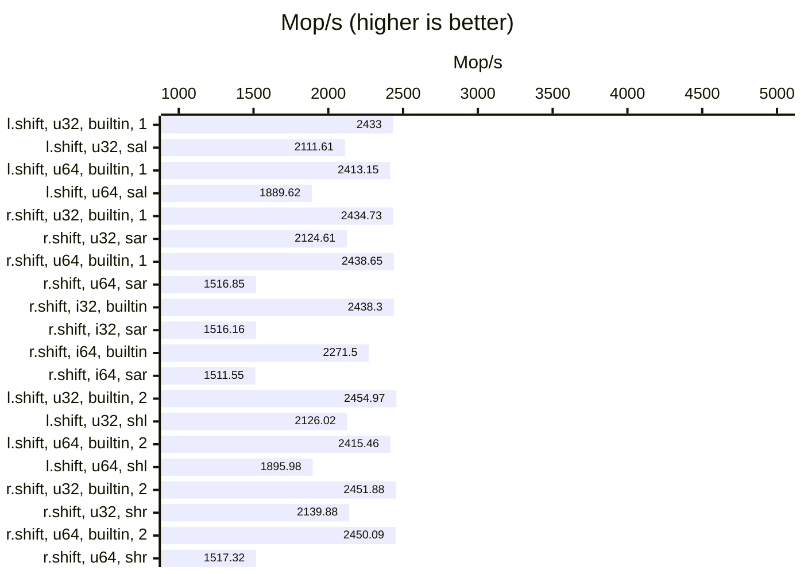
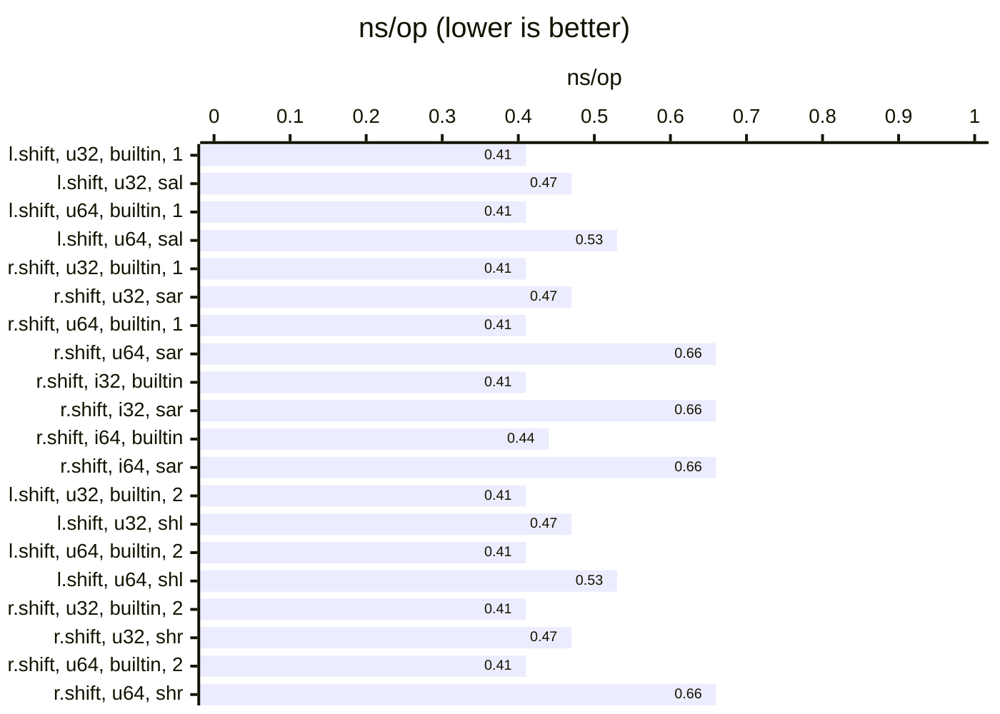
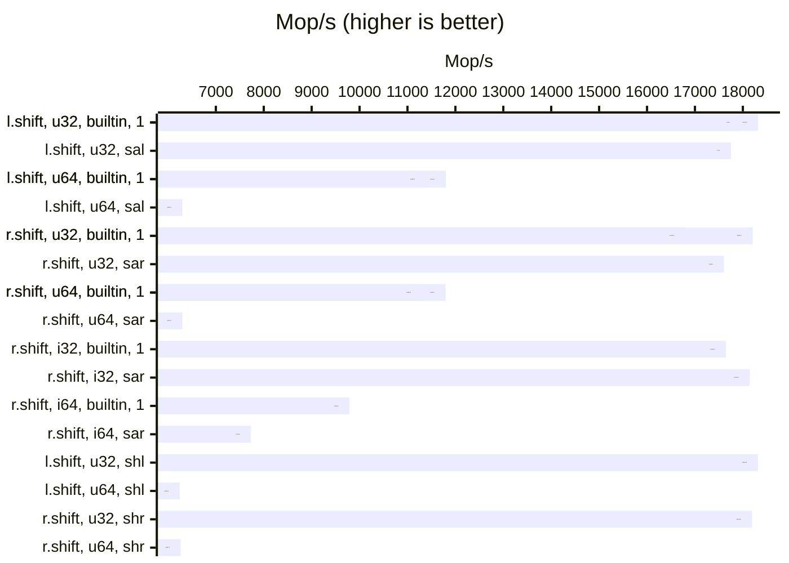
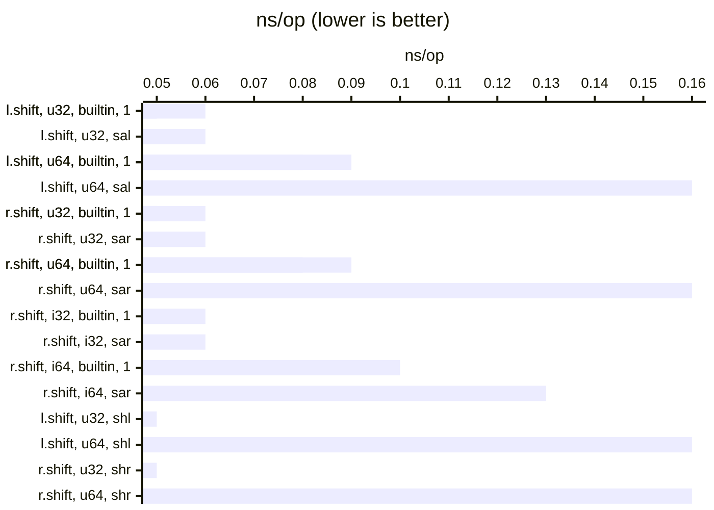
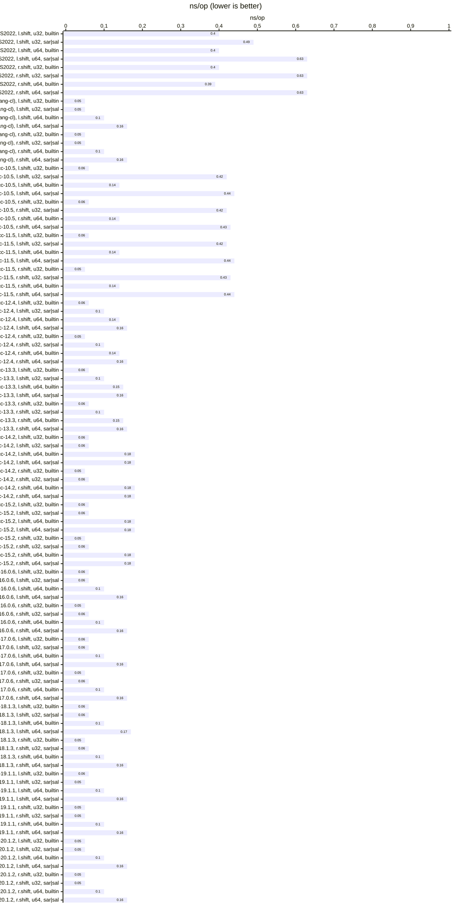

## Benchmarks

### AMD Ryzen 9 5950X 16-Core

#### VS 2022 (`/O2 /arch:AVX2`)

| relative | ns/op |             op/s | err% | total | Compare sal vs builtin << (uint32_t) |
|---------:|------:|-----------------:|-----:|------:|:-------------------------------------|
|   100.0% |  0.41 | 2,432,991,779.38 | 0.1% |  9.06 | `builtin << (uint32_t)`              |
|    86.8% |  0.47 | 2,111,605,877.90 | 0.1% | 11.27 | `sal<uint32_t>`                      |

| relative | ns/op |             op/s | err% | total | Compare sal vs builtin << (uint64_t) |
|---------:|------:|-----------------:|-----:|------:|:-------------------------------------|
|   100.0% |  0.41 | 2,413,145,066.52 | 0.1% |  9.05 | `builtin << (uint64_t)`              |
|    78.3% |  0.53 | 1,889,617,697.16 | 0.1% | 12.59 | `sal<uint64_t>`                      |

| relative | ns/op |             op/s | err% | total | Compare sar vs builtin >> (uint32_t) |
|---------:|------:|-----------------:|-----:|------:|:-------------------------------------|
|   100.0% |  0.41 | 2,434,731,148.68 | 0.1% |  8.97 | `builtin >> (uint32_t)`              |
|    87.3% |  0.47 | 2,124,612,522.42 | 0.0% | 11.21 | `sar<uint32_t>`                      |

| relative | ns/op |             op/s | err% | total | Compare sar vs builtin >> (uint64_t) |
|---------:|------:|-----------------:|-----:|------:|:-------------------------------------|
|   100.0% |  0.41 | 2,438,652,364.67 | 0.2% |  8.97 | `builtin >> (uint64_t)`              |
|    62.2% |  0.66 | 1,516,845,779.38 | 0.0% | 15.69 | `sar<uint64_t>`                      |

| relative | ns/op |             op/s | err% | total | Compare sar vs builtin >> (int32_t) |
|---------:|------:|-----------------:|-----:|------:|:------------------------------------|
|   100.0% |  0.41 | 2,438,291,051.90 | 0.1% |  8.96 | `builtin >> (int32_t)`              |
|    62.2% |  0.66 | 1,516,157,216.54 | 0.1% | 15.71 | `sar<int32_t>`                      |

| relative | ns/op |             op/s | err% | total | Compare sar vs builtin >> (int64_t) |
|---------:|------:|-----------------:|-----:|------:|:------------------------------------|
|   100.0% |  0.44 | 2,271,498,128.00 | 0.0% |  9.61 | `builtin >> (int64_t)`              |
|    66.5% |  0.66 | 1,511,548,314.06 | 0.2% | 15.76 | `sar<int64_t>`                      |

| relative | ns/op |             op/s | err% | total | Compare shl vs builtin << (uint32_t) |
|---------:|------:|-----------------:|-----:|------:|:-------------------------------------|
|   100.0% |  0.41 | 2,454,974,421.21 | 0.0% |  8.90 | `builtin << (uint32_t)`              |
|    86.6% |  0.47 | 2,126,021,271.09 | 0.1% | 11.20 | `shl<uint32_t>`                      |

| relative | ns/op |             op/s | err% | total | Compare shl vs builtin << (uint64_t) |
|---------:|------:|-----------------:|-----:|------:|:-------------------------------------|
|   100.0% |  0.41 | 2,415,458,039.09 | 0.0% |  9.04 | `builtin << (uint64_t)`              |
|    78.5% |  0.53 | 1,895,981,392.22 | 0.2% | 12.54 | `shl<uint64_t>`                      |

| relative | ns/op |             op/s | err% | total | Compare shr vs builtin >> (uint32_t) |
|---------:|------:|-----------------:|-----:|------:|:-------------------------------------|
|   100.0% |  0.41 | 2,451,879,764.51 | 0.0% |  8.91 | `builtin >> (uint32_t)`              |
|    87.3% |  0.47 | 2,139,882,752.72 | 0.2% | 11.12 | `shr<uint32_t>`                      |

| relative | ns/op |             op/s | err% | total | Compare shr vs builtin >> (uint64_t) |
|---------:|------:|-----------------:|-----:|------:|:-------------------------------------|
|   100.0% |  0.41 | 2,450,086,352.83 | 0.0% |  8.92 | `builtin >> (uint64_t)`              |
|    61.9% |  0.66 | 1,517,323,372.72 | 0.0% | 15.69 | `shr<uint64_t>`                      |

### VS 2022 (clang-cl, `/O2 -march=native`)

| relative | ns/op |              op/s | err% | total | Compare sal vs builtin << (uint32_t) |
|---------:|------:|------------------:|-----:|------:|:-------------------------------------|
|   100.0% |  0.06 | 17,955,998,150.00 | 0.1% |  1.80 | `builtin << (uint32_t)`              |
|    98.9% |  0.06 | 17,752,996,669.90 | 0.1% |  1.82 | `sal<uint32_t>`                      |

| relative | ns/op |              op/s | err% | total | Compare sal vs builtin << (uint64_t) |
|---------:|------:|------------------:|-----:|------:|:-------------------------------------|
|   100.0% |  0.08 | 11,801,165,804.83 | 0.1% |  2.02 | `builtin << (uint64_t)`              |
|    53.4% |  0.16 |  6,300,931,020.29 | 0.0% |  3.78 | `sal<uint64_t>`                      |

| relative | ns/op |              op/s | err% | total | Compare sar vs builtin >> (uint32_t) |
|---------:|------:|------------------:|-----:|------:|:-------------------------------------|
|   100.0% |  0.06 | 16,799,323,115.62 | 0.5% |  1.81 | `builtin >> (uint32_t)`              |
|   104.8% |  0.06 | 17,604,804,652.46 | 0.1% |  1.81 | `sar<uint32_t>`                      |

| relative | ns/op |              op/s | err% | total | Compare sar vs builtin >> (uint64_t) |
|---------:|------:|------------------:|-----:|------:|:-------------------------------------|
|   100.0% |  0.08 | 11,796,012,352.21 | 0.1% |  2.02 | `builtin >> (uint64_t)`              |
|    53.4% |  0.16 |  6,301,508,878.77 | 0.1% |  3.78 | `sar<uint64_t>`                      |

| relative | ns/op |              op/s | err% | total | Compare sar vs builtin >> (int32_t) |
|---------:|------:|------------------:|-----:|------:|:------------------------------------|
|   100.0% |  0.06 | 17,649,120,829.06 | 0.1% |  1.81 | `builtin >> (int32_t)`              |
|   102.8% |  0.06 | 18,143,178,004.93 | 0.1% |  1.82 | `sar<int32_t>`                      |

| relative | ns/op |             op/s | err% | total | Compare sar vs builtin >> (int64_t) |
|---------:|------:|-----------------:|-----:|------:|:------------------------------------|
|   100.0% |  0.10 | 9,788,159,897.06 | 0.0% |  2.43 | `builtin >> (int64_t)`              |
|    79.0% |  0.13 | 7,730,263,774.87 | 0.0% |  3.08 | `sar<int64_t>`                      |

| relative | ns/op |              op/s | err% | total | Compare shl vs builtin << (uint32_t) |
|---------:|------:|------------------:|-----:|------:|:-------------------------------------|
|   100.0% |  0.05 | 18,319,645,351.49 | 0.1% |  1.82 | `builtin << (uint32_t)`              |
|   100.0% |  0.05 | 18,316,279,311.77 | 0.1% |  1.82 | `shl<uint32_t>`                      |

| relative | ns/op |              op/s | err% | total | Compare shl vs builtin << (uint64_t) |
|---------:|------:|------------------:|-----:|------:|:-------------------------------------|
|   100.0% |  0.09 | 11,383,350,417.65 | 0.1% |  2.09 | `builtin << (uint64_t)`              |
|    54.9% |  0.16 |  6,246,243,608.04 | 0.1% |  3.81 | `shl<uint64_t>`                      |

| relative | ns/op |              op/s | err% | total | Compare shr vs builtin >> (uint32_t) |
|---------:|------:|------------------:|-----:|------:|:-------------------------------------|
|   100.0% |  0.05 | 18,205,070,840.23 | 0.0% |  1.81 | `builtin >> (uint32_t)`              |
|    99.9% |  0.05 | 18,191,648,662.57 | 0.1% |  1.82 | `shr<uint32_t>`                      |

| relative | ns/op |              op/s | err% | total | Compare shr vs builtin >> (uint64_t) |
|---------:|------:|------------------:|-----:|------:|:-------------------------------------|
|   100.0% |  0.09 | 11,300,875,200.65 | 0.0% |  2.11 | `builtin >> (uint64_t)`              |
|    55.4% |  0.16 |  6,265,789,875.15 | 0.1% |  3.80 | `shr<uint64_t>`                      |

#### WSL-gcc 10.5 (`-O3 -march=native`)

| relative | ns/op |              op/s | err% | total | Compare sal vs builtin << (uint32_t) |
|---------:|------:|------------------:|-----:|------:|:-------------------------------------|
|   100.0% |  0.06 | 18,051,899,425.86 | 0.5% |  1.77 | `builtin << (uint32_t)`              |
|    13.1% |  0.42 |  2,358,705,083.55 | 0.2% |  9.27 | `sal<uint32_t>`                      |

| relative | ns/op |             op/s | err% | total | Compare sal vs builtin << (uint64_t) |
|---------:|------:|-----------------:|-----:|------:|:-------------------------------------|
|   100.0% |  0.14 | 6,923,346,994.70 | 0.6% |  3.47 | `builtin << (uint64_t)`              |
|    33.1% |  0.44 | 2,294,851,172.12 | 0.2% |  9.56 | `sal<uint64_t>`                      |

| relative | ns/op |              op/s | err% | total | Compare sar vs builtin >> (uint32_t) |
|---------:|------:|------------------:|-----:|------:|:-------------------------------------|
|   100.0% |  0.06 | 17,827,498,125.76 | 0.8% |  1.81 | `builtin >> (uint32_t)`              |
|    13.2% |  0.42 |  2,357,617,437.24 | 0.4% |  9.27 | `sar<uint32_t>`                      |

| relative | ns/op |             op/s | err% | total | Compare sar vs builtin >> (uint64_t) |
|---------:|------:|-----------------:|-----:|------:|:-------------------------------------|
|   100.0% |  0.14 | 6,911,629,276.32 | 0.3% |  3.45 | `builtin >> (uint64_t)`              |
|    33.6% |  0.43 | 2,322,896,134.07 | 0.5% |  9.41 | `sar<uint64_t>`                      |

#### WSL-gcc 11.5 (`-O3 -march=native`)

| relative | ns/op |              op/s | err% | total | Compare sal vs builtin << (uint32_t) |
|---------:|------:|------------------:|-----:|------:|:-------------------------------------|
|   100.0% |  0.06 | 17,686,912,494.72 | 1.8% |  1.80 | `builtin << (uint32_t)`              |
|    13.4% |  0.42 |  2,375,449,948.50 | 0.2% |  9.24 | `sal<uint32_t>`                      |

| relative | ns/op |             op/s | err% | total | Compare sal vs builtin << (uint64_t) |
|---------:|------:|-----------------:|-----:|------:|:-------------------------------------|
|   100.0% |  0.14 | 6,932,097,054.55 | 0.1% |  3.44 | `builtin << (uint64_t)`              |
|    33.1% |  0.44 | 2,293,845,890.67 | 0.3% |  9.58 | `sal<uint64_t>`                      |

| relative | ns/op |              op/s | err% | total | Compare sar vs builtin >> (uint32_t) |
|---------:|------:|------------------:|-----:|------:|:-------------------------------------|
|   100.0% |  0.05 | 18,188,314,106.01 | 0.1% |  1.81 | `builtin >> (uint32_t)`              |
|    12.9% |  0.43 |  2,344,019,349.11 | 0.4% |  9.31 | `sar<uint32_t>`                      |

| relative | ns/op |             op/s | err% | total | Compare sar vs builtin >> (uint64_t) |
|---------:|------:|-----------------:|-----:|------:|:-------------------------------------|
|   100.0% |  0.14 | 6,913,661,597.13 | 0.3% |  3.45 | `builtin >> (uint64_t)`              |
|    33.1% |  0.44 | 2,291,681,814.27 | 0.2% |  9.53 | `sar<uint64_t>`                      |

#### WSL-gcc 12.4 (`-O3 -march=native`)

| relative | ns/op |              op/s | err% | total | Compare sal vs builtin << (uint32_t) |
|---------:|------:|------------------:|-----:|------:|:-------------------------------------|
|   100.0% |  0.06 | 16,883,661,443.09 | 0.5% |  1.79 | `builtin << (uint32_t)`              |
|    58.1% |  0.10 |  9,815,879,630.47 | 0.1% |  2.42 | `sal<uint32_t>`                      |

| relative | ns/op |             op/s | err% | total | Compare sal vs builtin << (uint64_t) |
|---------:|------:|-----------------:|-----:|------:|:-------------------------------------|
|   100.0% |  0.14 | 6,913,913,973.44 | 0.1% |  3.44 | `builtin << (uint64_t)`              |
|    91.9% |  0.16 | 6,350,831,366.19 | 0.0% |  3.75 | `sal<uint64_t>`                      |

| relative | ns/op |              op/s | err% | total | Compare sar vs builtin >> (uint32_t) |
|---------:|------:|------------------:|-----:|------:|:-------------------------------------|
|   100.0% |  0.05 | 18,189,934,517.19 | 0.1% |  1.81 | `builtin >> (uint32_t)`              |
|    54.2% |  0.10 |  9,855,648,835.82 | 0.1% |  2.42 | `sar<uint32_t>`                      |

| relative | ns/op |             op/s | err% | total | Compare sar vs builtin >> (uint64_t) |
|---------:|------:|-----------------:|-----:|------:|:-------------------------------------|
|   100.0% |  0.14 | 6,986,779,650.66 | 0.1% |  3.41 | `builtin >> (uint64_t)`              |
|    89.7% |  0.16 | 6,267,384,812.92 | 0.1% |  3.80 | `sar<uint64_t>`                      |

#### WSL-gcc 13.3 (`-O3 -march=native`)

| relative | ns/op |              op/s | err% | total | Compare sal vs builtin << (uint32_t) |
|---------:|------:|------------------:|-----:|------:|:-------------------------------------|
|   100.0% |  0.06 | 16,421,992,475.14 | 2.1% |  1.76 | `builtin << (uint32_t)`              |
|    59.5% |  0.10 |  9,777,136,864.31 | 0.2% |  2.44 | `sal<uint32_t>`                      |

| relative | ns/op |             op/s | err% | total | Compare sal vs builtin << (uint64_t) |
|---------:|------:|-----------------:|-----:|------:|:-------------------------------------|
|   100.0% |  0.15 | 6,836,719,531.38 | 0.2% |  3.48 | `builtin << (uint64_t)`              |
|    90.8% |  0.16 | 6,210,853,739.28 | 0.3% |  3.83 | `sal<uint64_t>`                      |

| relative | ns/op |              op/s | err% | total | Compare sar vs builtin >> (uint32_t) |
|---------:|------:|------------------:|-----:|------:|:-------------------------------------|
|   100.0% |  0.06 | 18,016,123,661.40 | 0.1% |  1.81 | `builtin >> (uint32_t)`              |
|    54.5% |  0.10 |  9,812,969,408.55 | 0.2% |  2.42 | `sar<uint32_t>`                      |

| relative | ns/op |             op/s | err% | total | Compare sar vs builtin >> (uint64_t) |
|---------:|------:|-----------------:|-----:|------:|:-------------------------------------|
|   100.0% |  0.15 | 6,814,335,876.88 | 0.1% |  3.49 | `builtin >> (uint64_t)`              |
|    92.1% |  0.16 | 6,272,899,066.54 | 0.2% |  3.80 | `sar<uint64_t>`                      |

#### WSL-gcc 14.2 (`-O3 -march=native`)

| relative | ns/op |              op/s | err% | total | Compare sal vs builtin << (uint32_t) |
|---------:|------:|------------------:|-----:|------:|:-------------------------------------|
|   100.0% |  0.06 | 18,077,962,906.45 | 0.5% |  1.80 | `builtin << (uint32_t)`              |
|    91.3% |  0.06 | 16,506,550,534.63 | 0.3% |  1.81 | `sal<uint32_t>`                      |

| relative | ns/op |             op/s | err% | total | Compare sal vs builtin << (uint64_t) |
|---------:|------:|-----------------:|-----:|------:|:-------------------------------------|
|   100.0% |  0.18 | 5,623,466,055.99 | 1.0% |  4.25 | `builtin << (uint64_t)`              |
|    98.2% |  0.18 | 5,520,366,396.93 | 0.5% |  4.34 | `sal<uint64_t>`                      |

| relative | ns/op |              op/s | err% | total | Compare sar vs builtin >> (uint32_t) |
|---------:|------:|------------------:|-----:|------:|:-------------------------------------|
|   100.0% |  0.05 | 18,209,261,936.02 | 0.2% |  1.81 | `builtin >> (uint32_t)`              |
|    90.5% |  0.06 | 16,487,060,270.23 | 0.2% |  1.82 | `sar<uint32_t>`                      |

| relative | ns/op |             op/s | err% | total | Compare sar vs builtin >> (uint64_t) |
|---------:|------:|-----------------:|-----:|------:|:-------------------------------------|
|   100.0% |  0.18 | 5,625,325,082.57 | 0.7% |  4.26 | `builtin >> (uint64_t)`              |
|    98.4% |  0.18 | 5,536,636,189.06 | 0.4% |  4.34 | `sar<uint64_t>`                      |

#### WSL-gcc 15.2 (`-O3 -march=native`)

| relative | ns/op |              op/s | err% | total | Compare sal vs builtin << (uint32_t) |
|---------:|------:|------------------:|-----:|------:|:-------------------------------------|
|   100.0% |  0.06 | 18,038,361,755.70 | 1.2% |  1.77 | `builtin << (uint32_t)`              |
|    92.1% |  0.06 | 16,621,473,861.77 | 0.3% |  1.80 | `sal<uint32_t>`                      |

| relative | ns/op |             op/s | err% | total | Compare sal vs builtin << (uint64_t) |
|---------:|------:|-----------------:|-----:|------:|:-------------------------------------|
|   100.0% |  0.18 | 5,692,037,365.97 | 0.1% |  4.18 | `builtin << (uint64_t)`              |
|    98.0% |  0.18 | 5,577,516,787.97 | 0.3% |  4.27 | `sal<uint64_t>`                      |

| relative | ns/op |              op/s | err% | total | Compare sar vs builtin >> (uint32_t) |
|---------:|------:|------------------:|-----:|------:|:-------------------------------------|
|   100.0% |  0.05 | 18,283,360,866.48 | 0.1% |  1.81 | `builtin >> (uint32_t)`              |
|    91.1% |  0.06 | 16,647,280,118.71 | 0.1% |  1.81 | `sar<uint32_t>`                      |

| relative | ns/op |             op/s | err% | total | Compare sar vs builtin >> (uint64_t) |
|---------:|------:|-----------------:|-----:|------:|:-------------------------------------|
|   100.0% |  0.18 | 5,680,115,111.92 | 0.7% |  4.23 | `builtin >> (uint64_t)`              |
|    98.5% |  0.18 | 5,597,448,969.07 | 0.2% |  4.28 | `sar<uint64_t>`                      |

#### WSL-clang 16.0.6 (`-O3 -march=native`)

| relative | ns/op |              op/s | err% | total | Compare sal vs builtin << (uint32_t) |
|---------:|------:|------------------:|-----:|------:|:-------------------------------------|
|   100.0% |  0.06 | 18,173,678,286.33 | 0.7% |  1.78 | `builtin << (uint32_t)`              |
|    92.2% |  0.06 | 16,758,810,008.24 | 0.2% |  1.82 | `sal<uint32_t>`                      |

| relative | ns/op |             op/s | err% | total | Compare sal vs builtin << (uint64_t) |
|---------:|------:|-----------------:|-----:|------:|:-------------------------------------|
|   100.0% |  0.10 | 9,904,803,625.53 | 0.2% |  2.41 | `builtin << (uint64_t)`              |
|    62.7% |  0.16 | 6,206,668,291.41 | 0.1% |  3.84 | `sal<uint64_t>`                      |

| relative | ns/op |              op/s | err% | total | Compare sar vs builtin >> (uint32_t) |
|---------:|------:|------------------:|-----:|------:|:-------------------------------------|
|   100.0% |  0.05 | 18,290,412,139.68 | 0.2% |  1.81 | `builtin >> (uint32_t)`              |
|    91.7% |  0.06 | 16,777,003,120.64 | 0.1% |  1.81 | `sar<uint32_t>`                      |

| relative | ns/op |             op/s | err% | total | Compare sar vs builtin >> (uint64_t) |
|---------:|------:|-----------------:|-----:|------:|:-------------------------------------|
|   100.0% |  0.10 | 9,847,754,347.17 | 0.2% |  2.44 | `builtin >> (uint64_t)`              |
|    61.9% |  0.16 | 6,100,373,754.81 | 1.1% |  3.91 | `sar<uint64_t>`                      |

#### WSL-clang 17.0.6 (`-O3 -march=native`)

| relative | ns/op |              op/s | err% | total | Compare sal vs builtin << (uint32_t) |
|---------:|------:|------------------:|-----:|------:|:-------------------------------------|
|   100.0% |  0.06 | 18,131,336,519.90 | 0.7% |  1.77 | `builtin << (uint32_t)`              |
|    90.2% |  0.06 | 16,351,990,917.39 | 1.6% |  1.83 | `sal<uint32_t>`                      |

| relative | ns/op |             op/s | err% | total | Compare sal vs builtin << (uint64_t) |
|---------:|------:|-----------------:|-----:|------:|:-------------------------------------|
|   100.0% |  0.10 | 9,868,007,844.15 | 0.5% |  2.42 | `builtin << (uint64_t)`              |
|    63.1% |  0.16 | 6,226,951,779.34 | 0.4% |  3.84 | `sal<uint64_t>`                      |

| relative | ns/op |              op/s | err% | total | Compare sar vs builtin >> (uint32_t) |
|---------:|------:|------------------:|-----:|------:|:-------------------------------------|
|   100.0% |  0.05 | 18,276,664,276.32 | 0.3% |  1.80 | `builtin >> (uint32_t)`              |
|    91.6% |  0.06 | 16,738,614,024.65 | 0.1% |  1.82 | `sar<uint32_t>`                      |

| relative | ns/op |             op/s | err% | total | Compare sar vs builtin >> (uint64_t) |
|---------:|------:|-----------------:|-----:|------:|:-------------------------------------|
|   100.0% |  0.10 | 9,846,566,337.22 | 0.8% |  2.44 | `builtin >> (uint64_t)`              |
|    63.2% |  0.16 | 6,226,877,447.13 | 0.1% |  3.82 | `sar<uint64_t>`                      |

#### WSL-clang 18.1.3 (`-O3 -march=native`)

| relative | ns/op |              op/s | err% | total | Compare sal vs builtin << (uint32_t) |
|---------:|------:|------------------:|-----:|------:|:-------------------------------------|
|   100.0% |  0.06 | 17,564,887,995.85 | 2.6% |  1.77 | `builtin << (uint32_t)`              |
|    97.0% |  0.06 | 17,033,569,125.92 | 0.5% |  1.79 | `sal<uint32_t>`                      |

| relative | ns/op |             op/s | err% | total | Compare sal vs builtin << (uint64_t) |
|---------:|------:|-----------------:|-----:|------:|:-------------------------------------|
|   100.0% |  0.10 | 9,972,161,002.82 | 0.3% |  2.40 | `builtin << (uint64_t)`              |
|    58.7% |  0.17 | 5,855,190,485.24 | 1.0% |  4.07 | `sal<uint64_t>`                      |

| relative | ns/op |              op/s | err% | total | Compare sar vs builtin >> (uint32_t) |
|---------:|------:|------------------:|-----:|------:|:-------------------------------------|
|   100.0% |  0.05 | 18,366,034,817.97 | 0.2% |  1.82 | `builtin >> (uint32_t)`              |
|    93.1% |  0.06 | 17,094,705,420.35 | 0.1% |  1.82 | `sar<uint32_t>`                      |

| relative | ns/op |             op/s | err% | total | Compare sar vs builtin >> (uint64_t) |
|---------:|------:|-----------------:|-----:|------:|:-------------------------------------|
|   100.0% |  0.10 | 9,944,557,463.18 | 0.8% |  2.39 | `builtin >> (uint64_t)`              |
|    62.5% |  0.16 | 6,216,448,063.94 | 0.9% |  3.84 | `sar<uint64_t>`                      |

#### WSL-clang 19.1.1 (`-O3 -march=native`)

| relative | ns/op |              op/s | err% | total | Compare sal vs builtin << (uint32_t) |
|---------:|------:|------------------:|-----:|------:|:-------------------------------------|
|   100.0% |  0.06 | 17,900,829,714.91 | 2.3% |  1.78 | `builtin << (uint32_t)`              |
|   101.7% |  0.05 | 18,205,801,676.43 | 0.1% |  1.81 | `sal<uint32_t>`                      |

| relative | ns/op |             op/s | err% | total | Compare sal vs builtin << (uint64_t) |
|---------:|------:|-----------------:|-----:|------:|:-------------------------------------|
|   100.0% |  0.10 | 9,934,164,653.43 | 0.1% |  2.40 | `builtin << (uint64_t)`              |
|    62.5% |  0.16 | 6,211,992,190.38 | 0.1% |  3.83 | `sal<uint64_t>`                      |

| relative | ns/op |              op/s | err% | total | Compare sar vs builtin >> (uint32_t) |
|---------:|------:|------------------:|-----:|------:|:-------------------------------------|
|   100.0% |  0.05 | 18,309,925,027.23 | 0.0% |  1.82 | `builtin >> (uint32_t)`              |
|    99.3% |  0.05 | 18,186,558,700.09 | 0.1% |  1.81 | `sar<uint32_t>`                      |

| relative | ns/op |             op/s | err% | total | Compare sar vs builtin >> (uint64_t) |
|---------:|------:|-----------------:|-----:|------:|:-------------------------------------|
|   100.0% |  0.10 | 9,920,784,009.37 | 0.1% |  2.40 | `builtin >> (uint64_t)`              |
|    62.3% |  0.16 | 6,184,157,480.77 | 0.4% |  3.87 | `sar<uint64_t>`                      |

#### WSL-clang 20.1.2 (`-O3 -march=native`)

| relative | ns/op |              op/s | err% | total | Compare sal vs builtin << (uint32_t) |
|---------:|------:|------------------:|-----:|------:|:-------------------------------------|
|   100.0% |  0.05 | 18,201,643,167.20 | 1.0% |  1.78 | `builtin << (uint32_t)`              |
|   100.5% |  0.05 | 18,284,324,780.92 | 0.1% |  1.82 | `sal<uint32_t>`                      |

| relative | ns/op |             op/s | err% | total | Compare sal vs builtin << (uint64_t) |
|---------:|------:|-----------------:|-----:|------:|:-------------------------------------|
|   100.0% |  0.10 | 9,936,044,783.16 | 0.1% |  2.40 | `builtin << (uint64_t)`              |
|    62.2% |  0.16 | 6,179,025,227.07 | 0.7% |  3.88 | `sal<uint64_t>`                      |

| relative | ns/op |              op/s | err% | total | Compare sar vs builtin >> (uint32_t) |
|---------:|------:|------------------:|-----:|------:|:-------------------------------------|
|   100.0% |  0.05 | 18,369,268,258.70 | 0.2% |  1.81 | `builtin >> (uint32_t)`              |
|    99.3% |  0.05 | 18,244,672,909.08 | 0.3% |  1.83 | `sar<uint32_t>`                      |

| relative | ns/op |             op/s | err% | total | Compare sar vs builtin >> (uint64_t) |
|---------:|------:|-----------------:|-----:|------:|:-------------------------------------|
|   100.0% |  0.10 | 9,849,619,525.07 | 1.0% |  2.42 | `builtin >> (uint64_t)`              |
|    62.3% |  0.16 | 6,135,700,238.01 | 0.9% |  3.88 | `sar<uint64_t>`                      |

#### Graphs

```mermaid
---
config:
    xyChart:
        showDataLabel: true
        width: 1200
        height: 2400
    yAxis:
        showLabel: false
        showAxisLine: false
---
xychart horizontal
    title "Mop/s (higher is better)"
    y-axis "Mop/s" 1000 --> 20000
    x-axis ["VS2022, l.shift, u32, builtin", "VS2022, l.shift, u32, sar|sal", "VS2022, l.shift, u64, builtin", "VS2022, l.shift, u64, sar|sal", "VS2022, r.shift, u32, builtin", "VS2022, r.shift, u32, sar|sal", "VS2022, r.shift, u64, builtin", "VS2022, r.shift, u64, sar|sal", "VS2022 (clang-cl), l.shift, u32, builtin", "VS2022 (clang-cl), l.shift, u32, sar|sal", "VS2022 (clang-cl), l.shift, u64, builtin", "VS2022 (clang-cl), l.shift, u64, sar|sal", "VS2022 (clang-cl), r.shift, u32, builtin", "VS2022 (clang-cl), r.shift, u32, sar|sal", "VS2022 (clang-cl), r.shift, u64, builtin", "VS2022 (clang-cl), r.shift, u64, sar|sal", "gcc-10.5, l.shift, u32, builtin", "gcc-10.5, l.shift, u32, sar|sal", "gcc-10.5, l.shift, u64, builtin", "gcc-10.5, l.shift, u64, sar|sal", "gcc-10.5, r.shift, u32, builtin", "gcc-10.5, r.shift, u32, sar|sal", "gcc-10.5, r.shift, u64, builtin", "gcc-10.5, r.shift, u64, sar|sal", "gcc-11.5, l.shift, u32, builtin", "gcc-11.5, l.shift, u32, sar|sal", "gcc-11.5, l.shift, u64, builtin", "gcc-11.5, l.shift, u64, sar|sal", "gcc-11.5, r.shift, u32, builtin", "gcc-11.5, r.shift, u32, sar|sal", "gcc-11.5, r.shift, u64, builtin", "gcc-11.5, r.shift, u64, sar|sal", "gcc-12.4, l.shift, u32, builtin", "gcc-12.4, l.shift, u32, sar|sal", "gcc-12.4, l.shift, u64, builtin", "gcc-12.4, l.shift, u64, sar|sal", "gcc-12.4, r.shift, u32, builtin", "gcc-12.4, r.shift, u32, sar|sal", "gcc-12.4, r.shift, u64, builtin", "gcc-12.4, r.shift, u64, sar|sal", "gcc-13.3, l.shift, u32, builtin", "gcc-13.3, l.shift, u32, sar|sal", "gcc-13.3, l.shift, u64, builtin", "gcc-13.3, l.shift, u64, sar|sal", "gcc-13.3, r.shift, u32, builtin", "gcc-13.3, r.shift, u32, sar|sal", "gcc-13.3, r.shift, u64, builtin", "gcc-13.3, r.shift, u64, sar|sal", "gcc-14.2, l.shift, u32, builtin", "gcc-14.2, l.shift, u32, sar|sal", "gcc-14.2, l.shift, u64, builtin", "gcc-14.2, l.shift, u64, sar|sal", "gcc-14.2, r.shift, u32, builtin", "gcc-14.2, r.shift, u32, sar|sal", "gcc-14.2, r.shift, u64, builtin", "gcc-14.2, r.shift, u64, sar|sal", "gcc-15.2, l.shift, u32, builtin", "gcc-15.2, l.shift, u32, sar|sal", "gcc-15.2, l.shift, u64, builtin", "gcc-15.2, l.shift, u64, sar|sal", "gcc-15.2, r.shift, u32, builtin", "gcc-15.2, r.shift, u32, sar|sal", "gcc-15.2, r.shift, u64, builtin", "gcc-15.2, r.shift, u64, sar|sal", "clang-16.0.6, l.shift, u32, builtin", "clang-16.0.6, l.shift, u32, sar|sal", "clang-16.0.6, l.shift, u64, builtin", "clang-16.0.6, l.shift, u64, sar|sal", "clang-16.0.6, r.shift, u32, builtin", "clang-16.0.6, r.shift, u32, sar|sal", "clang-16.0.6, r.shift, u64, builtin", "clang-16.0.6, r.shift, u64, sar|sal", "clang-17.0.6, l.shift, u32, builtin", "clang-17.0.6, l.shift, u32, sar|sal", "clang-17.0.6, l.shift, u64, builtin", "clang-17.0.6, l.shift, u64, sar|sal", "clang-17.0.6, r.shift, u32, builtin", "clang-17.0.6, r.shift, u32, sar|sal", "clang-17.0.6, r.shift, u64, builtin", "clang-17.0.6, r.shift, u64, sar|sal", "clang-18.1.3, l.shift, u32, builtin", "clang-18.1.3, l.shift, u32, sar|sal", "clang-18.1.3, l.shift, u64, builtin", "clang-18.1.3, l.shift, u64, sar|sal", "clang-18.1.3, r.shift, u32, builtin", "clang-18.1.3, r.shift, u32, sar|sal", "clang-18.1.3, r.shift, u64, builtin", "clang-18.1.3, r.shift, u64, sar|sal", "clang-19.1.1, l.shift, u32, builtin", "clang-19.1.1, l.shift, u32, sar|sal", "clang-19.1.1, l.shift, u64, builtin", "clang-19.1.1, l.shift, u64, sar|sal", "clang-19.1.1, r.shift, u32, builtin", "clang-19.1.1, r.shift, u32, sar|sal", "clang-19.1.1, r.shift, u64, builtin", "clang-19.1.1, r.shift, u64, sar|sal", "clang-20.1.2, l.shift, u32, builtin", "clang-20.1.2, l.shift, u32, sar|sal", "clang-20.1.2, l.shift, u64, builtin", "clang-20.1.2, l.shift, u64, sar|sal", "clang-20.1.2, r.shift, u32, builtin", "clang-20.1.2, r.shift, u32, sar|sal", "clang-20.1.2, r.shift, u64, builtin", "clang-20.1.2, r.shift, u64, sar|sal"]
    bar [2488.97, 2049.44, 2527.89, 1578.55, 2512, 1590.01, 2538.97, 1591.26, 18812.69, 19064.94, 10306.24, 6311.37, 19160.23, 19133.82, 10310.63, 6288.99, 18051.9, 2358.71, 6923.35, 2294.85, 17827.5, 2357.62, 6911.63, 2322.9, 17686.91, 2375.45, 6932.1, 2293.85, 18188.31, 2344.02, 6913.66, 2291.68, 16883.66, 9815.88, 6913.91, 6350.83, 18189.93, 9855.65, 6986.78, 6267.38, 16421.99, 9777.14, 6836.72, 6210.85, 18016.12, 9812.97, 6814.33, 6272.9, 18077.96, 16506.55, 5623.47, 5520.37, 18209.26, 16487.06, 5625.33, 5536.64, 18038.36, 16621.47, 5692.04, 5577.52, 18283.36, 16647.28, 5680.12, 5597.45, 18173.68, 16758.81, 9904.8, 6206.67, 18290.41, 16777, 9847.75, 6100.37, 18131.34, 16351.99, 9868.01, 6226.95, 18276.66, 16738.61, 9846.57, 6226.88, 17564.89, 17033.57, 9972.16, 5855.19, 18366.03, 17094.71, 9944.58, 6216.45, 17900.83, 18205.8, 9934.16, 6211.99, 18309.93, 18186.56, 9920.78, 6184.16, 18201.64, 18284.32, 9936.04, 6179.03, 18369.27, 18244.67, 9849.62, 6135.7]
```

### CI/CD

#### win, x64, vs2022 (MSVC 19.44.35215.0)

| relative | ns/op |             op/s | err% | total | Compare sal vs builtin << (uint32_t) |
|---------:|------:|-----------------:|-----:|------:|:-------------------------------------|
|   100.0% |  0.58 | 1,729,573,157.28 | 0.1% | 13.78 | `builtin << (uint32_t)`              |
|    61.0% |  0.95 | 1,054,977,107.85 | 0.1% | 22.60 | `sal<uint32_t>`                      |

| relative | ns/op |             op/s | err% | total | Compare sal vs builtin << (uint64_t) |
|---------:|------:|-----------------:|-----:|------:|:-------------------------------------|
|   100.0% |  0.59 | 1,696,460,675.74 | 0.2% | 14.60 | `builtin << (uint64_t)`              |
|    76.2% |  0.77 | 1,292,612,644.05 | 2.0% | 18.78 | `sal<uint64_t>`                      |

| relative | ns/op |             op/s | err% | total | Compare sar vs builtin >> (uint32_t) |
|---------:|------:|-----------------:|-----:|------:|:-------------------------------------|
|   100.0% |  0.58 | 1,726,766,499.89 | 0.2% | 13.84 | `builtin >> (uint32_t)`              |
|    85.9% |  0.67 | 1,483,597,729.56 | 0.1% | 16.05 | `sar<uint32_t>`                      |

| relative | ns/op |             op/s | err% | total | Compare sar vs builtin >> (uint64_t) |
|---------:|------:|-----------------:|-----:|------:|:-------------------------------------|
|   100.0% |  0.58 | 1,721,436,904.20 | 0.1% | 13.84 | `builtin >> (uint64_t)`              |
|    76.6% |  0.76 | 1,318,245,154.74 | 0.5% | 18.28 | `sar<uint64_t>`                      |

| relative | ns/op |             op/s | err% | total | Compare sar vs builtin >> (int32_t) |
|---------:|------:|-----------------:|-----:|------:|:------------------------------------|
|   100.0% |  0.59 | 1,706,014,309.24 | 0.3% | 14.10 | `builtin >> (int32_t)`              |
|    61.8% |  0.95 | 1,053,523,182.16 | 0.1% | 22.63 | `sar<int32_t>`                      |

| relative | ns/op |             op/s | err% | total | Compare sar vs builtin >> (int64_t) |
|---------:|------:|-----------------:|-----:|------:|:------------------------------------|
|   100.0% |  0.59 | 1,695,613,855.58 | 0.1% | 14.04 | `builtin >> (int64_t)`              |
|    61.9% |  0.95 | 1,048,842,896.05 | 0.2% | 22.70 | `sar<int64_t>`                      |

| relative | ns/op |             op/s | err% | total | Compare shl vs builtin << (uint32_t) |
|---------:|------:|-----------------:|-----:|------:|:-------------------------------------|
|   100.0% |  0.58 | 1,734,651,874.72 | 0.1% | 13.72 | `builtin << (uint32_t)`              |
|    60.8% |  0.95 | 1,054,091,413.80 | 0.2% | 22.62 | `shl<uint32_t>`                      |

| relative | ns/op |             op/s | err% | total | Compare shl vs builtin << (uint64_t) |
|---------:|------:|-----------------:|-----:|------:|:-------------------------------------|
|   100.0% |  0.59 | 1,687,749,832.46 | 0.4% | 14.11 | `builtin << (uint64_t)`              |
|    77.0% |  0.77 | 1,298,781,370.49 | 1.5% | 18.58 | `shl<uint64_t>`                      |

| relative | ns/op |             op/s | err% | total | Compare shr vs builtin >> (uint32_t) |
|---------:|------:|-----------------:|-----:|------:|:-------------------------------------|
|   100.0% |  0.64 | 1,558,240,930.56 | 2.1% | 15.22 | `builtin >> (uint32_t)`              |
|    88.3% |  0.73 | 1,376,517,784.24 | 4.5% | 17.48 | `shr<uint32_t>`                      |

| relative | ns/op |             op/s | err% | total | Compare shr vs builtin >> (uint64_t) |
|---------:|------:|-----------------:|-----:|------:|:-------------------------------------|
|   100.0% |  0.59 | 1,694,401,557.04 | 0.1% | 14.04 | `builtin >> (uint64_t)`              |
|    77.4% |  0.76 | 1,312,208,048.97 | 0.2% | 18.69 | `shr<uint64_t>`                      |

#### macos-13, x64, xcode-15 (AppleClang 15)

| relative | ns/op |             op/s | err% | total | Compare sal vs builtin << (uint32_t) |
|---------:|------:|-----------------:|-----:|------:|:-------------------------------------|
|   100.0% |  0.18 | 5,478,993,252.45 | 1.3% |  4.39 | `builtin << (uint32_t)`              |
|    87.8% |  0.21 | 4,809,787,482.76 | 2.1% |  5.03 | `sal<uint32_t>`                      |

| relative | ns/op |             op/s |  err% | total | Compare sal vs builtin << (uint64_t) |
|---------:|------:|-----------------:|------:|------:|:-------------------------------------|
|   100.0% |  0.32 | 3,150,283,652.84 |  3.8% |  7.15 | `builtin << (uint64_t)`              |
|    81.6% |  0.39 | 2,571,273,895.27 | 13.6% |  9.77 | `sal<uint64_t>`                      |

| relative | ns/op |             op/s |  err% | total | Compare sar vs builtin >> (uint32_t) |
|---------:|------:|-----------------:|------:|------:|:-------------------------------------|
|   100.0% |  0.21 | 4,749,637,175.24 |  4.0% |  5.46 | `builtin >> (uint32_t)`              |
|    67.2% |  0.31 | 3,194,036,949.67 | 11.6% |  7.26 | `sar<uint32_t>`                      |

| relative | ns/op |             op/s |  err% | total | Compare sar vs builtin >> (uint64_t) |
|---------:|------:|-----------------:|------:|------:|:-------------------------------------|
|   100.0% |  0.46 | 2,192,423,508.52 | 15.4% | 11.06 | `builtin >> (uint64_t)`              |
|    94.6% |  0.48 | 2,074,298,908.30 |  6.1% | 10.62 | `sar<uint64_t>`                      |

| relative | ns/op |             op/s | err% | total | Compare sar vs builtin >> (int32_t) |
|---------:|------:|-----------------:|-----:|------:|:------------------------------------|
|   100.0% |  0.22 | 4,635,394,382.76 | 7.0% |  5.64 | `builtin >> (int32_t)`              |
|   116.8% |  0.18 | 5,413,525,869.73 | 7.1% |  4.34 | `sar<int32_t>`                      |

| relative | ns/op |             op/s | err% | total | Compare sar vs builtin >> (int64_t) |
|---------:|------:|-----------------:|-----:|------:|:------------------------------------|
|   100.0% |  0.41 | 2,435,416,378.23 | 8.1% |  9.78 | `builtin >> (int64_t)`              |
|    95.8% |  0.43 | 2,333,699,990.66 | 7.4% | 11.23 | `sar<int64_t>`                      |

| relative | ns/op |             op/s | err% | total | Compare shl vs builtin << (uint32_t)                                                                              |
|---------:|------:|-----------------:|-----:|------:|:------------------------------------------------------------------------------------------------------------------|
|   100.0% |  0.18 | 5,550,813,923.98 | 9.1% |  4.38 | `builtin << (uint32_t)` |
|    74.9% |  0.24 | 4,158,405,554.26 | 9.8% |  5.17 | `shl<uint32_t>` |

| relative | ns/op |             op/s | err% | total | Compare shl vs builtin << (uint64_t) |
|---------:|------:|-----------------:|-----:|------:|:-------------------------------------|
|   100.0% |  0.33 | 3,023,558,460.81 | 3.7% |  8.08 | `builtin << (uint64_t)`              |
|    72.9% |  0.45 | 2,205,550,488.14 | 9.2% | 10.00 | `shl<uint64_t>`                      |

| relative | ns/op |             op/s | err% | total | Compare shr vs builtin >> (uint32_t) |
|---------:|------:|-----------------:|-----:|------:|:-------------------------------------|
|   100.0% |  0.20 | 5,107,922,862.30 | 5.1% |  4.88 | `builtin >> (uint32_t)`              |
|    78.1% |  0.25 | 3,987,458,922.24 | 7.7% |  6.14 | `shr<uint32_t>`                      |

| relative | ns/op |             op/s | err% | total | Compare shr vs builtin >> (uint64_t) |
|---------:|------:|-----------------:|-----:|------:|:-------------------------------------|
|   100.0% |  0.34 | 2,983,429,286.92 | 3.4% |  7.89 | `builtin >> (uint64_t)`              |
|    81.5% |  0.41 | 2,430,481,207.77 | 6.7% |  8.93 | `shr<uint64_t>`                      |

#### macos-14, aarch64, xcode-15 (AppleClang 15)

| relative | ns/op |             op/s | err% | total | Compare sal vs builtin << (uint32_t) |
|---------:|------:|-----------------:|-----:|------:|:-------------------------------------|
|   100.0% |  0.11 | 9,465,073,079.55 | 1.1% |  2.66 | `builtin << (uint32_t)`              |
|    88.8% |  0.12 | 8,402,949,342.06 | 2.6% |  2.86 | `sal<uint32_t>`                      |

| relative | ns/op |             op/s | err% | total | Compare sal vs builtin << (uint64_t) |
|---------:|------:|-----------------:|-----:|------:|:-------------------------------------|
|   100.0% |  0.16 | 6,074,359,404.13 | 8.7% |  4.16 | `builtin << (uint64_t)`              |
|    76.9% |  0.21 | 4,671,655,266.86 | 0.7% |  5.11 | `sal<uint64_t>`                      |

| relative | ns/op |             op/s | err% | total | Compare sar vs builtin >> (uint32_t) |
|---------:|------:|-----------------:|-----:|------:|:-------------------------------------|
|   100.0% |  0.10 | 9,680,241,584.24 | 0.4% |  2.45 | `builtin >> (uint32_t)`              |
|    94.8% |  0.11 | 9,179,477,722.00 | 2.6% |  2.61 | `sar<uint32_t>`                      |

| relative | ns/op |             op/s | err% | total | Compare sar vs builtin >> (uint64_t) |
|---------:|------:|-----------------:|-----:|------:|:-------------------------------------|
|   100.0% |  0.15 | 6,678,942,364.78 | 1.3% |  3.59 | `builtin >> (uint64_t)`              |
|    61.7% |  0.24 | 4,124,123,546.69 | 1.9% |  5.75 | `sar<uint64_t>`                      |

| relative | ns/op |              op/s | err% | total | Compare sar vs builtin >> (int32_t) |
|---------:|------:|------------------:|-----:|------:|:------------------------------------|
|   100.0% |  0.10 | 10,306,567,333.94 | 0.8% |  2.33 | `builtin >> (int32_t)`              |
|    96.1% |  0.10 |  9,906,101,149.25 | 0.5% |  2.41 | `sar<int32_t>`                      |

| relative | ns/op |             op/s | err% | total | Compare sar vs builtin >> (int64_t) |
|---------:|------:|-----------------:|-----:|------:|:------------------------------------|
|   100.0% |  0.15 | 6,865,008,444.52 | 1.2% |  3.49 | `builtin >> (int64_t)`              |
|    84.8% |  0.17 | 5,820,507,844.48 | 1.1% |  4.09 | `sar<int64_t>`                      |

| relative | ns/op |              op/s | err% | total | Compare shl vs builtin << (uint32_t) |
|---------:|------:|------------------:|-----:|------:|:-------------------------------------|
|   100.0% |  0.10 | 10,452,330,433.94 | 0.2% |  2.30 | `builtin << (uint32_t)`              |
|    93.8% |  0.10 |  9,808,584,374.32 | 1.2% |  2.42 | `shl<uint32_t>`                      |

| relative | ns/op |             op/s | err% | total | Compare shl vs builtin << (uint64_t) |
|---------:|------:|-----------------:|-----:|------:|:-------------------------------------|
|   100.0% |  0.15 | 6,798,775,785.38 | 1.6% |  3.54 | `builtin << (uint64_t)`              |
|    70.9% |  0.21 | 4,823,362,579.82 | 1.2% |  4.93 | `shl<uint64_t>`                      |

| relative | ns/op |              op/s | err% | total | Compare shr vs builtin >> (uint32_t) |
|---------:|------:|------------------:|-----:|------:|:-------------------------------------|
|   100.0% |  0.10 | 10,231,491,272.73 | 1.7% |  2.33 | `builtin >> (uint32_t)`              |
|    90.8% |  0.11 |  9,288,166,754.72 | 0.9% |  2.55 | `shr<uint32_t>`                      |

| relative | ns/op |             op/s | err% | total | Compare shr vs builtin >> (uint64_t) |
|---------:|------:|-----------------:|-----:|------:|:-------------------------------------|
|   100.0% |  0.15 | 6,644,523,813.35 | 1.7% |  3.57 | `builtin >> (uint64_t)`              |
|    61.1% |  0.25 | 4,061,629,843.69 | 1.0% |  5.91 | `shr<uint64_t>`                      |

#### macos-14, aarch64, xcode-15 (AppleClang 15) via Rosetta (x86_64)

| relative | ns/op |             op/s | err% | total | Compare sal vs builtin << (uint32_t) |
|---------:|------:|-----------------:|-----:|------:|:-------------------------------------|
|   100.0% |  0.13 | 7,620,369,108.62 | 5.8% |  3.18 | `builtin << (uint32_t)`              |
|    69.6% |  0.19 | 5,303,434,454.47 | 4.6% |  4.49 | `sal<uint32_t>`                      |

| relative | ns/op |             op/s | err% | total | Compare sal vs builtin << (uint64_t) |
|---------:|------:|-----------------:|-----:|------:|:-------------------------------------|
|   100.0% |  0.70 | 1,431,438,800.68 | 2.7% | 16.73 | `builtin << (uint64_t)`              |
|    77.2% |  0.91 | 1,104,421,864.64 | 1.9% | 21.90 | `sal<uint64_t>`                      |

| relative | ns/op |           op/s | err% | total | Compare sar vs builtin >> (uint32_t) |
|---------:|------:|---------------:|-----:|------:|:-------------------------------------|
|   100.0% |  1.12 | 891,468,139.28 | 1.2% | 27.31 | `builtin >> (uint32_t)`              |
|    93.2% |  1.20 | 831,023,840.85 | 2.6% | 29.11 | `sar<uint32_t>`                      |

| relative | ns/op |             op/s | err% | total | Compare sar vs builtin >> (uint64_t) |
|---------:|------:|-----------------:|-----:|------:|:-------------------------------------|
|   100.0% |  0.80 | 1,256,951,333.30 | 2.2% | 19.01 | `builtin >> (uint64_t)`              |
|    79.7% |  1.00 | 1,001,281,693.89 | 2.2% | 23.96 | `sar<uint64_t>`                      |

| relative | ns/op |           op/s | err% | total | Compare sar vs builtin >> (int32_t) |
|---------:|------:|---------------:|-----:|------:|:------------------------------------|
|   100.0% |  1.15 | 873,301,318.64 | 1.6% | 27.56 | `builtin >> (int32_t)`              |
|    93.2% |  1.23 | 813,637,403.44 | 3.0% | 29.58 | `sar<int32_t>`                      |

| relative | ns/op |             op/s | err% | total | Compare sar vs builtin >> (int64_t) |
|---------:|------:|-----------------:|-----:|------:|:------------------------------------|
|   100.0% |  0.40 | 2,496,779,284.51 | 2.2% |  8.96 | `builtin >> (int64_t)`              |
|    92.1% |  0.43 | 2,299,269,285.77 | 4.0% |  9.65 | `sar<int64_t>`                      |

| relative | ns/op |             op/s | err% | total | Compare shl vs builtin << (uint32_t) |
|---------:|------:|-----------------:|-----:|------:|:-------------------------------------|
|   100.0% |  0.14 | 7,394,077,357.41 | 3.6% |  3.31 | `builtin << (uint32_t)`              |
|    68.7% |  0.20 | 5,082,266,543.97 | 1.4% |  4.74 | `shl<uint32_t>`                      |

| relative | ns/op |             op/s | err% | total | Compare shl vs builtin << (uint64_t) |
|---------:|------:|-----------------:|-----:|------:|:-------------------------------------|
|   100.0% |  0.87 | 1,152,624,109.35 | 4.0% | 20.38 | `builtin << (uint64_t)`              |
|    75.1% |  1.15 |   865,930,197.57 | 4.5% | 27.16 | `shl<uint64_t>`                      |

| relative | ns/op |           op/s | err% | total | Compare shr vs builtin >> (uint32_t) |
|---------:|------:|---------------:|-----:|------:|:-------------------------------------|
|   100.0% |  1.46 | 684,514,852.52 | 3.8% | 34.89 | `builtin >> (uint32_t)`              |
|   100.9% |  1.45 | 690,641,748.04 | 4.1% | 35.16 | `shr<uint32_t>`                      |

| relative | ns/op |             op/s | err% | total | Compare shr vs builtin >> (uint64_t) |
|---------:|------:|-----------------:|-----:|------:|:-------------------------------------|
|   100.0% |  0.88 | 1,139,331,427.93 | 7.9% | 20.89 | `builtin >> (uint64_t)`              |
|    84.1% |  1.04 |   957,631,630.91 | 1.5% | 25.40 | `shr<uint64_t>`                      |

#### ubuntu-24.04, x64, gcc-11.4

| relative | ns/op |              op/s | err% | total | Compare sal vs builtin << (uint32_t) |
|---------:|------:|------------------:|-----:|------:|:-------------------------------------|
|   100.0% |  0.08 | 12,308,700,310.60 | 0.1% |  1.94 | `builtin << (uint32_t)`              |
|    13.0% |  0.62 |  1,602,033,770.88 | 0.0% | 14.86 | `sal<uint32_t>`                      |

| relative | ns/op |             op/s | err% | total | Compare sal vs builtin << (uint64_t) |
|---------:|------:|-----------------:|-----:|------:|:-------------------------------------|
|   100.0% |  0.16 | 6,219,088,827.77 | 0.5% |  3.86 | `builtin << (uint64_t)`              |
|    24.9% |  0.64 | 1,551,181,677.91 | 0.0% | 15.35 | `sal<uint64_t>`                      |

| relative | ns/op |              op/s | err% | total | Compare sar vs builtin >> (uint32_t) |
|---------:|------:|------------------:|-----:|------:|:-------------------------------------|
|   100.0% |  0.08 | 12,309,720,254.98 | 0.0% |  1.93 | `builtin >> (uint32_t)`              |
|    13.0% |  0.62 |  1,601,760,289.41 | 0.0% | 14.86 | `sar<uint32_t>`                      |

| relative | ns/op |             op/s | err% | total | Compare sar vs builtin >> (uint64_t) |
|---------:|------:|-----------------:|-----:|------:|:-------------------------------------|
|   100.0% |  0.16 | 6,256,001,620.29 | 0.0% |  3.81 | `builtin >> (uint64_t)`              |
|    24.8% |  0.64 | 1,551,187,717.58 | 0.0% | 15.34 | `sar<uint64_t>`                      |

| relative | ns/op |              op/s | err% | total | Compare sar vs builtin >> (int32_t) |
|---------:|------:|------------------:|-----:|------:|:------------------------------------|
|   100.0% |  0.08 | 12,312,078,508.89 | 0.0% |  1.93 | `builtin >> (int32_t)`              |
|    54.5% |  0.15 |  6,708,924,052.29 | 0.0% |  3.55 | `sar<int32_t>`                      |

| relative | ns/op |             op/s | err% | total | Compare sar vs builtin >> (int64_t) |
|---------:|------:|-----------------:|-----:|------:|:------------------------------------|
|   100.0% |  0.32 | 3,119,544,610.96 | 0.1% |  7.00 | `builtin >> (int64_t)`              |
|    51.4% |  0.62 | 1,604,044,604.88 | 0.0% | 14.84 | `sar<int64_t>`                      |

| relative | ns/op |              op/s | err% | total | Compare shl vs builtin << (uint32_t) |
|---------:|------:|------------------:|-----:|------:|:-------------------------------------|
|   100.0% |  0.08 | 12,776,489,844.97 | 0.0% |  1.86 | `builtin << (uint32_t)`              |
|    12.5% |  0.62 |  1,602,420,803.45 | 0.0% | 14.85 | `shl<uint32_t>`                      |

| relative | ns/op |             op/s | err% | total | Compare shl vs builtin << (uint64_t) |
|---------:|------:|-----------------:|-----:|------:|:-------------------------------------|
|   100.0% |  0.16 | 6,225,243,771.09 | 0.1% |  3.82 | `builtin << (uint64_t)`              |
|    24.9% |  0.65 | 1,550,287,232.74 | 0.0% | 15.35 | `shl<uint64_t>`                      |

| relative | ns/op |              op/s | err% | total | Compare shr vs builtin >> (uint32_t) |
|---------:|------:|------------------:|-----:|------:|:-------------------------------------|
|   100.0% |  0.08 | 12,780,357,759.49 | 0.0% |  1.86 | `builtin >> (uint32_t)`              |
|    12.5% |  0.62 |  1,603,505,559.56 | 0.0% | 14.84 | `shr<uint32_t>`                      |

| relative | ns/op |             op/s | err% | total | Compare shr vs builtin >> (uint64_t) |
|---------:|------:|-----------------:|-----:|------:|:-------------------------------------|
|   100.0% |  0.16 | 6,224,625,907.08 | 0.0% |  3.82 | `builtin >> (uint64_t)`              |
|    24.9% |  0.65 | 1,550,120,881.63 | 0.0% | 15.35 | `shr<uint64_t>`                      |

#### ubuntu-24.04, x64, gcc-12.4

| relative | ns/op |              op/s | err% | total | Compare sal vs builtin << (uint32_t) |
|---------:|------:|------------------:|-----:|------:|:-------------------------------------|
|   100.0% |  0.08 | 12,192,548,342.56 | 0.1% |  1.95 | `builtin << (uint32_t)`              |
|    54.4% |  0.15 |  6,636,768,702.72 | 0.1% |  3.59 | `sal<uint32_t>`                      |

| relative | ns/op |             op/s | err% | total | Compare sal vs builtin << (uint64_t) |
|---------:|------:|-----------------:|-----:|------:|:-------------------------------------|
|   100.0% |  0.16 | 6,184,539,336.82 | 0.1% |  3.86 | `builtin << (uint64_t)`              |
|    55.4% |  0.29 | 3,424,438,558.12 | 0.5% |  6.50 | `sal<uint64_t>`                      |

| relative | ns/op |              op/s | err% | total | Compare sar vs builtin >> (uint32_t) |
|---------:|------:|------------------:|-----:|------:|:-------------------------------------|
|   100.0% |  0.09 | 11,639,026,426.82 | 0.1% |  2.05 | `builtin >> (uint32_t)`              |
|    57.0% |  0.15 |  6,633,008,775.80 | 0.1% |  3.59 | `sar<uint32_t>`                      |

| relative | ns/op |             op/s | err% | total | Compare sar vs builtin >> (uint64_t) |
|---------:|------:|-----------------:|-----:|------:|:-------------------------------------|
|   100.0% |  0.16 | 6,152,532,590.88 | 0.5% |  3.90 | `builtin >> (uint64_t)`              |
|    55.6% |  0.29 | 3,422,528,434.77 | 0.5% |  6.95 | `sar<uint64_t>`                      |

| relative | ns/op |              op/s | err% | total | Compare sar vs builtin >> (int32_t) |
|---------:|------:|------------------:|-----:|------:|:------------------------------------|
|   100.0% |  0.08 | 12,249,300,773.13 | 0.1% |  1.94 | `builtin >> (int32_t)`              |
|    54.0% |  0.15 |  6,619,888,960.35 | 0.1% |  3.60 | `sar<int32_t>`                      |

| relative | ns/op |             op/s | err% | total | Compare sar vs builtin >> (int64_t) |
|---------:|------:|-----------------:|-----:|------:|:------------------------------------|
|   100.0% |  0.22 | 4,500,695,786.02 | 0.1% |  5.32 | `builtin >> (int64_t)`              |
|    62.4% |  0.36 | 2,809,901,774.43 | 0.1% |  7.78 | `sar<int64_t>`                      |

| relative | ns/op |              op/s | err% | total | Compare shl vs builtin << (uint32_t) |
|---------:|------:|------------------:|-----:|------:|:-------------------------------------|
|   100.0% |  0.08 | 12,760,531,354.36 | 0.0% |  1.87 | `builtin << (uint32_t)`              |
|    69.4% |  0.11 |  8,860,593,214.98 | 0.1% |  2.69 | `shl<uint32_t>`                      |

| relative | ns/op |             op/s | err% | total | Compare shl vs builtin << (uint64_t) |
|---------:|------:|-----------------:|-----:|------:|:-------------------------------------|
|   100.0% |  0.16 | 6,181,739,355.69 | 0.3% |  3.87 | `builtin << (uint64_t)`              |
|    55.1% |  0.29 | 3,405,878,106.76 | 0.9% |  6.98 | `shl<uint64_t>`                      |

| relative | ns/op |              op/s | err% | total | Compare shr vs builtin >> (uint32_t) |
|---------:|------:|------------------:|-----:|------:|:-------------------------------------|
|   100.0% |  0.08 | 12,714,296,628.67 | 0.1% |  1.87 | `builtin >> (uint32_t)`              |
|    69.3% |  0.11 |  8,812,776,707.17 | 0.2% |  2.71 | `shr<uint32_t>`                      |

| relative | ns/op |             op/s | err% | total | Compare shr vs builtin >> (uint64_t) |
|---------:|------:|-----------------:|-----:|------:|:-------------------------------------|
|   100.0% |  0.16 | 6,187,111,338.97 | 0.1% |  3.86 | `builtin >> (uint64_t)`              |
|    55.6% |  0.29 | 3,437,793,259.65 | 0.2% |  6.96 | `shr<uint64_t>`                      |

#### ubuntu-24.04, x64, gcc-14.2

| relative | ns/op |              op/s | err% | total | Compare sal vs builtin << (uint32_t) |
|---------:|------:|------------------:|-----:|------:|:-------------------------------------|
|   100.0% |  0.08 | 12,225,283,935.17 | 0.1% |  1.95 | `builtin << (uint32_t)`              |
|    91.2% |  0.09 | 11,145,753,836.25 | 0.1% |  2.13 | `sal<uint32_t>`                      |

| relative | ns/op |             op/s | err% | total | Compare sal vs builtin << (uint64_t) |
|---------:|------:|-----------------:|-----:|------:|:-------------------------------------|
|   100.0% |  0.16 | 6,226,461,570.02 | 0.1% |  3.82 | `builtin << (uint64_t)`              |
|    53.7% |  0.30 | 3,345,635,381.38 | 0.1% |  7.11 | `sal<uint64_t>`                      |

| relative | ns/op |              op/s | err% | total | Compare sar vs builtin >> (uint32_t) |
|---------:|------:|------------------:|-----:|------:|:-------------------------------------|
|   100.0% |  0.08 | 12,231,012,475.91 | 0.1% |  1.95 | `builtin >> (uint32_t)`              |
|    91.5% |  0.09 | 11,196,758,813.04 | 0.4% |  2.13 | `sar<uint32_t>`                      |

| relative | ns/op |             op/s | err% | total | Compare sar vs builtin >> (uint64_t) |
|---------:|------:|-----------------:|-----:|------:|:-------------------------------------|
|   100.0% |  0.16 | 6,236,466,249.53 | 0.1% |  3.81 | `builtin >> (uint64_t)`              |
|    53.6% |  0.30 | 3,345,827,403.57 | 0.0% |  7.11 | `sar<uint64_t>`                      |

| relative | ns/op |              op/s | err% | total | Compare sar vs builtin >> (int32_t) |
|---------:|------:|------------------:|-----:|------:|:------------------------------------|
|   100.0% |  0.08 | 11,962,032,911.09 | 0.2% |  1.99 | `builtin >> (int32_t)`              |
|    88.0% |  0.10 | 10,521,959,073.59 | 0.2% |  2.26 | `sar<int32_t>`                      |

| relative | ns/op |             op/s | err% | total | Compare sar vs builtin >> (int64_t) |
|---------:|------:|-----------------:|-----:|------:|:------------------------------------|
|   100.0% |  0.22 | 4,634,357,957.99 | 0.1% |  5.14 | `builtin >> (int64_t)`              |
|    58.4% |  0.37 | 2,707,096,097.93 | 0.0% |  8.07 | `sar<int64_t>`                      |

| relative | ns/op |              op/s | err% | total | Compare shl vs builtin << (uint32_t) |
|---------:|------:|------------------:|-----:|------:|:-------------------------------------|
|   100.0% |  0.08 | 12,754,462,340.27 | 0.0% |  1.87 | `builtin << (uint32_t)`              |
|    90.7% |  0.09 | 11,565,904,246.51 | 0.1% |  2.06 | `shl<uint32_t>`                      |

| relative | ns/op |             op/s | err% | total | Compare shl vs builtin << (uint64_t) |
|---------:|------:|-----------------:|-----:|------:|:-------------------------------------|
|   100.0% |  0.16 | 6,194,408,244.50 | 0.1% |  3.84 | `builtin << (uint64_t)`              |
|    53.7% |  0.30 | 3,326,535,633.71 | 0.0% |  7.15 | `shl<uint64_t>`                      |

| relative | ns/op |              op/s | err% | total | Compare shr vs builtin >> (uint32_t) |
|---------:|------:|------------------:|-----:|------:|:-------------------------------------|
|   100.0% |  0.08 | 12,759,551,990.94 | 0.0% |  1.87 | `builtin >> (uint32_t)`              |
|    90.9% |  0.09 | 11,592,542,296.32 | 0.1% |  2.05 | `shr<uint32_t>`                      |

| relative | ns/op |             op/s | err% | total | Compare shr vs builtin >> (uint64_t) |
|---------:|------:|-----------------:|-----:|------:|:-------------------------------------|
|   100.0% |  0.16 | 6,202,440,743.63 | 0.1% |  3.84 | `builtin >> (uint64_t)`              |
|    53.7% |  0.30 | 3,329,971,328.71 | 0.0% |  7.14 | `shr<uint64_t>`                      |

#### ubuntu-24.04, aarch64, gcc-14.2

| relative | ns/op |             op/s | err% | total | Compare sal vs builtin << (uint32_t) |
|---------:|------:|-----------------:|-----:|------:|:-------------------------------------|
|   100.0% |  0.12 | 8,547,629,636.35 | 0.0% |  2.78 | `builtin << (uint32_t)`              |
|    68.4% |  0.17 | 5,848,400,791.22 | 0.0% |  4.07 | `sal<uint32_t>`                      |

| relative | ns/op |             op/s | err% | total | Compare sal vs builtin << (uint64_t) |
|---------:|------:|-----------------:|-----:|------:|:-------------------------------------|
|   100.0% |  0.21 | 4,812,818,725.05 | 0.0% |  4.94 | `builtin << (uint64_t)`              |
|    51.8% |  0.40 | 2,491,038,962.96 | 0.0% |  8.77 | `sal<uint64_t>`                      |

| relative | ns/op |             op/s | err% | total | Compare sar vs builtin >> (uint32_t) |
|---------:|------:|-----------------:|-----:|------:|:-------------------------------------|
|   100.0% |  0.12 | 8,391,414,818.91 | 0.1% |  2.84 | `builtin >> (uint32_t)`              |
|    69.7% |  0.17 | 5,845,701,883.42 | 0.0% |  4.07 | `sar<uint32_t>`                      |

| relative | ns/op |             op/s | err% | total | Compare sar vs builtin >> (uint64_t) |
|---------:|------:|-----------------:|-----:|------:|:-------------------------------------|
|   100.0% |  0.21 | 4,813,298,588.17 | 0.0% |  4.94 | `builtin >> (uint64_t)`              |
|    56.3% |  0.37 | 2,708,491,436.23 | 0.0% |  8.06 | `sar<uint64_t>`                      |

| relative | ns/op |             op/s | err% | total | Compare sar vs builtin >> (int32_t) |
|---------:|------:|-----------------:|-----:|------:|:------------------------------------|
|   100.0% |  0.12 | 8,390,367,619.80 | 0.0% |  2.84 | `builtin >> (int32_t)`              |
|    53.8% |  0.22 | 4,513,542,688.84 | 0.0% |  5.27 | `sar<int32_t>`                      |

| relative | ns/op |             op/s | err% | total | Compare sar vs builtin >> (int64_t) |
|---------:|------:|-----------------:|-----:|------:|:------------------------------------|
|   100.0% |  0.21 | 4,810,501,665.76 | 0.0% |  4.95 | `builtin >> (int64_t)`              |
|    35.1% |  0.59 | 1,686,205,386.08 | 0.0% | 14.11 | `sar<int64_t>`                      |

| relative | ns/op |             op/s | err% | total | Compare shl vs builtin << (uint32_t) |
|---------:|------:|-----------------:|-----:|------:|:-------------------------------------|
|   100.0% |  0.11 | 8,994,443,167.35 | 0.0% |  2.65 | `builtin << (uint32_t)`              |
|    65.0% |  0.17 | 5,850,773,231.47 | 0.0% |  4.07 | `shl<uint32_t>`                      |

| relative | ns/op |             op/s | err% | total | Compare shl vs builtin << (uint64_t) |
|---------:|------:|-----------------:|-----:|------:|:-------------------------------------|
|   100.0% |  0.21 | 4,821,748,355.09 | 0.0% |  4.94 | `builtin << (uint64_t)`              |
|    51.6% |  0.40 | 2,487,979,278.32 | 0.0% |  8.78 | `shl<uint64_t>`                      |

| relative | ns/op |             op/s | err% | total | Compare shr vs builtin >> (uint32_t) |
|---------:|------:|-----------------:|-----:|------:|:-------------------------------------|
|   100.0% |  0.12 | 8,484,031,309.83 | 0.1% |  2.80 | `builtin >> (uint32_t)`              |
|    69.0% |  0.17 | 5,851,152,756.56 | 0.0% |  4.07 | `shr<uint32_t>`                      |

| relative | ns/op |             op/s | err% | total | Compare shr vs builtin >> (uint64_t) |
|---------:|------:|-----------------:|-----:|------:|:-------------------------------------|
|   100.0% |  0.21 | 4,823,003,396.19 | 0.0% |  4.93 | `builtin >> (uint64_t)`              |
|    51.6% |  0.40 | 2,488,305,919.70 | 0.0% |  8.78 | `shr<uint64_t>`                      |

#### ubuntu-24.04, x64, clang-18.1.3

| relative | ns/op |              op/s | err% | total | Compare sal vs builtin << (uint32_t) |
|---------:|------:|------------------:|-----:|------:|:-------------------------------------|
|   100.0% |  0.08 | 12,187,401,474.39 | 0.2% |  1.95 | `builtin << (uint32_t)`              |
|    93.2% |  0.09 | 11,359,595,159.00 | 0.0% |  2.10 | `sal<uint32_t>`                      |

| relative | ns/op |             op/s | err% | total | Compare sal vs builtin << (uint64_t) |
|---------:|------:|-----------------:|-----:|------:|:-------------------------------------|
|   100.0% |  0.12 | 8,032,149,298.58 | 0.1% |  2.96 | `builtin << (uint64_t)`              |
|    56.4% |  0.22 | 4,530,812,880.60 | 0.1% |  5.25 | `sal<uint64_t>`                      |

| relative | ns/op |              op/s | err% | total | Compare sar vs builtin >> (uint32_t) |
|---------:|------:|------------------:|-----:|------:|:-------------------------------------|
|   100.0% |  0.08 | 12,275,440,111.60 | 0.0% |  1.94 | `builtin >> (uint32_t)`              |
|    93.2% |  0.09 | 11,436,549,716.67 | 0.0% |  2.08 | `sar<uint32_t>`                      |

| relative | ns/op |             op/s | err% | total | Compare sar vs builtin >> (uint64_t) |
|---------:|------:|-----------------:|-----:|------:|:-------------------------------------|
|   100.0% |  0.13 | 7,925,383,606.01 | 0.2% |  3.00 | `builtin >> (uint64_t)`              |
|    57.1% |  0.22 | 4,527,031,739.80 | 0.1% |  5.26 | `sar<uint64_t>`                      |

| relative | ns/op |              op/s | err% | total | Compare sar vs builtin >> (int32_t) |
|---------:|------:|------------------:|-----:|------:|:------------------------------------|
|   100.0% |  0.08 | 12,254,384,506.65 | 0.0% |  1.94 | `builtin >> (int32_t)`              |
|    99.5% |  0.08 | 12,197,023,458.77 | 0.0% |  1.95 | `sar<int32_t>`                      |

| relative | ns/op |             op/s | err% | total | Compare sar vs builtin >> (int64_t) |
|---------:|------:|-----------------:|-----:|------:|:------------------------------------|
|   100.0% |  0.15 | 6,534,904,711.06 | 0.1% |  3.64 | `builtin >> (int64_t)`              |
|    79.4% |  0.19 | 5,186,674,151.11 | 0.1% |  4.59 | `sar<int64_t>`                      |

| relative | ns/op |              op/s | err% | total | Compare shl vs builtin << (uint32_t) |
|---------:|------:|------------------:|-----:|------:|:-------------------------------------|
|   100.0% |  0.08 | 12,777,566,956.56 | 0.0% |  1.87 | `builtin << (uint32_t)`              |
|    96.2% |  0.08 | 12,297,702,527.53 | 0.1% |  1.94 | `shl<uint32_t>`                      |

| relative | ns/op |             op/s | err% | total | Compare shl vs builtin << (uint64_t) |
|---------:|------:|-----------------:|-----:|------:|:-------------------------------------|
|   100.0% |  0.13 | 7,592,201,800.59 | 0.2% |  3.12 | `builtin << (uint64_t)`              |
|    56.8% |  0.23 | 4,311,518,094.70 | 0.1% |  5.58 | `shl<uint64_t>`                      |

| relative | ns/op |              op/s | err% | total | Compare shr vs builtin >> (uint32_t) |
|---------:|------:|------------------:|-----:|------:|:-------------------------------------|
|   100.0% |  0.08 | 12,711,789,401.29 | 0.1% |  1.87 | `builtin >> (uint32_t)`              |
|    95.1% |  0.08 | 12,087,176,613.27 | 0.1% |  1.97 | `shr<uint32_t>`                      |

| relative | ns/op |             op/s | err% | total | Compare shr vs builtin >> (uint64_t) |
|---------:|------:|-----------------:|-----:|------:|:-------------------------------------|
|   100.0% |  0.13 | 7,994,598,917.63 | 0.1% |  2.98 | `builtin >> (uint64_t)`              |
|    52.4% |  0.24 | 4,189,242,399.64 | 0.1% |  5.69 | `shr<uint64_t>`                      |
