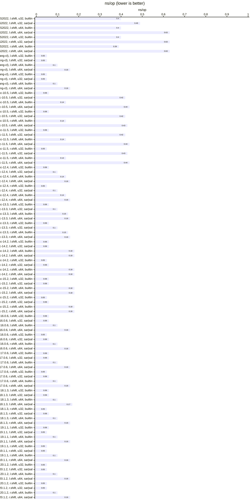

## Benchmarks

### AMD Ryzen 9 5950X 16-Core

#### VS 2022 (`/O2 /arch:AVX2`)

| relative | ns/op |             op/s | err% | total | Compare sal vs builtin << (uint32_t) |
|---------:|------:|-----------------:|-----:|------:|:-------------------------------------|
|   100.0% |  0.40 | 2,488,969,795.94 | 0.4% |  8.78 | `builtin << (uint32_t)`              |
|    82.3% |  0.49 | 2,049,435,384.83 | 0.2% | 11.65 | `sal<uint32_t>`                      |

| relative | ns/op |             op/s | err% | total | Compare sal vs builtin << (uint64_t) |
|---------:|------:|-----------------:|-----:|------:|:-------------------------------------|
|   100.0% |  0.40 | 2,527,885,541.72 | 0.1% |  8.64 | `builtin << (uint64_t)`              |
|    62.4% |  0.63 | 1,578,552,083.57 | 0.3% | 15.11 | `sal<uint64_t>`                      |

| relative | ns/op |             op/s | err% | total | Compare sar vs builtin >> (uint32_t) |
|---------:|------:|-----------------:|-----:|------:|:-------------------------------------|
|   100.0% |  0.40 | 2,511,997,876.40 | 0.1% |  8.69 | `builtin >> (uint32_t)`              |
|    63.3% |  0.63 | 1,590,012,824.26 | 0.4% | 15.11 | `sar<uint32_t>`                      |

| relative | ns/op |             op/s | err% | total | Compare sar vs builtin >> (uint64_t) |
|---------:|------:|-----------------:|-----:|------:|:-------------------------------------|
|   100.0% |  0.39 | 2,538,972,271.81 | 0.3% |  8.62 | `builtin >> (uint64_t)`              |
|    62.7% |  0.63 | 1,591,256,434.09 | 0.2% | 14.96 | `sar<uint64_t>`                      |

### VS 2022 (clang-cl, `/O2 -march=native`)

| relative | ns/op |              op/s | err% | total | Compare sal vs builtin << (uint32_t) |
|---------:|------:|------------------:|-----:|------:|:-------------------------------------|
|   100.0% |  0.05 | 18,812,689,661.38 | 1.6% |  1.80 | `builtin << (uint32_t)`              |
|   101.3% |  0.05 | 19,064,941,298.75 | 0.3% |  1.81 | `sal<uint32_t>`                      |

| relative | ns/op |              op/s | err% | total | Compare sal vs builtin << (uint64_t) |
|---------:|------:|------------------:|-----:|------:|:-------------------------------------|
|   100.0% |  0.10 | 10,306,242,595.86 | 0.1% |  2.31 | `builtin << (uint64_t)`              |
|    61.2% |  0.16 |  6,311,373,812.44 | 0.2% |  3.77 | `sal<uint64_t>`                      |

| relative | ns/op |              op/s | err% | total | Compare sar vs builtin >> (uint32_t) |
|---------:|------:|------------------:|-----:|------:|:-------------------------------------|
|   100.0% |  0.05 | 19,160,233,043.62 | 0.2% |  1.82 | `builtin >> (uint32_t)`              |
|    99.9% |  0.05 | 19,133,815,229.14 | 0.2% |  1.82 | `sar<uint32_t>`                      |

| relative | ns/op |              op/s | err% | total | Compare sar vs builtin >> (uint64_t) |
|---------:|------:|------------------:|-----:|------:|:-------------------------------------|
|   100.0% |  0.10 | 10,310,632,208.17 | 0.1% |  2.32 | `builtin >> (uint64_t)`              |
|    61.0% |  0.16 |  6,288,994,688.54 | 0.5% |  3.81 | `sar<uint64_t>`                      |

#### WSL-gcc 10.5 (`-O3 -march=native`)

| relative | ns/op |              op/s | err% | total | Compare sal vs builtin << (uint32_t) |
|---------:|------:|------------------:|-----:|------:|:-------------------------------------|
|   100.0% |  0.06 | 18,051,899,425.86 | 0.5% |  1.77 | `builtin << (uint32_t)`              |
|    13.1% |  0.42 |  2,358,705,083.55 | 0.2% |  9.27 | `sal<uint32_t>`                      |

| relative | ns/op |             op/s | err% | total | Compare sal vs builtin << (uint64_t) |
|---------:|------:|-----------------:|-----:|------:|:-------------------------------------|
|   100.0% |  0.14 | 6,923,346,994.70 | 0.6% |  3.47 | `builtin << (uint64_t)`              |
|    33.1% |  0.44 | 2,294,851,172.12 | 0.2% |  9.56 | `sal<uint64_t>`                      |

| relative | ns/op |              op/s | err% | total | Compare sar vs builtin >> (uint32_t) |
|---------:|------:|------------------:|-----:|------:|:-------------------------------------|
|   100.0% |  0.06 | 17,827,498,125.76 | 0.8% |  1.81 | `builtin >> (uint32_t)`              |
|    13.2% |  0.42 |  2,357,617,437.24 | 0.4% |  9.27 | `sar<uint32_t>`                      |

| relative | ns/op |             op/s | err% | total | Compare sar vs builtin >> (uint64_t) |
|---------:|------:|-----------------:|-----:|------:|:-------------------------------------|
|   100.0% |  0.14 | 6,911,629,276.32 | 0.3% |  3.45 | `builtin >> (uint64_t)`              |
|    33.6% |  0.43 | 2,322,896,134.07 | 0.5% |  9.41 | `sar<uint64_t>`                      |

#### WSL-gcc 11.5 (`-O3 -march=native`)

| relative | ns/op |              op/s | err% | total | Compare sal vs builtin << (uint32_t) |
|---------:|------:|------------------:|-----:|------:|:-------------------------------------|
|   100.0% |  0.06 | 17,686,912,494.72 | 1.8% |  1.80 | `builtin << (uint32_t)`              |
|    13.4% |  0.42 |  2,375,449,948.50 | 0.2% |  9.24 | `sal<uint32_t>`                      |

| relative | ns/op |             op/s | err% | total | Compare sal vs builtin << (uint64_t) |
|---------:|------:|-----------------:|-----:|------:|:-------------------------------------|
|   100.0% |  0.14 | 6,932,097,054.55 | 0.1% |  3.44 | `builtin << (uint64_t)`              |
|    33.1% |  0.44 | 2,293,845,890.67 | 0.3% |  9.58 | `sal<uint64_t>`                      |

| relative | ns/op |              op/s | err% | total | Compare sar vs builtin >> (uint32_t) |
|---------:|------:|------------------:|-----:|------:|:-------------------------------------|
|   100.0% |  0.05 | 18,188,314,106.01 | 0.1% |  1.81 | `builtin >> (uint32_t)`              |
|    12.9% |  0.43 |  2,344,019,349.11 | 0.4% |  9.31 | `sar<uint32_t>`                      |

| relative | ns/op |             op/s | err% | total | Compare sar vs builtin >> (uint64_t) |
|---------:|------:|-----------------:|-----:|------:|:-------------------------------------|
|   100.0% |  0.14 | 6,913,661,597.13 | 0.3% |  3.45 | `builtin >> (uint64_t)`              |
|    33.1% |  0.44 | 2,291,681,814.27 | 0.2% |  9.53 | `sar<uint64_t>`                      |

#### WSL-gcc 12.4 (`-O3 -march=native`)

| relative | ns/op |              op/s | err% | total | Compare sal vs builtin << (uint32_t) |
|---------:|------:|------------------:|-----:|------:|:-------------------------------------|
|   100.0% |  0.06 | 16,883,661,443.09 | 0.5% |  1.79 | `builtin << (uint32_t)`              |
|    58.1% |  0.10 |  9,815,879,630.47 | 0.1% |  2.42 | `sal<uint32_t>`                      |

| relative | ns/op |             op/s | err% | total | Compare sal vs builtin << (uint64_t) |
|---------:|------:|-----------------:|-----:|------:|:-------------------------------------|
|   100.0% |  0.14 | 6,913,913,973.44 | 0.1% |  3.44 | `builtin << (uint64_t)`              |
|    91.9% |  0.16 | 6,350,831,366.19 | 0.0% |  3.75 | `sal<uint64_t>`                      |

| relative | ns/op |              op/s | err% | total | Compare sar vs builtin >> (uint32_t) |
|---------:|------:|------------------:|-----:|------:|:-------------------------------------|
|   100.0% |  0.05 | 18,189,934,517.19 | 0.1% |  1.81 | `builtin >> (uint32_t)`              |
|    54.2% |  0.10 |  9,855,648,835.82 | 0.1% |  2.42 | `sar<uint32_t>`                      |

| relative | ns/op |             op/s | err% | total | Compare sar vs builtin >> (uint64_t) |
|---------:|------:|-----------------:|-----:|------:|:-------------------------------------|
|   100.0% |  0.14 | 6,986,779,650.66 | 0.1% |  3.41 | `builtin >> (uint64_t)`              |
|    89.7% |  0.16 | 6,267,384,812.92 | 0.1% |  3.80 | `sar<uint64_t>`                      |

#### WSL-gcc 13.3 (`-O3 -march=native`)

| relative | ns/op |              op/s | err% | total | Compare sal vs builtin << (uint32_t) |
|---------:|------:|------------------:|-----:|------:|:-------------------------------------|
|   100.0% |  0.06 | 16,421,992,475.14 | 2.1% |  1.76 | `builtin << (uint32_t)`              |
|    59.5% |  0.10 |  9,777,136,864.31 | 0.2% |  2.44 | `sal<uint32_t>`                      |

| relative | ns/op |             op/s | err% | total | Compare sal vs builtin << (uint64_t) |
|---------:|------:|-----------------:|-----:|------:|:-------------------------------------|
|   100.0% |  0.15 | 6,836,719,531.38 | 0.2% |  3.48 | `builtin << (uint64_t)`              |
|    90.8% |  0.16 | 6,210,853,739.28 | 0.3% |  3.83 | `sal<uint64_t>`                      |

| relative | ns/op |              op/s | err% | total | Compare sar vs builtin >> (uint32_t) |
|---------:|------:|------------------:|-----:|------:|:-------------------------------------|
|   100.0% |  0.06 | 18,016,123,661.40 | 0.1% |  1.81 | `builtin >> (uint32_t)`              |
|    54.5% |  0.10 |  9,812,969,408.55 | 0.2% |  2.42 | `sar<uint32_t>`                      |

| relative | ns/op |             op/s | err% | total | Compare sar vs builtin >> (uint64_t) |
|---------:|------:|-----------------:|-----:|------:|:-------------------------------------|
|   100.0% |  0.15 | 6,814,335,876.88 | 0.1% |  3.49 | `builtin >> (uint64_t)`              |
|    92.1% |  0.16 | 6,272,899,066.54 | 0.2% |  3.80 | `sar<uint64_t>`                      |

#### WSL-gcc 14.2 (`-O3 -march=native`)

| relative | ns/op |              op/s | err% | total | Compare sal vs builtin << (uint32_t) |
|---------:|------:|------------------:|-----:|------:|:-------------------------------------|
|   100.0% |  0.06 | 18,077,962,906.45 | 0.5% |  1.80 | `builtin << (uint32_t)`              |
|    91.3% |  0.06 | 16,506,550,534.63 | 0.3% |  1.81 | `sal<uint32_t>`                      |

| relative | ns/op |             op/s | err% | total | Compare sal vs builtin << (uint64_t) |
|---------:|------:|-----------------:|-----:|------:|:-------------------------------------|
|   100.0% |  0.18 | 5,623,466,055.99 | 1.0% |  4.25 | `builtin << (uint64_t)`              |
|    98.2% |  0.18 | 5,520,366,396.93 | 0.5% |  4.34 | `sal<uint64_t>`                      |

| relative | ns/op |              op/s | err% | total | Compare sar vs builtin >> (uint32_t) |
|---------:|------:|------------------:|-----:|------:|:-------------------------------------|
|   100.0% |  0.05 | 18,209,261,936.02 | 0.2% |  1.81 | `builtin >> (uint32_t)`              |
|    90.5% |  0.06 | 16,487,060,270.23 | 0.2% |  1.82 | `sar<uint32_t>`                      |

| relative | ns/op |             op/s | err% | total | Compare sar vs builtin >> (uint64_t) |
|---------:|------:|-----------------:|-----:|------:|:-------------------------------------|
|   100.0% |  0.18 | 5,625,325,082.57 | 0.7% |  4.26 | `builtin >> (uint64_t)`              |
|    98.4% |  0.18 | 5,536,636,189.06 | 0.4% |  4.34 | `sar<uint64_t>`                      |

#### WSL-gcc 15.2 (`-O3 -march=native`)

| relative | ns/op |              op/s | err% | total | Compare sal vs builtin << (uint32_t) |
|---------:|------:|------------------:|-----:|------:|:-------------------------------------|
|   100.0% |  0.06 | 18,038,361,755.70 | 1.2% |  1.77 | `builtin << (uint32_t)`              |
|    92.1% |  0.06 | 16,621,473,861.77 | 0.3% |  1.80 | `sal<uint32_t>`                      |

| relative | ns/op |             op/s | err% | total | Compare sal vs builtin << (uint64_t) |
|---------:|------:|-----------------:|-----:|------:|:-------------------------------------|
|   100.0% |  0.18 | 5,692,037,365.97 | 0.1% |  4.18 | `builtin << (uint64_t)`              |
|    98.0% |  0.18 | 5,577,516,787.97 | 0.3% |  4.27 | `sal<uint64_t>`                      |

| relative | ns/op |              op/s | err% | total | Compare sar vs builtin >> (uint32_t) |
|---------:|------:|------------------:|-----:|------:|:-------------------------------------|
|   100.0% |  0.05 | 18,283,360,866.48 | 0.1% |  1.81 | `builtin >> (uint32_t)`              |
|    91.1% |  0.06 | 16,647,280,118.71 | 0.1% |  1.81 | `sar<uint32_t>`                      |

| relative | ns/op |             op/s | err% | total | Compare sar vs builtin >> (uint64_t) |
|---------:|------:|-----------------:|-----:|------:|:-------------------------------------|
|   100.0% |  0.18 | 5,680,115,111.92 | 0.7% |  4.23 | `builtin >> (uint64_t)`              |
|    98.5% |  0.18 | 5,597,448,969.07 | 0.2% |  4.28 | `sar<uint64_t>`                      |

#### WSL-clang 16.0.6 (`-O3 -march=native`)

| relative | ns/op |              op/s | err% | total | Compare sal vs builtin << (uint32_t) |
|---------:|------:|------------------:|-----:|------:|:-------------------------------------|
|   100.0% |  0.06 | 18,173,678,286.33 | 0.7% |  1.78 | `builtin << (uint32_t)`              |
|    92.2% |  0.06 | 16,758,810,008.24 | 0.2% |  1.82 | `sal<uint32_t>`                      |

| relative | ns/op |             op/s | err% | total | Compare sal vs builtin << (uint64_t) |
|---------:|------:|-----------------:|-----:|------:|:-------------------------------------|
|   100.0% |  0.10 | 9,904,803,625.53 | 0.2% |  2.41 | `builtin << (uint64_t)`              |
|    62.7% |  0.16 | 6,206,668,291.41 | 0.1% |  3.84 | `sal<uint64_t>`                      |

| relative | ns/op |              op/s | err% | total | Compare sar vs builtin >> (uint32_t) |
|---------:|------:|------------------:|-----:|------:|:-------------------------------------|
|   100.0% |  0.05 | 18,290,412,139.68 | 0.2% |  1.81 | `builtin >> (uint32_t)`              |
|    91.7% |  0.06 | 16,777,003,120.64 | 0.1% |  1.81 | `sar<uint32_t>`                      |

| relative | ns/op |             op/s | err% | total | Compare sar vs builtin >> (uint64_t) |
|---------:|------:|-----------------:|-----:|------:|:-------------------------------------|
|   100.0% |  0.10 | 9,847,754,347.17 | 0.2% |  2.44 | `builtin >> (uint64_t)`              |
|    61.9% |  0.16 | 6,100,373,754.81 | 1.1% |  3.91 | `sar<uint64_t>`                      |

#### WSL-clang 17.0.6 (`-O3 -march=native`)

| relative | ns/op |              op/s | err% | total | Compare sal vs builtin << (uint32_t) |
|---------:|------:|------------------:|-----:|------:|:-------------------------------------|
|   100.0% |  0.06 | 18,131,336,519.90 | 0.7% |  1.77 | `builtin << (uint32_t)`              |
|    90.2% |  0.06 | 16,351,990,917.39 | 1.6% |  1.83 | `sal<uint32_t>`                      |

| relative | ns/op |             op/s | err% | total | Compare sal vs builtin << (uint64_t) |
|---------:|------:|-----------------:|-----:|------:|:-------------------------------------|
|   100.0% |  0.10 | 9,868,007,844.15 | 0.5% |  2.42 | `builtin << (uint64_t)`              |
|    63.1% |  0.16 | 6,226,951,779.34 | 0.4% |  3.84 | `sal<uint64_t>`                      |

| relative | ns/op |              op/s | err% | total | Compare sar vs builtin >> (uint32_t) |
|---------:|------:|------------------:|-----:|------:|:-------------------------------------|
|   100.0% |  0.05 | 18,276,664,276.32 | 0.3% |  1.80 | `builtin >> (uint32_t)`              |
|    91.6% |  0.06 | 16,738,614,024.65 | 0.1% |  1.82 | `sar<uint32_t>`                      |

| relative | ns/op |             op/s | err% | total | Compare sar vs builtin >> (uint64_t) |
|---------:|------:|-----------------:|-----:|------:|:-------------------------------------|
|   100.0% |  0.10 | 9,846,566,337.22 | 0.8% |  2.44 | `builtin >> (uint64_t)`              |
|    63.2% |  0.16 | 6,226,877,447.13 | 0.1% |  3.82 | `sar<uint64_t>`                      |

#### WSL-clang 18.1.3 (`-O3 -march=native`)

| relative | ns/op |              op/s | err% | total | Compare sal vs builtin << (uint32_t) |
|---------:|------:|------------------:|-----:|------:|:-------------------------------------|
|   100.0% |  0.06 | 17,564,887,995.85 | 2.6% |  1.77 | `builtin << (uint32_t)`              |
|    97.0% |  0.06 | 17,033,569,125.92 | 0.5% |  1.79 | `sal<uint32_t>`                      |

| relative | ns/op |             op/s | err% | total | Compare sal vs builtin << (uint64_t) |
|---------:|------:|-----------------:|-----:|------:|:-------------------------------------|
|   100.0% |  0.10 | 9,972,161,002.82 | 0.3% |  2.40 | `builtin << (uint64_t)`              |
|    58.7% |  0.17 | 5,855,190,485.24 | 1.0% |  4.07 | `sal<uint64_t>`                      |

| relative | ns/op |              op/s | err% | total | Compare sar vs builtin >> (uint32_t) |
|---------:|------:|------------------:|-----:|------:|:-------------------------------------|
|   100.0% |  0.05 | 18,366,034,817.97 | 0.2% |  1.82 | `builtin >> (uint32_t)`              |
|    93.1% |  0.06 | 17,094,705,420.35 | 0.1% |  1.82 | `sar<uint32_t>`                      |

| relative | ns/op |             op/s | err% | total | Compare sar vs builtin >> (uint64_t) |
|---------:|------:|-----------------:|-----:|------:|:-------------------------------------|
|   100.0% |  0.10 | 9,944,557,463.18 | 0.8% |  2.39 | `builtin >> (uint64_t)`              |
|    62.5% |  0.16 | 6,216,448,063.94 | 0.9% |  3.84 | `sar<uint64_t>`                      |

#### WSL-clang 19.1.1 (`-O3 -march=native`)

| relative | ns/op |              op/s | err% | total | Compare sal vs builtin << (uint32_t) |
|---------:|------:|------------------:|-----:|------:|:-------------------------------------|
|   100.0% |  0.06 | 17,900,829,714.91 | 2.3% |  1.78 | `builtin << (uint32_t)`              |
|   101.7% |  0.05 | 18,205,801,676.43 | 0.1% |  1.81 | `sal<uint32_t>`                      |

| relative | ns/op |             op/s | err% | total | Compare sal vs builtin << (uint64_t) |
|---------:|------:|-----------------:|-----:|------:|:-------------------------------------|
|   100.0% |  0.10 | 9,934,164,653.43 | 0.1% |  2.40 | `builtin << (uint64_t)`              |
|    62.5% |  0.16 | 6,211,992,190.38 | 0.1% |  3.83 | `sal<uint64_t>`                      |

| relative | ns/op |              op/s | err% | total | Compare sar vs builtin >> (uint32_t) |
|---------:|------:|------------------:|-----:|------:|:-------------------------------------|
|   100.0% |  0.05 | 18,309,925,027.23 | 0.0% |  1.82 | `builtin >> (uint32_t)`              |
|    99.3% |  0.05 | 18,186,558,700.09 | 0.1% |  1.81 | `sar<uint32_t>`                      |

| relative | ns/op |             op/s | err% | total | Compare sar vs builtin >> (uint64_t) |
|---------:|------:|-----------------:|-----:|------:|:-------------------------------------|
|   100.0% |  0.10 | 9,920,784,009.37 | 0.1% |  2.40 | `builtin >> (uint64_t)`              |
|    62.3% |  0.16 | 6,184,157,480.77 | 0.4% |  3.87 | `sar<uint64_t>`                      |

#### WSL-clang 20.1.2 (`-O3 -march=native`)

| relative | ns/op |              op/s | err% | total | Compare sal vs builtin << (uint32_t) |
|---------:|------:|------------------:|-----:|------:|:-------------------------------------|
|   100.0% |  0.05 | 18,201,643,167.20 | 1.0% |  1.78 | `builtin << (uint32_t)`              |
|   100.5% |  0.05 | 18,284,324,780.92 | 0.1% |  1.82 | `sal<uint32_t>`                      |

| relative | ns/op |             op/s | err% | total | Compare sal vs builtin << (uint64_t) |
|---------:|------:|-----------------:|-----:|------:|:-------------------------------------|
|   100.0% |  0.10 | 9,936,044,783.16 | 0.1% |  2.40 | `builtin << (uint64_t)`              |
|    62.2% |  0.16 | 6,179,025,227.07 | 0.7% |  3.88 | `sal<uint64_t>`                      |

| relative | ns/op |              op/s | err% | total | Compare sar vs builtin >> (uint32_t) |
|---------:|------:|------------------:|-----:|------:|:-------------------------------------|
|   100.0% |  0.05 | 18,369,268,258.70 | 0.2% |  1.81 | `builtin >> (uint32_t)`              |
|    99.3% |  0.05 | 18,244,672,909.08 | 0.3% |  1.83 | `sar<uint32_t>`                      |

| relative | ns/op |             op/s | err% | total | Compare sar vs builtin >> (uint64_t) |
|---------:|------:|-----------------:|-----:|------:|:-------------------------------------|
|   100.0% |  0.10 | 9,849,619,525.07 | 1.0% |  2.42 | `builtin >> (uint64_t)`              |
|    62.3% |  0.16 | 6,135,700,238.01 | 0.9% |  3.88 | `sar<uint64_t>`                      |

#### Graphs

```mermaid
---
config:
    xyChart:
        showDataLabel: true
        width: 1200
        height: 2400
    yAxis:
        showLabel: false
        showAxisLine: false
---
xychart horizontal
    title "Mop/s (higher is better)"
    y-axis "Mop/s" 1000 --> 20000
    x-axis ["VS2022, l.shift, u32, builtin", "VS2022, l.shift, u32, sar|sal", "VS2022, l.shift, u64, builtin", "VS2022, l.shift, u64, sar|sal", "VS2022, r.shift, u32, builtin", "VS2022, r.shift, u32, sar|sal", "VS2022, r.shift, u64, builtin", "VS2022, r.shift, u64, sar|sal", "VS2022 (clang-cl), l.shift, u32, builtin", "VS2022 (clang-cl), l.shift, u32, sar|sal", "VS2022 (clang-cl), l.shift, u64, builtin", "VS2022 (clang-cl), l.shift, u64, sar|sal", "VS2022 (clang-cl), r.shift, u32, builtin", "VS2022 (clang-cl), r.shift, u32, sar|sal", "VS2022 (clang-cl), r.shift, u64, builtin", "VS2022 (clang-cl), r.shift, u64, sar|sal", "gcc-10.5, l.shift, u32, builtin", "gcc-10.5, l.shift, u32, sar|sal", "gcc-10.5, l.shift, u64, builtin", "gcc-10.5, l.shift, u64, sar|sal", "gcc-10.5, r.shift, u32, builtin", "gcc-10.5, r.shift, u32, sar|sal", "gcc-10.5, r.shift, u64, builtin", "gcc-10.5, r.shift, u64, sar|sal", "gcc-11.5, l.shift, u32, builtin", "gcc-11.5, l.shift, u32, sar|sal", "gcc-11.5, l.shift, u64, builtin", "gcc-11.5, l.shift, u64, sar|sal", "gcc-11.5, r.shift, u32, builtin", "gcc-11.5, r.shift, u32, sar|sal", "gcc-11.5, r.shift, u64, builtin", "gcc-11.5, r.shift, u64, sar|sal", "gcc-12.4, l.shift, u32, builtin", "gcc-12.4, l.shift, u32, sar|sal", "gcc-12.4, l.shift, u64, builtin", "gcc-12.4, l.shift, u64, sar|sal", "gcc-12.4, r.shift, u32, builtin", "gcc-12.4, r.shift, u32, sar|sal", "gcc-12.4, r.shift, u64, builtin", "gcc-12.4, r.shift, u64, sar|sal", "gcc-13.3, l.shift, u32, builtin", "gcc-13.3, l.shift, u32, sar|sal", "gcc-13.3, l.shift, u64, builtin", "gcc-13.3, l.shift, u64, sar|sal", "gcc-13.3, r.shift, u32, builtin", "gcc-13.3, r.shift, u32, sar|sal", "gcc-13.3, r.shift, u64, builtin", "gcc-13.3, r.shift, u64, sar|sal", "gcc-14.2, l.shift, u32, builtin", "gcc-14.2, l.shift, u32, sar|sal", "gcc-14.2, l.shift, u64, builtin", "gcc-14.2, l.shift, u64, sar|sal", "gcc-14.2, r.shift, u32, builtin", "gcc-14.2, r.shift, u32, sar|sal", "gcc-14.2, r.shift, u64, builtin", "gcc-14.2, r.shift, u64, sar|sal", "gcc-15.2, l.shift, u32, builtin", "gcc-15.2, l.shift, u32, sar|sal", "gcc-15.2, l.shift, u64, builtin", "gcc-15.2, l.shift, u64, sar|sal", "gcc-15.2, r.shift, u32, builtin", "gcc-15.2, r.shift, u32, sar|sal", "gcc-15.2, r.shift, u64, builtin", "gcc-15.2, r.shift, u64, sar|sal", "clang-16.0.6, l.shift, u32, builtin", "clang-16.0.6, l.shift, u32, sar|sal", "clang-16.0.6, l.shift, u64, builtin", "clang-16.0.6, l.shift, u64, sar|sal", "clang-16.0.6, r.shift, u32, builtin", "clang-16.0.6, r.shift, u32, sar|sal", "clang-16.0.6, r.shift, u64, builtin", "clang-16.0.6, r.shift, u64, sar|sal", "clang-17.0.6, l.shift, u32, builtin", "clang-17.0.6, l.shift, u32, sar|sal", "clang-17.0.6, l.shift, u64, builtin", "clang-17.0.6, l.shift, u64, sar|sal", "clang-17.0.6, r.shift, u32, builtin", "clang-17.0.6, r.shift, u32, sar|sal", "clang-17.0.6, r.shift, u64, builtin", "clang-17.0.6, r.shift, u64, sar|sal", "clang-18.1.3, l.shift, u32, builtin", "clang-18.1.3, l.shift, u32, sar|sal", "clang-18.1.3, l.shift, u64, builtin", "clang-18.1.3, l.shift, u64, sar|sal", "clang-18.1.3, r.shift, u32, builtin", "clang-18.1.3, r.shift, u32, sar|sal", "clang-18.1.3, r.shift, u64, builtin", "clang-18.1.3, r.shift, u64, sar|sal", "clang-19.1.1, l.shift, u32, builtin", "clang-19.1.1, l.shift, u32, sar|sal", "clang-19.1.1, l.shift, u64, builtin", "clang-19.1.1, l.shift, u64, sar|sal", "clang-19.1.1, r.shift, u32, builtin", "clang-19.1.1, r.shift, u32, sar|sal", "clang-19.1.1, r.shift, u64, builtin", "clang-19.1.1, r.shift, u64, sar|sal", "clang-20.1.2, l.shift, u32, builtin", "clang-20.1.2, l.shift, u32, sar|sal", "clang-20.1.2, l.shift, u64, builtin", "clang-20.1.2, l.shift, u64, sar|sal", "clang-20.1.2, r.shift, u32, builtin", "clang-20.1.2, r.shift, u32, sar|sal", "clang-20.1.2, r.shift, u64, builtin", "clang-20.1.2, r.shift, u64, sar|sal"]
    bar [2488.97, 2049.44, 2527.89, 1578.55, 2512, 1590.01, 2538.97, 1591.26, 18812.69, 19064.94, 10306.24, 6311.37, 19160.23, 19133.82, 10310.63, 6288.99, 18051.9, 2358.71, 6923.35, 2294.85, 17827.5, 2357.62, 6911.63, 2322.9, 17686.91, 2375.45, 6932.1, 2293.85, 18188.31, 2344.02, 6913.66, 2291.68, 16883.66, 9815.88, 6913.91, 6350.83, 18189.93, 9855.65, 6986.78, 6267.38, 16421.99, 9777.14, 6836.72, 6210.85, 18016.12, 9812.97, 6814.33, 6272.9, 18077.96, 16506.55, 5623.47, 5520.37, 18209.26, 16487.06, 5625.33, 5536.64, 18038.36, 16621.47, 5692.04, 5577.52, 18283.36, 16647.28, 5680.12, 5597.45, 18173.68, 16758.81, 9904.8, 6206.67, 18290.41, 16777, 9847.75, 6100.37, 18131.34, 16351.99, 9868.01, 6226.95, 18276.66, 16738.61, 9846.57, 6226.88, 17564.89, 17033.57, 9972.16, 5855.19, 18366.03, 17094.71, 9944.58, 6216.45, 17900.83, 18205.8, 9934.16, 6211.99, 18309.93, 18186.56, 9920.78, 6184.16, 18201.64, 18284.32, 9936.04, 6179.03, 18369.27, 18244.67, 9849.62, 6135.7]
```

### CI/CD

#### win, x64, vs2022 (MSVC 19.44.35215.0)

| relative | ns/op |             op/s | err% | total | Compare sal vs builtin << (uint32_t) |
|---------:|------:|-----------------:|-----:|------:|:-------------------------------------|
|   100.0% |  0.57 | 1,760,885,929.93 | 0.2% | 13.68 | `builtin << (uint32_t)`              |
|    60.9% |  0.93 | 1,073,244,988.51 | 0.0% | 22.19 | `sal<uint32_t>`                      |

| relative | ns/op |             op/s | err% | total | Compare sal vs builtin << (uint64_t) |
|---------:|------:|-----------------:|-----:|------:|:-------------------------------------|
|   100.0% |  0.58 | 1,727,109,155.99 | 0.0% | 13.79 | `builtin << (uint64_t)`              |
|    62.2% |  0.93 | 1,073,826,464.64 | 0.1% | 22.19 | `sal<uint64_t>`                      |

| relative | ns/op |             op/s | err% | total | Compare sar vs builtin >> (uint32_t) |
|---------:|------:|-----------------:|-----:|------:|:-------------------------------------|
|   100.0% |  0.57 | 1,758,829,545.71 | 0.0% | 13.53 | `builtin >> (uint32_t)`              |
|    85.8% |  0.66 | 1,509,712,438.93 | 0.1% | 15.77 | `sar<uint32_t>`                      |

| relative | ns/op |             op/s | err% | total | Compare sar vs builtin >> (uint64_t) |
|---------:|------:|-----------------:|-----:|------:|:-------------------------------------|
|   100.0% |  0.57 | 1,747,843,174.04 | 0.1% | 13.62 | `builtin >> (uint64_t)`              |
|    61.4% |  0.93 | 1,074,023,733.19 | 0.0% | 22.17 | `sar<uint64_t>`                      |

#### macos-13, x64, xcode-15 (AppleClang 15)

| relative | ns/op |             op/s | err% | total | Compare sal vs builtin << (uint32_t) |
|---------:|------:|-----------------:|-----:|------:|:-------------------------------------|
|   100.0% |  0.14 | 7,364,295,220.76 | 5.2% |  3.20 | `builtin << (uint32_t)`              |
|    84.9% |  0.16 | 6,248,817,360.28 | 7.3% |  3.79 | `sal<uint32_t>`                      |

| relative | ns/op |             op/s |  err% | total | Compare sal vs builtin << (uint64_t) |
|---------:|------:|-----------------:|------:|------:|:-------------------------------------|
|   100.0% |  0.28 | 3,595,765,592.58 | 14.7% |  6.51 | `builtin << (uint64_t)`              |
|    98.8% |  0.28 | 3,551,267,464.49 |  4.1% |  6.81 | `sal<uint64_t>`                      |

| relative | ns/op |             op/s | err% | total | Compare sar vs builtin >> (uint32_t) |
|---------:|------:|-----------------:|-----:|------:|:-------------------------------------|
|   100.0% |  0.14 | 7,193,206,238.22 | 1.9% |  3.32 | `builtin >> (uint32_t)`              |
|    87.5% |  0.16 | 6,294,173,110.71 | 5.8% |  3.86 | `sar<uint32_t>`                      |

| relative | ns/op |             op/s | err% | total | Compare sar vs builtin >> (uint64_t) |
|---------:|------:|-----------------:|-----:|------:|:-------------------------------------|
|   100.0% |  0.25 | 3,945,417,573.41 | 3.6% |  5.95 | `builtin >> (uint64_t)`              |
|    87.9% |  0.29 | 3,469,565,362.39 | 4.2% |  6.26 | `sar<uint64_t>`                      |

#### macos-14, aarch64, xcode-15 (AppleClang 15)

| relative | ns/op |              op/s | err% | total | Compare sal vs builtin << (uint32_t) |
|---------:|------:|------------------:|-----:|------:|:-------------------------------------|
|   100.0% |  0.10 | 10,423,764,559.71 | 0.4% |  2.38 | `builtin << (uint32_t)`              |
|    94.9% |  0.10 |  9,891,004,297.61 | 0.3% |  2.42 | `sal<uint32_t>`                      |

| relative | ns/op |             op/s | err% | total | Compare sal vs builtin << (uint64_t) |
|---------:|------:|-----------------:|-----:|------:|:-------------------------------------|
|   100.0% |  0.15 | 6,727,006,366.44 | 0.5% |  3.55 | `builtin << (uint64_t)`              |
|    93.5% |  0.16 | 6,291,297,173.77 | 0.5% |  3.78 | `sal<uint64_t>`                      |

| relative | ns/op |              op/s | err% | total | Compare sar vs builtin >> (uint32_t) |
|---------:|------:|------------------:|-----:|------:|:-------------------------------------|
|   100.0% |  0.10 | 10,477,218,665.67 | 0.1% |  2.28 | `builtin >> (uint32_t)`              |
|    95.1% |  0.10 |  9,961,140,677.80 | 1.6% |  2.44 | `sar<uint32_t>`                      |

| relative | ns/op |             op/s | err% | total | Compare sar vs builtin >> (uint64_t) |
|---------:|------:|-----------------:|-----:|------:|:-------------------------------------|
|   100.0% |  0.15 | 6,546,756,260.96 | 1.5% |  3.64 | `builtin >> (uint64_t)`              |
|    86.4% |  0.18 | 5,653,587,735.81 | 0.2% |  4.24 | `sar<uint64_t>`                      |

#### macos-14, aarch64, xcode-15 (AppleClang 15) via Rosetta (x86_64)

| relative | ns/op |             op/s | err% | total | Compare sal vs builtin << (uint32_t) |
|---------:|------:|-----------------:|-----:|------:|:-------------------------------------|
|   100.0% |  0.13 | 7,448,187,821.34 | 2.5% |  3.28 | `builtin << (uint32_t)`              |
|    67.7% |  0.20 | 5,045,021,004.65 | 2.0% |  4.84 | `sal<uint32_t>`                      |

| relative | ns/op |             op/s | err% | total | Compare sal vs builtin << (uint64_t) |
|---------:|------:|-----------------:|-----:|------:|:-------------------------------------|
|   100.0% |  0.76 | 1,311,625,376.61 | 3.3% | 19.03 | `builtin << (uint64_t)`              |
|   183.4% |  0.42 | 2,405,432,918.47 | 1.9% |  9.05 | `sal<uint64_t>`                      |

| relative | ns/op |           op/s | err% | total | Compare sar vs builtin >> (uint32_t) |
|---------:|------:|---------------:|-----:|------:|:-------------------------------------|
|   100.0% |  1.12 | 896,041,572.12 | 1.8% | 26.70 | `builtin >> (uint32_t)`              |
|    94.0% |  1.19 | 842,308,252.52 | 2.2% | 28.69 | `sar<uint32_t>`                      |

| relative | ns/op |             op/s | err% | total | Compare sar vs builtin >> (uint64_t) |
|---------:|------:|-----------------:|-----:|------:|:-------------------------------------|
|   100.0% |  0.80 | 1,248,448,566.72 | 1.3% | 19.26 | `builtin >> (uint64_t)`              |
|   197.3% |  0.41 | 2,463,389,932.61 | 1.1% |  8.96 | `sar<uint64_t>`                      |

#### ubuntu-24.04, x64, gcc-11.4

| relative | ns/op |              op/s | err% | total | Compare sal vs builtin << (uint32_t) |
|---------:|------:|------------------:|-----:|------:|:-------------------------------------|
|   100.0% |  0.09 | 11,551,350,892.68 | 0.4% |  2.07 | `builtin << (uint32_t)`              |
|    13.8% |  0.63 |  1,597,207,006.81 | 0.1% | 14.90 | `sal<uint32_t>`                      |

| relative | ns/op |             op/s | err% | total | Compare sal vs builtin << (uint64_t) |
|---------:|------:|-----------------:|-----:|------:|:-------------------------------------|
|   100.0% |  0.21 | 4,685,610,439.10 | 0.1% |  5.08 | `builtin << (uint64_t)`              |
|    33.1% |  0.64 | 1,552,196,681.41 | 0.0% | 15.34 | `sal<uint64_t>`                      |

| relative | ns/op |              op/s | err% | total | Compare sar vs builtin >> (uint32_t) |
|---------:|------:|------------------:|-----:|------:|:-------------------------------------|
|   100.0% |  0.09 | 11,497,277,785.94 | 0.1% |  2.07 | `builtin >> (uint32_t)`              |
|    13.9% |  0.63 |  1,597,814,871.30 | 0.0% | 14.90 | `sar<uint32_t>`                      |

| relative | ns/op |             op/s | err% | total | Compare sar vs builtin >> (uint64_t) |
|---------:|------:|-----------------:|-----:|------:|:-------------------------------------|
|   100.0% |  0.21 | 4,685,688,278.88 | 0.0% |  5.08 | `builtin >> (uint64_t)`              |
|    33.1% |  0.64 | 1,552,473,597.52 | 0.0% | 15.33 | `sar<uint64_t>`                      |

#### ubuntu-24.04, x64, gcc-12.4

| relative | ns/op |              op/s | err% | total | Compare sal vs builtin << (uint32_t) |
|---------:|------:|------------------:|-----:|------:|:-------------------------------------|
|   100.0% |  0.09 | 11,653,689,097.95 | 0.2% |  2.06 | `builtin << (uint32_t)`              |
|    57.1% |  0.15 |  6,650,359,309.82 | 0.0% |  3.58 | `sal<uint32_t>`                      |

| relative | ns/op |             op/s | err% | total | Compare sal vs builtin << (uint64_t) |
|---------:|------:|-----------------:|-----:|------:|:-------------------------------------|
|   100.0% |  0.21 | 4,685,236,174.67 | 0.1% |  5.08 | `builtin << (uint64_t)`              |
|    91.8% |  0.23 | 4,299,128,695.76 | 0.1% |  5.54 | `sal<uint64_t>`                      |

| relative | ns/op |              op/s | err% | total | Compare sar vs builtin >> (uint32_t) |
|---------:|------:|------------------:|-----:|------:|:-------------------------------------|
|   100.0% |  0.08 | 12,282,280,475.75 | 0.0% |  1.94 | `builtin >> (uint32_t)`              |
|    54.3% |  0.15 |  6,663,737,793.35 | 0.0% |  3.58 | `sar<uint32_t>`                      |

| relative | ns/op |             op/s | err% | total | Compare sar vs builtin >> (uint64_t) |
|---------:|------:|-----------------:|-----:|------:|:-------------------------------------|
|   100.0% |  0.21 | 4,710,170,638.29 | 0.1% |  5.05 | `builtin >> (uint64_t)`              |
|    91.3% |  0.23 | 4,301,699,892.67 | 0.0% |  5.53 | `sar<uint64_t>`                      |

#### ubuntu-24.04, x64, gcc-14.2

| relative | ns/op |              op/s | err% | total | Compare sal vs builtin << (uint32_t) |
|---------:|------:|------------------:|-----:|------:|:-------------------------------------|
|   100.0% |  0.08 | 12,050,453,046.81 | 0.1% |  1.98 | `builtin << (uint32_t)`              |
|    88.8% |  0.09 | 10,700,478,064.38 | 0.4% |  2.22 | `sal<uint32_t>`                      |

| relative | ns/op |             op/s | err% | total | Compare sal vs builtin << (uint64_t) |
|---------:|------:|-----------------:|-----:|------:|:-------------------------------------|
|   100.0% |  0.26 | 3,790,658,842.43 | 0.1% |  6.29 | `builtin << (uint64_t)`              |
|    97.9% |  0.27 | 3,710,132,622.65 | 0.0% |  6.41 | `sal<uint64_t>`                      |

| relative | ns/op |              op/s | err% | total | Compare sar vs builtin >> (uint32_t) |
|---------:|------:|------------------:|-----:|------:|:-------------------------------------|
|   100.0% |  0.08 | 12,041,109,021.08 | 0.2% |  1.98 | `builtin >> (uint32_t)`              |
|    89.0% |  0.09 | 10,717,430,687.66 | 0.2% |  2.22 | `sar<uint32_t>`                      |

| relative | ns/op |             op/s | err% | total | Compare sar vs builtin >> (uint64_t) |
|---------:|------:|-----------------:|-----:|------:|:-------------------------------------|
|   100.0% |  0.26 | 3,788,682,702.69 | 0.1% |  6.28 | `builtin >> (uint64_t)`              |
|    97.9% |  0.27 | 3,708,192,371.69 | 0.0% |  6.42 | `sar<uint64_t>`                      |

#### ubuntu-24.04, aarch64, gcc-14.2

| relative | ns/op |             op/s | err% | total | Compare sal vs builtin << (uint32_t) |
|---------:|------:|-----------------:|-----:|------:|:-------------------------------------|
|   100.0% |  0.12 | 8,548,381,950.14 | 0.0% |  2.78 | `builtin << (uint32_t)`              |
|    68.5% |  0.17 | 5,851,874,971.28 | 0.0% |  4.07 | `sal<uint32_t>`                      |

| relative | ns/op |             op/s | err% | total | Compare sal vs builtin << (uint64_t) |
|---------:|------:|-----------------:|-----:|------:|:-------------------------------------|
|   100.0% |  0.22 | 4,503,192,282.83 | 0.0% |  5.28 | `builtin << (uint64_t)`              |
|    77.3% |  0.29 | 3,482,445,471.61 | 0.0% |  6.83 | `sal<uint64_t>`                      |

| relative | ns/op |             op/s | err% | total | Compare sar vs builtin >> (uint32_t) |
|---------:|------:|-----------------:|-----:|------:|:-------------------------------------|
|   100.0% |  0.12 | 8,391,948,828.00 | 0.0% |  2.84 | `builtin >> (uint32_t)`              |
|    69.7% |  0.17 | 5,846,314,475.30 | 0.0% |  4.07 | `sar<uint32_t>`                      |

| relative | ns/op |             op/s | err% | total | Compare sar vs builtin >> (uint64_t) |
|---------:|------:|-----------------:|-----:|------:|:-------------------------------------|
|   100.0% |  0.30 | 3,370,124,562.07 | 0.0% |  7.06 | `builtin >> (uint64_t)`              |
|   103.3% |  0.29 | 3,482,617,878.75 | 0.0% |  6.83 | `sar<uint64_t>`                      |

#### ubuntu-24.04, x64, clang-18.1.3

| relative | ns/op |              op/s | err% | total | Compare sal vs builtin << (uint32_t) |
|---------:|------:|------------------:|-----:|------:|:-------------------------------------|
|   100.0% |  0.08 | 12,352,145,915.60 | 0.0% |  1.93 | `builtin << (uint32_t)`              |
|    93.1% |  0.09 | 11,503,275,598.31 | 0.0% |  2.07 | `sal<uint32_t>`                      |

| relative | ns/op |             op/s | err% | total | Compare sal vs builtin << (uint64_t) |
|---------:|------:|-----------------:|-----:|------:|:-------------------------------------|
|   100.0% |  0.15 | 6,620,018,836.63 | 0.2% |  3.60 | `builtin << (uint64_t)`              |
|    62.9% |  0.24 | 4,162,272,233.90 | 0.0% |  5.72 | `sal<uint64_t>`                      |

| relative | ns/op |              op/s | err% | total | Compare sar vs builtin >> (uint32_t) |
|---------:|------:|------------------:|-----:|------:|:-------------------------------------|
|   100.0% |  0.08 | 12,366,456,416.28 | 0.1% |  1.93 | `builtin >> (uint32_t)`              |
|    93.0% |  0.09 | 11,501,458,244.64 | 0.2% |  2.07 | `sar<uint32_t>`                      |

| relative | ns/op |             op/s | err% | total | Compare sar vs builtin >> (uint64_t) |
|---------:|------:|-----------------:|-----:|------:|:-------------------------------------|
|   100.0% |  0.15 | 6,621,892,157.99 | 0.2% |  3.59 | `builtin >> (uint64_t)`              |
|    62.7% |  0.24 | 4,153,563,160.35 | 0.1% |  5.73 | `sar<uint64_t>`                      |
