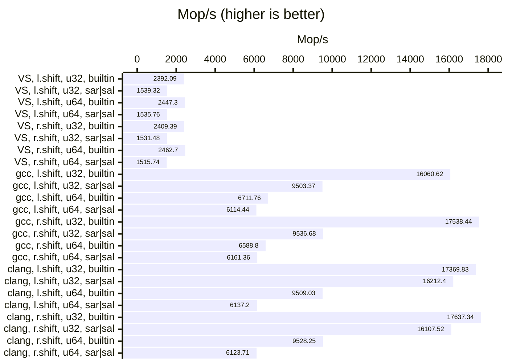
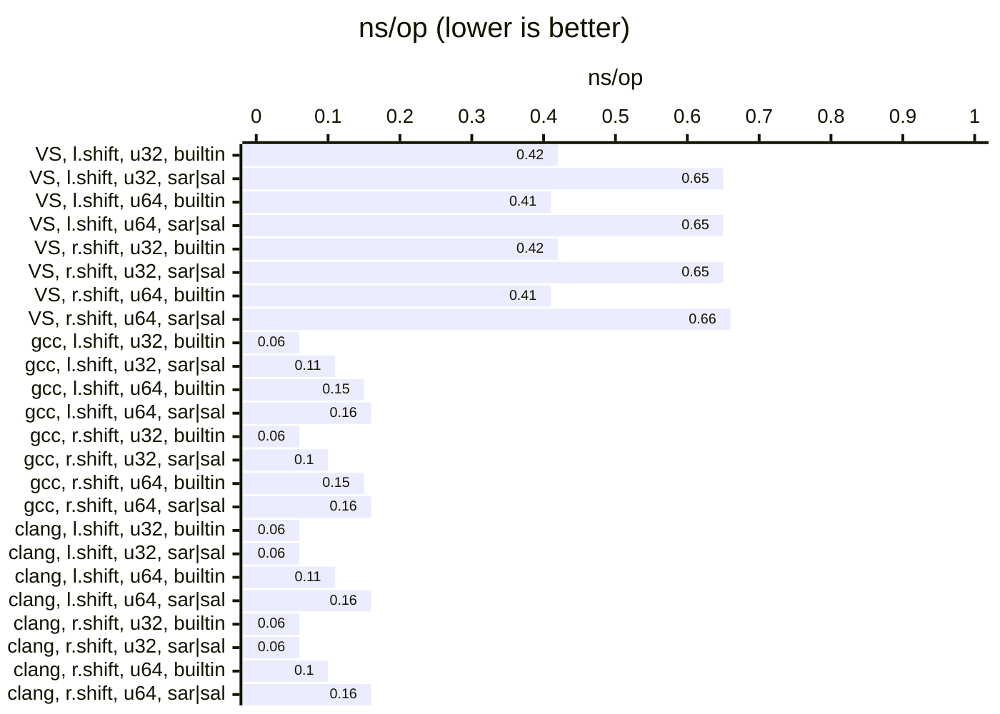

# bits

Library for bit manipulation.

## Examples of usage

### xmake

```lua
add_rules("mode.debug", "mode.release")

add_repositories("ttldtor https://github.com/ttldtor/xmake-repo.git")
add_requires("bits v0.2.0")

target("test_bits")
    set_kind("binary")
    add_packages("bits")
    add_files("src/*.cpp")
    set_languages("c++20")
```

### CMake

```cmake
cmake_minimum_required(VERSION 3.16)
project(test_bits LANGUAGES CXX)

include(FetchContent)
FetchContent_Declare(
        bits
        GIT_REPOSITORY https://github.com/ttldtor/bits.git
        GIT_TAG v0.2.0
)
FetchContent_MakeAvailable(bits)

add_executable(${PROJECT_NAME} src/main.cpp)
target_compile_features(${PROJECT_NAME} PRIVATE cxx_std_20)
target_link_libraries(${PROJECT_NAME} PRIVATE bits)
```

### Code

```c++
#include <iostream>
#include <bits/bits.hpp>

using namespace org::ttldtor::bits;

int main(int argc, char** argv) {
    std::cout << "hello world!" << std::endl;
    std::cout << shl(-5, 4) << std::endl;

    return 0;
}
```

## Benchmarks

### AMD Ryzen 9 5950X 16-Core

#### VS 2022

| relative |               ns/op |                op/s |    err% |     total | Compare sal vs builtin << (uint32_t)
|---------:|--------------------:|--------------------:|--------:|----------:|:-------------------------------------
|   100.0% |                0.42 |    2,392,093,558.51 |    0.2% |      9.17 | `builtin << (uint32_t)`
|    64.4% |                0.65 |    1,539,315,177.49 |    0.2% |     15.48 | `sal<uint32_t>`

| relative |               ns/op |                op/s |    err% |     total | Compare sal vs builtin << (uint64_t)
|---------:|--------------------:|--------------------:|--------:|----------:|:-------------------------------------
|   100.0% |                0.41 |    2,447,302,707.97 |    0.3% |      8.91 | `builtin << (uint64_t)`
|    62.8% |                0.65 |    1,535,759,824.69 |    0.3% |     15.50 | `sal<uint64_t>`

| relative |               ns/op |                op/s |    err% |     total | Compare sar vs builtin >> (uint32_t)
|---------:|--------------------:|--------------------:|--------:|----------:|:-------------------------------------
|   100.0% |                0.42 |    2,409,389,837.24 |    0.4% |      9.09 | `builtin >> (uint32_t)`
|    63.6% |                0.65 |    1,531,486,904.30 |    0.2% |     15.61 | `sar<uint32_t>`

| relative |               ns/op |                op/s |    err% |     total | Compare sar vs builtin >> (uint64_t)
|---------:|--------------------:|--------------------:|--------:|----------:|:-------------------------------------
|   100.0% |                0.41 |    2,462,702,004.17 |    0.3% |      8.87 | `builtin >> (uint64_t)`
|    61.5% |                0.66 |    1,515,737,308.30 |    0.4% |     15.74 | `sar<uint64_t>`

#### WSL-gcc 13.3

| relative |               ns/op |                op/s |    err% |     total | Compare sal vs builtin << (uint32_t)
|---------:|--------------------:|--------------------:|--------:|----------:|:-------------------------------------
|   100.0% |                0.06 |   16,060,617,939.42 |    0.8% |      1.81 | `builtin << (uint32_t)`
|    59.2% |                0.11 |    9,503,372,760.31 |    0.2% |      2.51 | `sal<uint32_t>`

| relative |               ns/op |                op/s |    err% |     total | Compare sal vs builtin << (uint64_t)
|---------:|--------------------:|--------------------:|--------:|----------:|:-------------------------------------
|   100.0% |                0.15 |    6,711,761,913.26 |    0.3% |      3.55 | `builtin << (uint64_t)`
|    91.1% |                0.16 |    6,114,440,425.01 |    0.4% |      3.89 | `sal<uint64_t>`

| relative |               ns/op |                op/s |    err% |     total | Compare sar vs builtin >> (uint32_t)
|---------:|--------------------:|--------------------:|--------:|----------:|:-------------------------------------
|   100.0% |                0.06 |   17,538,437,541.17 |    0.3% |      1.83 | `builtin >> (uint32_t)`
|    54.4% |                0.10 |    9,536,675,323.84 |    0.5% |      2.50 | `sar<uint32_t>`

| relative |               ns/op |                op/s |    err% |     total | Compare sar vs builtin >> (uint64_t)
|---------:|--------------------:|--------------------:|--------:|----------:|:-------------------------------------
|   100.0% |                0.15 |    6,588,800,057.93 |    0.6% |      3.62 | `builtin >> (uint64_t)`
|    93.5% |                0.16 |    6,161,361,378.81 |    0.6% |      3.88 | `sar<uint64_t>`

#### WSL-clang 18.1.3

| relative |               ns/op |                op/s |    err% |     total | Compare sal vs builtin << (uint32_t)
|---------:|--------------------:|--------------------:|--------:|----------:|:-------------------------------------
|   100.0% |                0.06 |   17,369,834,144.71 |    1.3% |      1.78 | `builtin << (uint32_t)`
|    93.3% |                0.06 |   16,212,399,911.95 |    0.8% |      1.81 | `sal<uint32_t>`

| relative |               ns/op |                op/s |    err% |     total | Compare sal vs builtin << (uint64_t)
|---------:|--------------------:|--------------------:|--------:|----------:|:-------------------------------------
|   100.0% |                0.11 |    9,509,028,417.12 |    1.1% |      2.51 | `builtin << (uint64_t)`
|    64.5% |                0.16 |    6,137,197,586.02 |    0.6% |      3.88 | `sal<uint64_t>`

| relative |               ns/op |                op/s |    err% |     total | Compare sar vs builtin >> (uint32_t)
|---------:|--------------------:|--------------------:|--------:|----------:|:-------------------------------------
|   100.0% |                0.06 |   17,637,342,230.27 |    0.3% |      1.82 | `builtin >> (uint32_t)`
|    91.3% |                0.06 |   16,107,520,218.66 |    0.4% |      1.82 | `sar<uint32_t>`

| relative |               ns/op |                op/s |    err% |     total | Compare sar vs builtin >> (uint64_t)
|---------:|--------------------:|--------------------:|--------:|----------:|:-------------------------------------
|   100.0% |                0.10 |    9,528,252,505.03 |    0.6% |      2.51 | `builtin >> (uint64_t)`
|    64.3% |                0.16 |    6,123,710,947.02 |    0.3% |      3.89 | `sar<uint64_t>`

#### Graphs






### CI/CD

#### win, x64, vs2022 (MSVC 19.44.35215.0)

| relative |               ns/op |                op/s |    err% |     total | Compare sal vs builtin << (uint32_t)
|---------:|--------------------:|--------------------:|--------:|----------:|:-------------------------------------
|   100.0% |                0.56 |    1,775,811,678.25 |    0.1% |     13.43 | `builtin << (uint32_t)`
|    60.2% |                0.94 |    1,069,140,117.89 |    0.5% |     22.66 | `sal<uint32_t>`

| relative |               ns/op |                op/s |    err% |     total | Compare sal vs builtin << (uint64_t)
|---------:|--------------------:|--------------------:|--------:|----------:|:-------------------------------------
|   100.0% |                0.58 |    1,719,997,265.50 |    0.1% |     13.86 | `builtin << (uint64_t)`
|    62.2% |                0.93 |    1,070,374,450.39 |    0.2% |     22.23 | `sal<uint64_t>`

| relative |               ns/op |                op/s |    err% |     total | Compare sar vs builtin >> (uint32_t)
|---------:|--------------------:|--------------------:|--------:|----------:|:-------------------------------------
|   100.0% |                0.57 |    1,763,878,639.39 |    0.1% |     13.49 | `builtin >> (uint32_t)`
|    60.9% |                0.93 |    1,073,800,734.07 |    0.1% |     22.17 | `sar<uint32_t>`

| relative |               ns/op |                op/s |    err% |     total | Compare sar vs builtin >> (uint64_t)
|---------:|--------------------:|--------------------:|--------:|----------:|:-------------------------------------
|   100.0% |                0.57 |    1,740,619,259.27 |    0.2% |     13.67 | `builtin >> (uint64_t)`
|    61.5% |                0.93 |    1,070,577,907.24 |    0.2% |     22.25 | `sar<uint64_t>`

#### macos-13, x64, xcode-15 (AppleClang 15)

| relative |               ns/op |                op/s |    err% |     total | Compare sal vs builtin << (uint32_t)
|---------:|--------------------:|--------------------:|--------:|----------:|:-------------------------------------
|   100.0% |                0.17 |    6,008,433,751.39 |    5.7% |      3.92 | `builtin << (uint32_t)`
|    89.9% |                0.19 |    5,403,884,928.39 |    7.8% |      4.70 | `sal<uint32_t>`

| relative |               ns/op |                op/s |    err% |     total | Compare sal vs builtin << (uint64_t)
|---------:|--------------------:|--------------------:|--------:|----------:|:-------------------------------------
|   100.0% |                0.30 |    3,333,210,199.49 |    5.5% |      6.67 | `builtin << (uint64_t)`
|    92.4% |                0.32 |    3,081,126,740.07 |    2.2% |      7.09 | `sal<uint64_t>`

| relative |               ns/op |                op/s |    err% |     total | Compare sar vs builtin >> (uint32_t)
|---------:|--------------------:|--------------------:|--------:|----------:|:-------------------------------------
|   100.0% |                0.14 |    6,921,849,845.93 |    3.4% |      3.49 | `builtin >> (uint32_t)`
|    75.5% |                0.19 |    5,226,209,546.19 |    3.4% |      4.73 | `sar<uint32_t>`

| relative |               ns/op |                op/s |    err% |     total | Compare sar vs builtin >> (uint64_t)
|---------:|--------------------:|--------------------:|--------:|----------:|:-------------------------------------
|   100.0% |                0.27 |    3,692,277,485.59 |    2.5% |      6.47 | `builtin >> (uint64_t)`
|    76.4% |                0.35 |    2,821,081,711.33 |   14.2% |      8.97 | `sar<uint64_t>`

#### macos-14, aarch64, xcode-15 (AppleClang 15)

| relative |               ns/op |                op/s |    err% |     total | Compare sal vs builtin << (uint32_t)
|---------:|--------------------:|--------------------:|--------:|----------:|:-------------------------------------
|   100.0% |                0.15 |    6,676,331,461.28 |    6.3% |      4.03 | `builtin << (uint32_t)`
|   107.1% |                0.14 |    7,147,235,655.32 |    3.2% |      3.32 | `sal<uint32_t>`

| relative |               ns/op |                op/s |    err% |     total | Compare sal vs builtin << (uint64_t)
|---------:|--------------------:|--------------------:|--------:|----------:|:-------------------------------------
|   100.0% |                0.20 |    5,004,396,528.24 |    2.9% |      4.94 | `builtin << (uint64_t)`
|    96.1% |                0.21 |    4,810,768,404.59 |    3.5% |      5.02 | `sal<uint64_t>`

| relative |               ns/op |                op/s |    err% |     total | Compare sar vs builtin >> (uint32_t)
|---------:|--------------------:|--------------------:|--------:|----------:|:-------------------------------------
|   100.0% |                0.13 |    7,428,896,844.83 |    3.6% |      3.21 | `builtin >> (uint32_t)`
|   112.1% |                0.12 |    8,325,499,952.43 |    3.4% |      2.88 | `sar<uint32_t>`

| relative |               ns/op |                op/s |    err% |     total | Compare sar vs builtin >> (uint64_t)
|---------:|--------------------:|--------------------:|--------:|----------:|:-------------------------------------
|   100.0% |                0.21 |    4,835,363,372.03 |    7.3% |      5.12 | `builtin >> (uint64_t)`
|    76.4% |                0.27 |    3,693,151,060.17 |    6.5% |      6.39 | `sar<uint64_t>`

#### ubuntu-24.04, x64, gcc-11.4

| relative |               ns/op |                op/s |    err% |     total | Compare sal vs builtin << (uint32_t)
|---------:|--------------------:|--------------------:|--------:|----------:|:-------------------------------------
|   100.0% |                0.09 |   11,634,768,857.48 |    0.1% |      2.05 | `builtin << (uint32_t)`
|    13.7% |                0.63 |    1,594,831,835.21 |    0.0% |     14.93 | `sal<uint32_t>`

| relative |               ns/op |                op/s |    err% |     total | Compare sal vs builtin << (uint64_t)
|---------:|--------------------:|--------------------:|--------:|----------:|:-------------------------------------
|   100.0% |                0.22 |    4,640,601,639.54 |    0.1% |      5.13 | `builtin << (uint64_t)`
|    33.3% |                0.65 |    1,545,188,282.51 |    0.0% |     15.40 | `sal<uint64_t>`

| relative |               ns/op |                op/s |    err% |     total | Compare sar vs builtin >> (uint32_t)
|---------:|--------------------:|--------------------:|--------:|----------:|:-------------------------------------
|   100.0% |                0.09 |   11,657,635,513.70 |    0.1% |      2.04 | `builtin >> (uint32_t)`
|    13.7% |                0.63 |    1,593,726,413.86 |    0.1% |     14.93 | `sar<uint32_t>`

| relative |               ns/op |                op/s |    err% |     total | Compare sar vs builtin >> (uint64_t)
|---------:|--------------------:|--------------------:|--------:|----------:|:-------------------------------------
|   100.0% |                0.22 |    4,647,362,352.15 |    0.1% |      5.12 | `builtin >> (uint64_t)`
|    33.3% |                0.65 |    1,546,436,137.57 |    0.1% |     15.39 | `sar<uint64_t>`

#### ubuntu-24.04, x64, gcc-12.4

| relative |               ns/op |                op/s |    err% |     total | Compare sal vs builtin << (uint32_t)
|---------:|--------------------:|--------------------:|--------:|----------:|:-------------------------------------
|   100.0% |                0.09 |   11,619,643,753.25 |    0.1% |      2.08 | `builtin << (uint32_t)`
|    57.1% |                0.15 |    6,636,516,855.83 |    0.1% |      3.60 | `sal<uint32_t>`

| relative |               ns/op |                op/s |    err% |     total | Compare sal vs builtin << (uint64_t)
|---------:|--------------------:|--------------------:|--------:|----------:|:-------------------------------------
|   100.0% |                0.21 |    4,669,477,955.75 |    0.0% |      5.10 | `builtin << (uint64_t)`
|    91.9% |                0.23 |    4,292,822,623.91 |    0.0% |      5.54 | `sal<uint64_t>`

| relative |               ns/op |                op/s |    err% |     total | Compare sar vs builtin >> (uint32_t)
|---------:|--------------------:|--------------------:|--------:|----------:|:-------------------------------------
|   100.0% |                0.08 |   12,235,950,999.61 |    0.1% |      1.94 | `builtin >> (uint32_t)`
|    54.4% |                0.15 |    6,653,993,982.19 |    0.0% |      3.58 | `sar<uint32_t>`

| relative |               ns/op |                op/s |    err% |     total | Compare sar vs builtin >> (uint64_t)
|---------:|--------------------:|--------------------:|--------:|----------:|:-------------------------------------
|   100.0% |                0.21 |    4,698,476,237.91 |    0.0% |      5.07 | `builtin >> (uint64_t)`
|    91.3% |                0.23 |    4,291,776,660.24 |    0.0% |      5.55 | `sar<uint64_t>`

#### ubuntu-24.04, x64, gcc-14.2

| relative |               ns/op |                op/s |    err% |     total | Compare sal vs builtin << (uint32_t)
|---------:|--------------------:|--------------------:|--------:|----------:|:-------------------------------------
|   100.0% |                0.08 |   12,286,025,189.73 |    0.0% |      1.94 | `builtin << (uint32_t)`
|    91.5% |                0.09 |   11,244,306,106.69 |    0.2% |      2.12 | `sal<uint32_t>`

| relative |               ns/op |                op/s |    err% |     total | Compare sal vs builtin << (uint64_t)
|---------:|--------------------:|--------------------:|--------:|----------:|:-------------------------------------
|   100.0% |                0.27 |    3,747,358,714.53 |    0.0% |      6.36 | `builtin << (uint64_t)`
|    97.8% |                0.27 |    3,664,939,122.42 |    0.0% |      6.49 | `sal<uint64_t>`

| relative |               ns/op |                op/s |    err% |     total | Compare sar vs builtin >> (uint32_t)
|---------:|--------------------:|--------------------:|--------:|----------:|:-------------------------------------
|   100.0% |                0.08 |   12,280,518,718.59 |    0.0% |      1.94 | `builtin >> (uint32_t)`
|    91.6% |                0.09 |   11,244,327,537.03 |    0.2% |      2.12 | `sar<uint32_t>`

| relative |               ns/op |                op/s |    err% |     total | Compare sar vs builtin >> (uint64_t)
|---------:|--------------------:|--------------------:|--------:|----------:|:-------------------------------------
|   100.0% |                0.27 |    3,759,073,074.59 |    0.1% |      6.33 | `builtin >> (uint64_t)`
|    97.4% |                0.27 |    3,661,150,581.85 |    0.1% |      6.49 | `sar<uint64_t>`

#### ubuntu-24.04, aarch64, gcc-14.2

| relative |               ns/op |                op/s |    err% |     total | Compare sal vs builtin << (uint32_t)
|---------:|--------------------:|--------------------:|--------:|----------:|:-------------------------------------
|   100.0% |                0.12 |    8,542,416,557.47 |    0.0% |      2.79 | `builtin << (uint32_t)`
|    79.0% |                0.15 |    6,750,235,513.68 |    0.0% |      3.53 | `sal<uint32_t>`

| relative |               ns/op |                op/s |    err% |     total | Compare sal vs builtin << (uint64_t)
|---------:|--------------------:|--------------------:|--------:|----------:|:-------------------------------------
|   100.0% |                0.22 |    4,495,737,691.91 |    0.0% |      5.29 | `builtin << (uint64_t)`
|    85.0% |                0.26 |    3,823,501,915.03 |    0.0% |      6.22 | `sal<uint64_t>`

| relative |               ns/op |                op/s |    err% |     total | Compare sar vs builtin >> (uint32_t)
|---------:|--------------------:|--------------------:|--------:|----------:|:-------------------------------------
|   100.0% |                0.12 |    8,419,456,700.81 |    0.0% |      2.83 | `builtin >> (uint32_t)`
|    80.0% |                0.15 |    6,734,362,883.68 |    0.0% |      3.53 | `sar<uint32_t>`

| relative |               ns/op |                op/s |    err% |     total | Compare sar vs builtin >> (uint64_t)
|---------:|--------------------:|--------------------:|--------:|----------:|:-------------------------------------
|   100.0% |                0.30 |    3,366,204,790.70 |    0.0% |      7.07 | `builtin >> (uint64_t)`
|    89.4% |                0.33 |    3,008,452,497.53 |    0.0% |      7.26 | `sar<uint64_t>`

#### ubuntu-24.04, x64, clang-18.1.3

| relative |               ns/op |                op/s |    err% |     total | Compare sal vs builtin << (uint32_t)
|---------:|--------------------:|--------------------:|--------:|----------:|:-------------------------------------
|   100.0% |                0.09 |   10,738,070,482.72 |    0.1% |      2.22 | `builtin << (uint32_t)`
|   102.6% |                0.09 |   11,021,928,775.24 |    0.0% |      2.16 | `sal<uint32_t>`

| relative |               ns/op |                op/s |    err% |     total | Compare sal vs builtin << (uint64_t)
|---------:|--------------------:|--------------------:|--------:|----------:|:-------------------------------------
|   100.0% |                0.15 |    6,611,487,396.66 |    0.1% |      3.60 | `builtin << (uint64_t)`
|    64.2% |                0.24 |    4,241,819,455.75 |    0.0% |      5.61 | `sal<uint64_t>`

| relative |               ns/op |                op/s |    err% |     total | Compare sar vs builtin >> (uint32_t)
|---------:|--------------------:|--------------------:|--------:|----------:|:-------------------------------------
|   100.0% |                0.08 |   12,106,141,103.24 |    0.0% |      1.97 | `builtin >> (uint32_t)`
|    91.3% |                0.09 |   11,057,365,414.18 |    0.1% |      2.15 | `sar<uint32_t>`

| relative |               ns/op |                op/s |    err% |     total | Compare sar vs builtin >> (uint64_t)
|---------:|--------------------:|--------------------:|--------:|----------:|:-------------------------------------
|   100.0% |                0.15 |    6,679,270,043.01 |    0.2% |      3.57 | `builtin >> (uint64_t)`
|    63.6% |                0.24 |    4,248,937,217.83 |    0.0% |      5.60 | `sar<uint64_t>`
